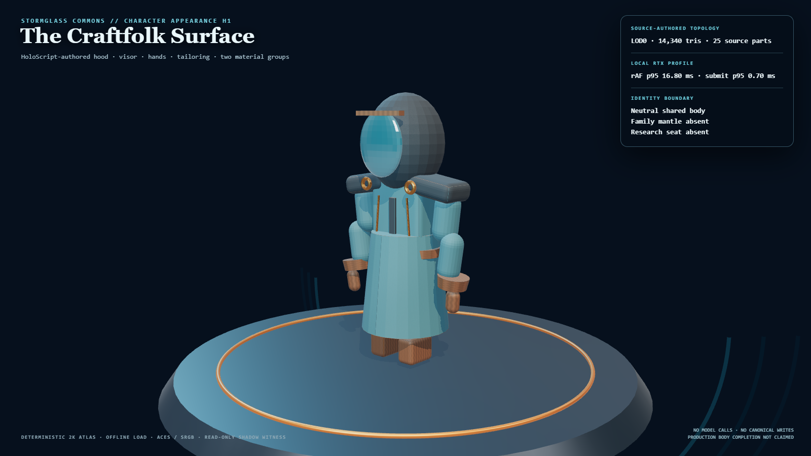
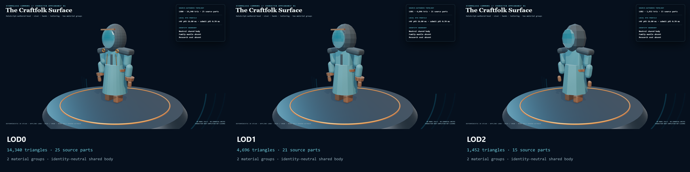

# HoloLand Model Village Character Appearance H0/H1

**Date:** 2026-07-27

**Status:** PASS

**Receipt:** `f578073ce9adce757ab544c57694661644e8805ce2ca8db49d48404b36e79385`

H0 now separates dermal profile, outfit skin, and presentation appearance in
the HoloScript format stack. H1 promotes one identity-neutral faceless
Stormglass Craftfolk surface shell with authored hood, visor, hands, shoulders,
tailoring, seams, fasteners, boots, three LOD visibility sets, and a
deterministic local material atlas.

## Visual result

The prior MV-V3 frame read as a dark procedural robe with separated cylinder
arms, ambiguous hands, and little material separation. This slice adds a
coherent hood/visor silhouette, connected shoulder mass, tapered sleeves,
gloved hands, tunic structure, leather belt/cuffs/boots, bronze seams and
fasteners, and wet-woven material breakup under the Hearthlight lighting
language.

## Source-authored LOD

| Tier | Parts | Vertices | Triangles | Material groups |
|---|---:|---:|---:|---:|
| LOD0 | 25 | 43020 | 14340 | 2 |
| LOD1 | 21 | 14088 | 4696 | 2 |
| LOD2 | 15 | 4356 | 1452 | 2 |

Budgets are 15,000 / 6,000 / 2,000 triangles. The topology reduction comes
from lower radial/cap/rounding segments plus source-authored removal of small
seams and fasteners.

## Deterministic atlas custody

- 2K albedo: `c4f73ef9b52e70e7de3d34af0b761b3f6e940a6e7e8191951c13c4b3d27e32fb`
- 2K normal: `e414ad09c5a2af1063d32c209bdf0215a8c4a8944b9c4aab8431e1819f329109`
- 1K AO/roughness/metalness mask: `883b522d57239921770bff72cf3c8f33f9d206411fbd7b312d707154f6ca76fe`
- Regions: woven teal, woven charcoal, weathered leather, aged bronze
- Repeated generation: byte-identical
- External asset requests: 0

The visible character uses two material groups: one atlas-driven opaque PBR
surface and one stormglass visor.

## Measured local browser profile

| Metric | p50 | p95 | p99 | Maximum |
|---|---:|---:|---:|---:|
| rAF cadence (ms) | 16.700 | 16.800 | 16.900 | 18.100 |
| CPU render submit (ms) | 0.500 | 0.700 | 0.900 | 3.500 |

- Protocol: 300 warm-up + 600 measured frames
- Dropped frames above 25 ms: 0 (0.000%)
- Browser: 150.0.7871.182
- GPU: ANGLE (NVIDIA, NVIDIA GeForce RTX 3060 Laptop GPU (0x00002520) Direct3D11 vs_5_0 ps_5_0, D3D11)

## Inherited capability preservation

The immutable MV-V3 body, 55-joint palette, four semantic clips, mantle socket,
and Performance G manifest remain hash-identical. This surface witness is a
read-only shadow consumer and does not replace the complete observer.

## Truth boundary

This is a production-art direction and operative browser surface slice, not a
complete production character. It does not claim cloth simulation, motion
retargeting, family-coded faces or bodies, authored hair-style geometry,
FACS/morph targets, observer promotion, photorealism, live research
participation, or full-world convergence. It performs no model calls,
canonical writes, resident-observation writes, network fetches, family-seat
joins, or wallet identity mutation.
