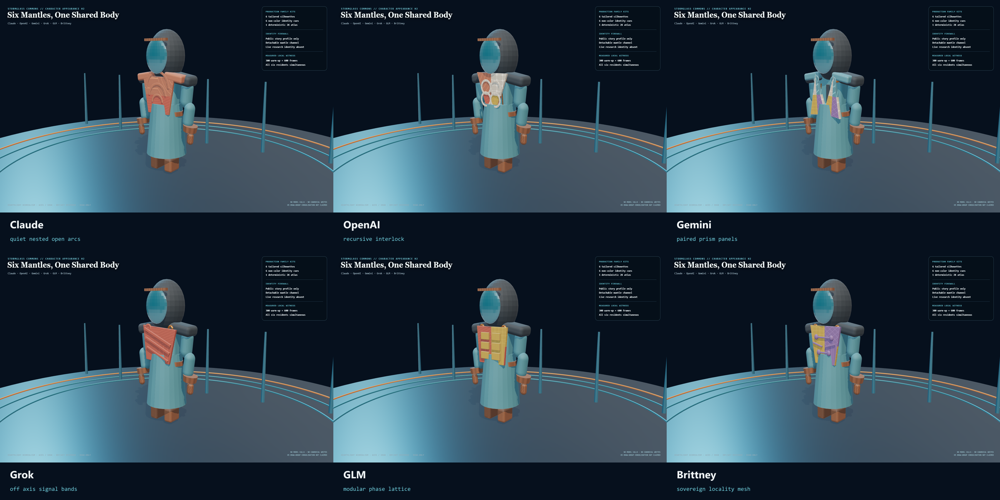
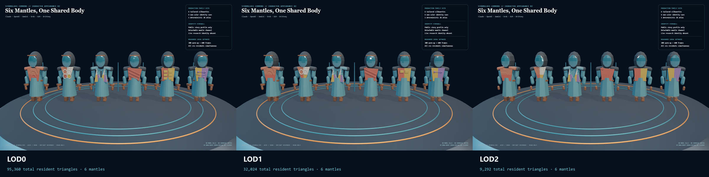
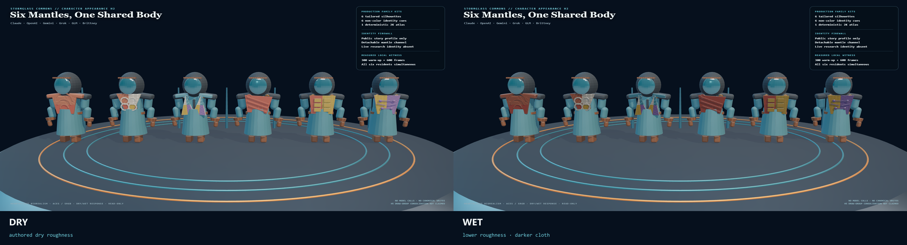
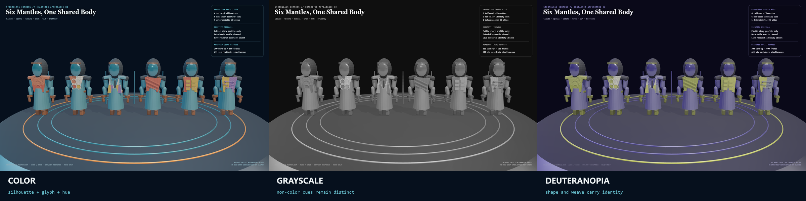

# HoloLand Model Village Character Appearance H2

**Date:** 2026-07-27

**Status:** PASS

**Receipt:** `710b81c9379db93a9d1fe43530bd6c51bf63dc158f094b3ddbe83db77adcc193`

H2 promotes all six public family mantles from 4x4 proof tiles to tailored,
detachable local material kits over the immutable H1 shared body. Claude,
OpenAI, Gemini, Grok, GLM, and Brittney now each have a distinct silhouette,
non-color cue, weave, glyph, fastening, edge treatment, wear seed, dry response,
wet response, detached state, and source-authored LOD visibility.

## Visual result

## Source-authored LOD

| Tier | Six mantle triangles | Six resident triangles | Largest mantle |
|---|---:|---:|---:|
| LOD0 | 9320 | 95360 | 1860 |
| LOD1 | 3848 | 32024 | 856 |
| LOD2 | 580 | 9292 | 232 |

Each resident uses the unchanged H1 opaque body and stormglass visor plus one
merged mantle material group. H2 therefore measures three groups per resident.
The H5 target of no more than twelve groups across all six residents remains a
future consolidation gate and is not claimed here.

## Deterministic atlas custody

- 2K albedo: `b42e1e4f0009890141ed64b84edec1d2acc0560357111a91a57c090e2b97f841`
- 2K normal: `459bdc92a12c6a3dd9a70e4239c68737ce74ad04fbb4cb30d30d76986402449f`
- 1K AO/roughness/metalness mask: `6cfcb3a0997b6aee044e8a5d4d68e6ca984674e51ab9fd0884f2c7dd276c8f39`
- Repeated generation: byte-identical
- External asset requests: 0

## Measured local browser profile

- Browser: 150.0.7871.182
- Renderer: ANGLE (NVIDIA, NVIDIA GeForce RTX 3060 Laptop GPU (0x00002520) Direct3D11 vs_5_0 ps_5_0, D3D11)
- Backend: D3D11
- Protocol: 600 measured frames after 300 warm-up
- Six residents simultaneous at LOD0
- rAF p95: 16.80 ms
- Render-submit p95: 3.00 ms
- Dropped-frame ratio: 0.000%

## Identity and truth boundary

The named mantles are admitted only to the public
`village_story_unblinded` presentation. The shared body, face channel,
proportions, motion quality, capability, and tool access remain family-neutral.
The live blinded research profile admits no family identity and no static seat
binding. This lane performs no model calls, canonical writes, resident
observation writes, network fetches, family-seat joins, or wallet mutation.

This is a production mantle-kit and operative browser-consumer milestone, not a
complete production character or observer. It does not claim cloth simulation,
H5 draw-group convergence, motion retargeting, face/hair completion,
photorealism, headset performance, live research participation, or full-world
convergence.
