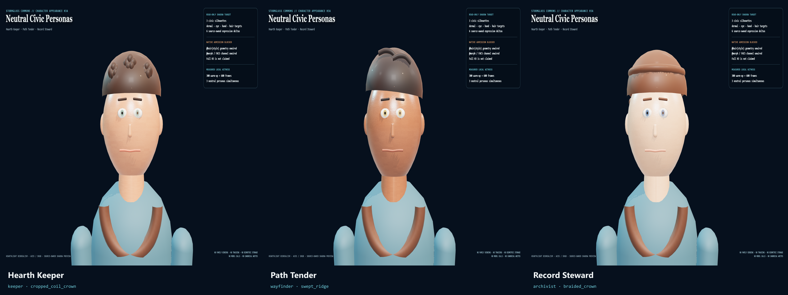
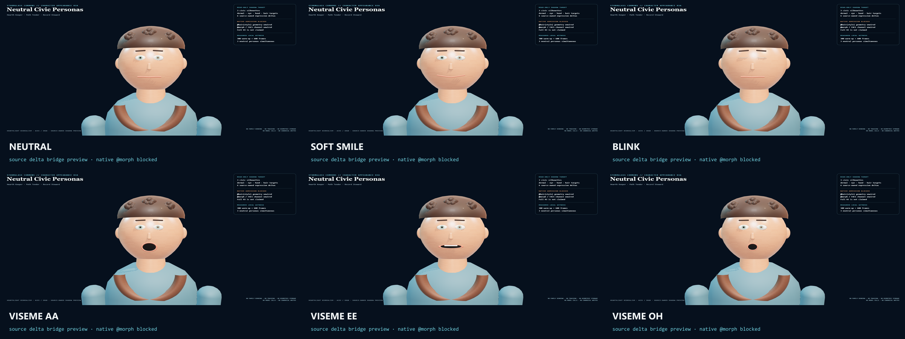
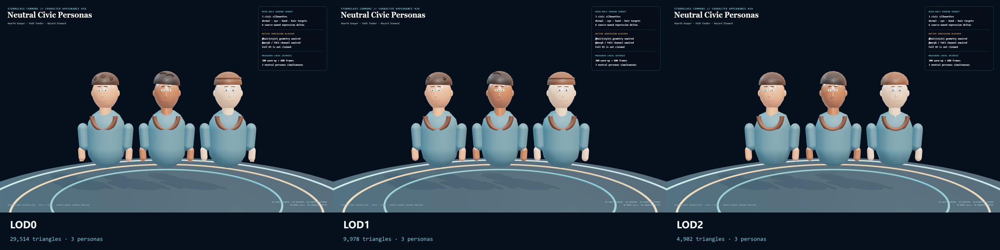
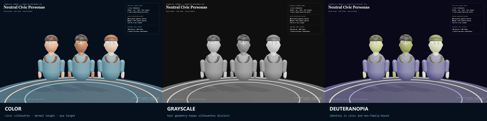

# HoloLand Model Village Character Appearance H3A

**Date:** 2026-07-27

**Status:** PASS

**Receipt:** `092444033bd71b5267c390585588283a91b75be672e9004c0da13ec99497225e`

H3A is a read-only neutral-persona visual target, not full H3. It makes three
civic silhouettes, deterministic dermal materials, restrained eye targets,
soft-faceted faces and hands, source-owned hair geometry, and six expression
deltas operative in a browser shadow consumer.

## Visual result

## Source-authored LOD

| Tier | Three persona triangles | Largest persona | Hair parts by persona |
|---|---:|---:|---:|
| LOD0 | 29514 | 11386 | 4 / 4 / 4 |
| LOD1 | 9978 | 3902 | 3 / 3 / 2 |
| LOD2 | 4902 | 1634 | 1 / 1 / 1 |

## Deterministic dermal atlas custody

- 2K albedo: `0faaf56dab3eec4fadeaafd628f01efe1b55881be13a0ea8771e3fcf60c27951`
- 2K normal: `0e55ad828aa72877f0cde85a0129e914109e409659349e97245e07cf0784c84f`
- 1K AO/roughness/metalness mask: `a8ab6f8a82ba3a914334eae227aea55c7868f0303c83a960d0ea3dc584d6a4c9`
- Repeated generation: byte-identical
- External asset requests: 0

## Measured local browser profile

- Browser: 150.0.7871.182
- Renderer: ANGLE (NVIDIA, NVIDIA GeForce RTX 3060 Laptop GPU (0x00002520) Direct3D11 vs_5_0 ps_5_0, D3D11)
- Backend: D3D11
- Protocol: 600 measured frames after 300 warm-up
- Three personas simultaneous at LOD0
- rAF p95: 16.80 ms
- Render-submit p95: 4.20 ms
- Dropped-frame ratio: 0.000%

## Native admission boundary

The upstream HoloScript engine at commit
`9153ab98a87decffc38876070ca8bfc04b179f01` still maps hair color and default
procedural hair, but reports authored `@hair(style)` geometry as unwired and
`@morph` as lacking a FACS/morph-target channel. H3A therefore proves only a
source-owned bridge preview. Full H3 remains blocked and is not claimed.

No persona binds Claude, OpenAI, Gemini, Grok, GLM, Brittney, or any adapter
family. The live blinded research profile cannot admit these civic personas
until assignment invariance is separately re-proved. Face and eye tracking are
off, biometric persistence is forbidden, and this lane performs no model calls,
network fetches, canonical writes, resident-observation writes, or seat joins.

This does not claim a complete production face, native hair-style behavior,
native morph/FACS behavior, production motion, photorealism, headset
performance, live research participation, or full-world convergence.
