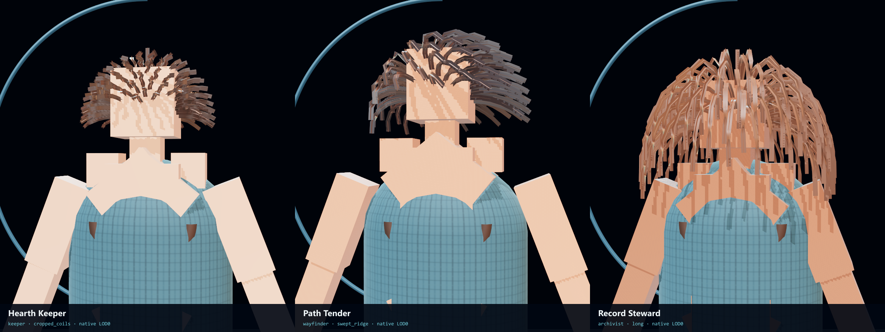
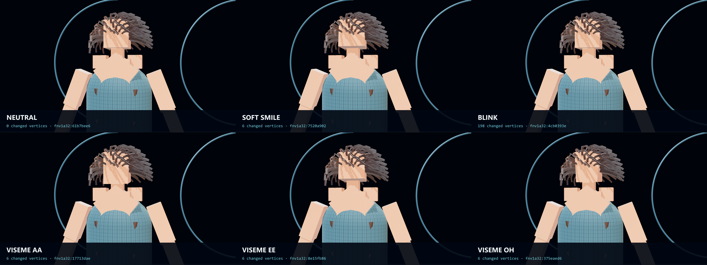
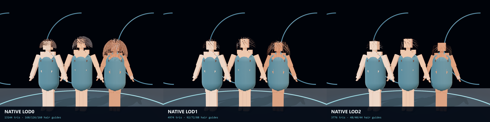
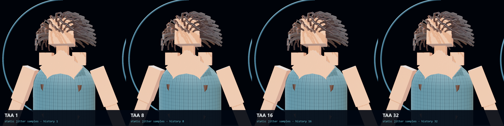

# HoloLand Model Village Character Appearance H3B

**Date:** 2026-07-27

**Status:** PASS

**Receipt:** `61856439df4c466d8318f2bf18fb8a9f80f3f53c6f1509f6e75e5762df720756`

H3B admits HoloScript's native character channels into HoloLand. Three
family-neutral civic personas compile through the sovereign
`character-webgpu` target with operative source-authored hair styles,
procedural-head morph probes, and per-tier native hair topology. The same local
hardware browser witness presents those exact bundles through a PBR studio
interpretation and a bounded static TAA32 pass.

## Visual result

## Native source-authored hair LOD

| Tier | Three-persona triangles | Hair triangles | Hair guides by persona | Curve segments by persona |
|---|---:|---:|---:|---:|
| LOD0 | 13144 | 9844 | 168 / 126 / 160 | 7 / 6 / 8 |
| LOD1 | 4974 | 1674 | 92 / 72 / 88 | 5 / 4 / 5 |
| LOD2 | 3776 | 476 | 48 / 40 / 44 | 3 / 3 / 3 |

The HoloLand bridge does not decimate hair. Each tier's `hair_guides`,
`hair_cards_per_guide`, and `hair_segments` values are authored in the H3B
`.holo`, selected by the HoloScript composition bridge, and serialized in the
native bundle receipt. HoloScript `LODManager` remains the sole runtime
selector.

## Native procedural-head morph receipts

| Probe | Changed vertices | Position digest | Applied native targets |
|---|---:|---|---|
| neutral | 0 | `fnv1a32:61b7bee6` | blink_left, blink_right, smile, jaw_open |
| soft_smile | 6 | `fnv1a32:7520a902` | smile |
| blink | 198 | `fnv1a32:4cb0393e` | blink_left, blink_right |
| viseme_aa | 6 | `fnv1a32:17713dae` | jaw_open, viseme_aa |
| viseme_ee | 6 | `fnv1a32:8e15fb86` | smile, viseme_ee |
| viseme_oh | 6 | `fnv1a32:375eaed6` | jaw_open, viseme_oh |

The current substrate is explicitly `procedural-head-v1`. It does not
recompute normals after deformation and is not a complete production face.

## Measured local browser profile

- Browser: 150.0.7871.182
- Renderer: ANGLE (NVIDIA, NVIDIA GeForce RTX 3060 Laptop GPU (0x00002520) Direct3D11 vs_5_0 ps_5_0, D3D11)
- Backend: D3D11
- Protocol: 600 measured frames after 300 warm-up
- Three native LOD0 personas simultaneous
- rAF p95: 16.80 ms
- Render-submit p95: 0.40 ms
- Dropped-frame ratio: 0.000%

## Static temporal convergence

- Implementation: `three_taa_render_pass`
- Settled history: 32 samples
- First-window center-patch mean delta: 0.066433
- Final-window center-patch mean delta: 0.067600
- History reset events receipted: profile_change, resize, camera_cut, persona_change, camera_cut, persona_change, camera_cut, persona_change, camera_cut, persona_change, camera_cut, expression_change, camera_cut, expression_change, camera_cut, expression_change, camera_cut, expression_change, camera_cut, expression_change, camera_cut, expression_change, camera_cut, lod_change, camera_cut, lod_change, camera_cut, lod_change, expression_change, camera_cut

This remains static jittered accumulation for settled frames. It has no motion
vectors, reprojection, disocclusion rejection, reactive mask, neighborhood
clamp, or production motion-stable TAA claim.

## Boundaries and next lane

Record Steward uses native `long` hair because H3A's `braided_crown` is not
yet in the admitted native style catalog; parity is explicitly false. H3B does
not replace the public first release, bind any persona to Claude/OpenAI/Gemini/
Grok or a research seat, admit live research, persist biometrics, call models,
or write canonical village state.

The next production-detail lane is facial topology, morph-normal/tangent
reconstruction, eye/tearline refinement, hands, and native wardrobe integration.
H3B does not claim photorealism, headset performance, or full-world convergence.
