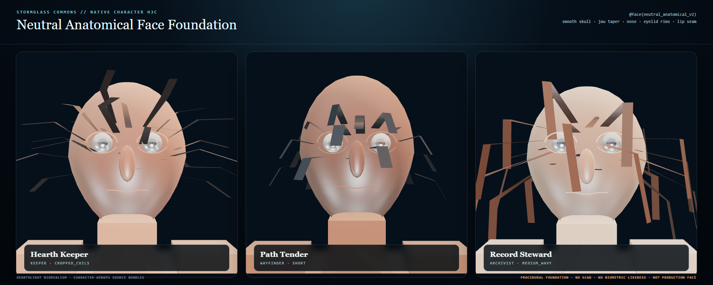

# HoloLand Model Village Character Appearance H3C

Date: 2026-07-28 (re-witnessed 2026-08-16)  
Status: accepted bounded foundation, re-witnessed under native facial morph v2  
Milestone: `MV_CHARACTER_APPEARANCE_H3C_FACE_FOUNDATION`

> **2026-08-16 re-witness.** Everything below the "Re-witness" heading at the end of
> this report is the current evidence of record. The body of the report is the
> original 2026-07-28 acceptance and is preserved as the dated record it was.
> The blink semantics it was written under have since changed upstream; the
> re-witness section states what changed, what was re-measured, and what held.

## Outcome

H3C replaces H3B's visible block-head cap with a source-selectable
`neutral-anatomical-v2` topology authored through:

- `.holo`: the world/look-development contract and three civic personas;
- `.hsplus`: native-bundle admission and the research/custody firewall;
- `.hs`: the deterministic read-only proof seed.

The sovereign `character-webgpu` compiler emitted all nine persona/LOD bundles
without fallback or stubs. The new topology adds 561 vertices over the
5,958-vertex legacy comparison bundle and carries its topology identity through
the native morph receipt.



## Native implementation

Pinned HoloScript commit:
`faf90ec8cbac992c6ca0ed9ffafb9033fa9bd127`

The implementation adds:

- an opt-in smooth skull with jaw taper and a flatter facial plane;
- a smooth bounded nose volume, upper eyelid and lower tearline arcs, and a
  neutral lip seam;
- smaller embedded ocular geometry for the anatomical topology;
- `@face(topology: "neutral_anatomical_v2", radial_segments: 22,
  vertical_segments: 16, tearline: true)` mapping;
- face topology serialization in the sovereign `character-webgpu` compiler;
- topology identity in native facial morph receipts.

The legacy `procedural-head-v1` remains the default. Unsupported topology names
fail closed instead of relabeling the legacy cap.

## GPU witness

The accepted fourth visual iteration was captured at 1,800 × 720 in Chrome
150.0.7871.182 on:

`ANGLE (NVIDIA GeForce RTX 3060 Laptop GPU, Direct3D11)`

Measured over the three simultaneous portrait renderers:

| Measure | Result |
|---|---:|
| Post-warm frame interval p95 | 20.6 ms |
| Render-submit p95 | 4.5 ms |
| Native persona/LOD bundles | 9 |
| Native expression receipts | 3 |
| Topology vertex delta | +561 |
| External requests | 0 |
| Page errors | 0 |

The look-development witness intentionally selects the source-authored LOD2 hair
topology (28/24/28 guides) so facial landmarks remain readable. LOD0 and LOD1
are still compiled, hashed, and admitted. The procedural iris/pupil presentation
is driven by each persona's authored `irisColor`; a segmented native iris
material is not claimed.

## Visual iteration record

1. LOD0 close-up rejected: inherited hair cards occluded the face.
2. Eye-centered LOD2 framing rejected: full elliptical landmark rims read as
   glasses and the ocular surfaces were oversized.
3. Refined eye scale, eyelid arcs, nose, and lip seam rejected: the nose volume
   remained too tall and the iris normal sign was wrong.
4. Softer nose, corrected iris facing, and source-authored portrait hair
   substitutions accepted as the bounded H3C foundation.

## Truth boundary

H3C proves a deterministic native procedural facial foundation. It does not
claim a scan-derived face, biometric likeness, production blendshape rig,
wet tear film, morph-normal recomputation, temporal reprojection, TAA
convergence, or photorealism. It performs no model calls, research-seat joins,
canonical village writes, resident-observation writes, or external network
fetches.

The accepted image is a substantial improvement over the block head, but it is
not the final realistic NPC target.

## Next bounded lane: H3D production facial regions

1. Split native eye geometry/material groups into sclera, iris, pupil, cornea,
   and tearline surfaces; eliminate the presentation-only iris shader.
2. Add facial regions for brow, cheek, lips, nostrils, ears, teeth, and tongue
   on a deformation-safe topology.
3. Recompute or transport normals/tangents after morph deformation and validate
   blink, smile, jaw, and viseme combinations on GPU.
4. Replace opaque ribbon hair cards with alpha-tested/tapered native hair
   shading, a scalp occlusion surface, and production hairline masks.
5. Author skin/dermal variation and age/detail atlases without tying neutral
   civic bodies to model-family identity.
6. Re-run the three-persona portrait and village-distance lineup through the
   existing LOD/performance/TAA gates before any production-face or
   photorealism claim.

## Verification

```text
HoloScript engine tests: 28 passed
HoloScript compiler tests: 10 passed
HoloScript engine build: passed
HoloScript core build and public types: passed
HoloLand H3C contract tests: 3 passed
HoloLand H3C native/GPU witness: passed
HoloScript safe-commit quality gates: passed for all three upstream commits
```

GraphRAG refresh scanned 11,648 tracked files, but impact analysis remained
non-authoritative because the cached graph covered only 57.44% of the current
20,280-file candidate set. Direct source reads, targeted tests, builds, compiler
receipts, and the GPU witness are the evidence of record for this lane.

## Re-witness, 2026-08-16 — native facial morph v1 → v2

### What changed upstream

HoloScript commit `09fe4773d` (2026-07-29) — one day after this gate's original
pin `faf90ec8c` — gave the native facial morph builder an optional orbital-lid
vertex range and wired `CharacterHost` to pass it. The effect on this
composition is specific and was never a claim H3C made:

- **Under v1**, an authored blink scaled only the eye globe.
- **Under v2**, a blink also closes the authored orbital lid shell — the same
  rim this composition has always asked for with `@face(tearline: true)`.

The receipt schema moved with it: every H3C bundle now reports
`holoscript.native-facial-morph.v2` instead of `v1`.

### What the original evidence actually got wrong

All three original expression probes (`neutral`, `soft_smile`, `viseme_oh`)
carry `blink` at zero. The v2 orbital path is skipped at zero blink weight, so
those three position digests, and the captured portrait golden, are **unchanged**
byte for byte under v2. What was stale was not the picture — it was the
receipt (nine bundle hashes, all carrying the `v1` schema string) and, more
seriously, the coverage: H3C claimed
`nativeEyelidTearlineRimTopologyClaimed: true` and never once moved that rim.
The gate witnessed the lid as geometry and never as motion.

### What is admitted now

`state.nativeAdmission` names the semantics instead of inheriting it:

```text
morphSchemaVersion:                          "holoscript.native-facial-morph.v2"
blinkClosesAuthoredOrbitalLid:               true
orbitalLidClosureMustCoverWholeAuthoredRim:  true
expressionNormalRecomputationAdmitted:       false
```

A fourth expression probe, `blink_closed` (`blink: 1`), exercises it.

### Re-measured evidence

| Measure | Result |
|---|---:|
| Post-warm frame interval p95 | 17.2 ms |
| Render-submit p95 | 1.1 ms |
| Native persona/LOD bundles | 9 |
| Native expression receipts | 4 |
| Topology vertex delta | +561 |
| Legacy comparison bundle | 5,958 vertices |
| Authored tearline rim | +76 vertices |
| Vertices the v2 blink closes beyond the v1 blink | 76 |
| Bundles reporting recomputed normals | 0 |
| External requests | 0 |
| Page errors | 0 |

Pinned HoloScript commit is now `721b4608da5d3752956d978108fa852cb2740b6d`.
Captured at 1,800 × 720 in Chrome 151.0.7922.138 on
`ANGLE (NVIDIA GeForce RTX 3060 Laptop GPU, Direct3D11)`.

The orbital-lid claim is measured, not asserted. The gate compiles the same
persona twice — once with the authored tearline and once with it withheld — and
requires that the rim's vertex cost and the rim's blink motion be the same
number (76 = 76), and that withholding the rim drops the receipt back to `v1`.
Neither figure is written into the contract; if upstream stops closing the
authored lid, the two measurements stop agreeing and this gate fails.

### What still holds

Verified by measurement rather than carried over: morph topology is still
`neutral-anatomical-v2`; `ignoredTargets` is empty on every bundle; no trait is
stubbed; the topology delta over the face-less legacy bundle is still +561 on a
5,958-vertex comparison; and **no bundle reports recomputed normals**, so morph
`v3` is not reaching this gate and
`normalsRecomputedAfterMorphClaimed: false` remains true. The portrait golden
reproduces bit for bit on a newer Chrome build.

### Gate coverage repaired at the same time

- `CharacterHost.ts` is now pinned. It is the file that decides whether the
  orbital range reaches the morph builder — the file that flipped this gate's
  semantics — and it sat behind every pin H3C held.
- The manifest has always recorded a `testSha256` and a `reportSha256` and
  verified neither. Both are now enforced.
