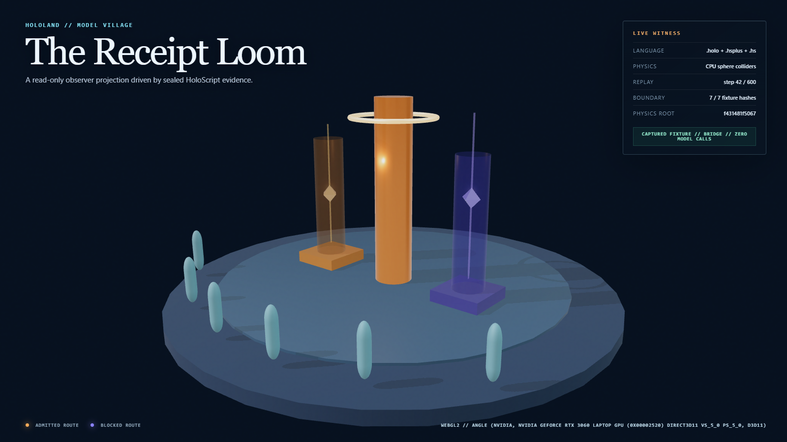
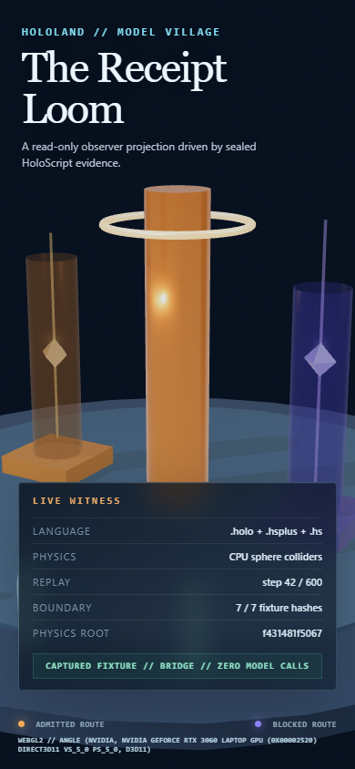

# Model Village MV-P0/MV-P1 Fixture Boundary Witness

**Date:** 2026-07-24

**Source commit used by the receipts:**
`1df8eb3e42d6f633926cceca44d33016d4b68bab`

## Verdict

- **MV-P1 passes** for the bounded Receipt Loom hero and portrait witness.
- **The captured-fixture portion of MV-P0 passes** for seven-field hash
  availability, fixture integrity, static pre-inference adapter exclusion,
  parsed-AST projection capability exclusion, physics-side-effect stability,
  and read-only browser consumption.
- **Full MV-P0 remains open.** No isolated observer-projection off/on toggle,
  native `.hs` pipeline execution, native `.hsplus` action execution, or live
  model turn was executed.

This is a HoloScript-authored captured fixture executed by a deterministic
HoloLand bridge. It is not a native HoloScript experiment-runtime receipt or a
scientific result.

## Executed route

```text
captured fixture inputs in .hs + boundary contract in .hsplus
  -> HoloScriptCodeParser + HoloScriptPlusParser
  -> bounded HoloLand fixture projection
  -> clock, public-state, schedule, observation, and action-fixture hashes
  -> HoloScript CPU physics witness
  -> read-only HoloLand Three/WebGL2 browser consumer
```

The observer `.holo` source is parsed and source-hash-bound. A fail-closed AST
scan found no executable logic, behavior attachment, import, provider, tool,
scheduler, receipt-writer, or resident-observation output surface. This is a
static source-capability exclusion; native runtime capability enforcement
remains upstream work.

## Captured-fixture result

The fixture executed:

- 3 ordered schedule entries across logical ticks 0 and 1;
- 6 identity-neutral resident observation envelopes;
- 2 syntactically chained action-fixture receipts;
- 3 distinct, balanced adapter assignments, with each seat receiving A, B,
  and C exactly once.

Canonical boundary:

| Field | SHA-256 |
|---|---|
| Canonical scene | `50200865b06cc3e8b4ab3e6b24d702ff1d4190609a9e076250db817a02efaf28` |
| Canonical pose | `ce90e81e1538da7ed686034991d5feb896d94cbb039f425b732584b4e891e2e2` |
| Logical clock | `a8fce7d3cc6f77a2190dbf96393ce6c640fae954a9ece347b439d33ed0fe30d7` |
| Public state | `7e95f3eb0f4d4e374bd280631a42f72f253c2c860c770e9538fa711f4201f6f9` |
| Executed schedule | `d25af0b4d075138b9a86de5fe243262d7fe6f34be4410c9af19a0b260e709ca7` |
| Resident observations | `ef5f843648d4dd5cec41f378267802c0fcefad65a95e2c0d86f4a50a2dd0f7dd` |
| Action-fixture root | `622b3bcce75beac981b511a25318bc8254c87a9e8ae13fb876b7ad82dcc59589` |

The action root is deliberately scoped. Denied fixtures must report no visible
impact and `blocked_without_world_mutation`, but referenced safety and
action-decision receipt IDs are opaque and are not validated as typed receipts.

## Integrity and negative evidence

The focused suite rejects:

- non-hex or missing boundary hashes;
- claim-boundary mutation without resealing;
- missing native headless scene or pose inputs;
- manifest parser substitution;
- missing, reversed, out-of-range, or phase-mismatched schedule steps;
- clock/public-state end misalignment;
- invalid rollback references;
- reused authorization, turn, safety, or decision IDs;
- denied actions claiming visible impact or world mutation;
- resident-observation identity fields;
- duplicate or non-counterbalanced assignment vectors;
- projection actions or other parsed executable capability surfaces.

Malformed fixtures produce a persisted, claim-bound failure receipt instead of
an unstructured exception.

The fixture and outer experiment hashes bind status, source authority, and
claim boundaries:

- Fixture receipt: `362e297f36ef986452787acd4b563f6530aa127e19bb2bbbe9259050efbeafae`
- Experiment receipt:
  `77eed1389e4336f1aacd2cd908ef394656b50b3db018a0c90a54e1d865d7a6be`

## Physics and browser result

The physics witness ran three fresh 600-step fixed-1/60 CPU replays:

- Physics state root:
  `f431481f5067db9f99e9728fd305a911761903e4946fa7123e2743ccd4c0b87e`
- Frame trace:
  `268545ba23401e1975c3f3293c4f2a3c7aa28281d755b71b13072d505ab3671a`
- Physics receipt:
  `d62519359cb44724e3df2b397b317b9669d7a24af59d89d66439243fa53504db`

The seven fields were equal before and after the physics witness. The receipt
labels this as `before_vs_after_physics_witness_execution` and explicitly
records `projectionToggleExecuted: false`.

The browser consumed all seven captured-fixture fields and displayed the
separate physics root. It did not run an off/on equivalence test.

- Rendering receipt:
  `8b0250d1260395abda661409112f1a8f72b94851b762fefe73b74dc7ccc84926`
- Context: WebGL 2.0.
- Reported backend: ANGLE Direct3D 11.
- Reported renderer:
  `ANGLE (NVIDIA, NVIDIA GeForce RTX 3060 Laptop GPU (0x00002520) Direct3D11 vs_5_0 ps_5_0, D3D11)`.
- Recognized software-renderer indicators: none.
- Final timing sample: 60 warm-up and 180 measured frames.
- rAF cadence p95: 16.80 ms.
- CPU `renderer.render()` submission p95: 1.30 ms.

Those strings and measurements describe the named local run. They are not
GPU-frame timing, WebGPU, sustained-load, headset, or cross-hardware evidence.
`BrowserRenderEvidence` remains a source-hash-bound declarative template rather
than a field-by-field rendering-gate contract.

## Durable visual evidence

### Hero — 1600 x 900



SHA-256:
`1a9b4148c7db0c871b736bea47e8f4d4c43c3704f7873c120df8773223b85ab1`

### Portrait — 390 x 844



SHA-256:
`7be420d38f14fcd9b3dd6e084faba9d32bcfdab06b575f5790d4b6d2ebf84193`

Both captures were inspected. The portrait shows both route legends, all seven
fixture hashes as available, the correctly labeled physics root, zero model
calls, and the complete WebGL2/ANGLE/NVIDIA/D3D11 provenance. Browser-measured
layout checks passed:

- all evidence chrome inside 390 x 844;
- both route labels visible;
- backend text neither clipped nor ellipsized;
- evidence-card/footer gap: 31.75 px;
- no document horizontal overflow.

This is a polished bounded tracer, not a claim of photorealism or a complete
living village.

## Reproduction

```powershell
pnpm run test:hololand-model-village
pnpm run test:hololand-model-village-physics
pnpm run test:hololand-model-village-rendering
pnpm run check:hololand-model-village
pnpm run check:hololand-model-village-physics
pnpm run check:hololand-model-village-rendering
```

All focused checks passed. The generated JSON receipts remain under
`.tmp/hololand/model-village/` and are intentionally not tracked.

## Remaining MV-P0 dependency

Upstream HoloScript headless execution must emit recomputable native logical
clock, public-state, schedule, resident-observation, and receipt-ledger
payloads from real `.hs` and `.hsplus` execution. HoloLand must then run an
isolated observer consumer off/on around that native execution and prove the
seven fields remain identical. Until then, full MV-P0 is open.
