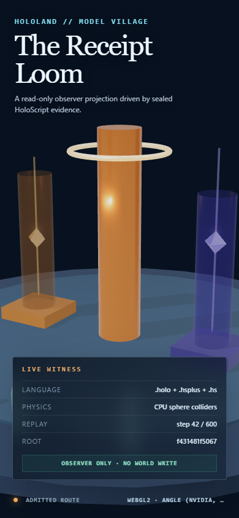

# Model Village MV-P9/MV-P10 Witness

**Date:** 2026-07-24

**Verdict:** Pass for the bounded local WebGL2 rendering witness and CPU
sphere-collider receipt tracer described here.

> **Historical visual receipt:** The mesh counts, screenshots, timings, and
> fixture-only observer boundary below describe the 2026-07-24 witness. The
> refreshed 2026-07-25 Living Commons witness adds a bounded V4 browser
> consumer toggle and 29 observer meshes without rewriting this receipt. See
> [the newer report](./HOLOLAND_MODEL_VILLAGE_PHASE0B_OBSERVER_LIVING_COMMONS_2026-07-25.md).

This is not a declaration that the full Model Village experiment, general
HoloLand renderer, native HoloScript+ action runtime, WebGPU path, or future
physics showcase is complete.

## Executed route

```text
observer/calibration .holo
  -> HoloCompositionParser
  -> SceneIRCompiler
  -> dedicated HoloLand Three/WebGL adapter
  -> named Chrome WebGL2 frame and screenshot receipts

observer policy .hsplus + rigid-body manifest .hs
  -> structured fail-dark bridge contract
  -> HoloScript runtime PhysicsWorld
  -> PhysicsWorldImpl
  -> three fresh 600-step, fixed-1/60 CPU replays
  -> ordered-contact, sleep, final-transform, and frame-trace digests
```

The bridge used one `PhysicsWorld.addBodyWithConfig` registration path. The
current React Three adapter was not used; it still imports the removed
`R3FCompiler` surface and is not an executing witness.

## Physics result

- Physics state root, identical across all three local runs:
  `f431481f5067db9f99e9728fd305a911761903e4946fa7123e2743ccd4c0b87e`
- Frame trace:
  `268545ba23401e1975c3f3293c4f2a3c7aa28281d755b71b13072d505ab3671a`
- Ordered-contact digest:
  `5b7b7fae0372668c902c48da3db12e35dcd368ee85e2ff7ce3088ab1f84483d1`
- Synthetic admitted and blocked fixtures carrying pre-verified signature flags
  and exact loaded-source hashes each released one token.
- Missing, tampered, and duplicate fixtures released nothing.
- Both dynamic bodies used sphere colliders derived as half the maximum mesh
  scale and contacted separate axis-aligned static box floors.
- The gate required exactly two route-correct starts: admitted token to admitted
  floor at step 58, and blocked token to blocked floor at step 62. Cross-lane or
  extra contacts fail the gate.
- Both dynamic bodies slept within the 600-step window with zero final linear
  and angular velocity.
- The faceted crystal is the visual mesh; its disclosed collision shape is a
  sphere.

The harness performs exact loaded-source hash comparison. It trusts fixture
booleans that say a signature and action hash were already verified; it does
not itself perform cryptographic signature verification.

## Browser and rendering result

- Browser route: hardware-requested Chrome headless witness.
- Context: WebGL 2.0.
- Observed backend: ANGLE Direct3D 11.
- Observed renderer:
  `ANGLE (NVIDIA, NVIDIA GeForce RTX 3060 Laptop GPU (0x00002520) Direct3D11 vs_5_0 ps_5_0, D3D11)`.
- Known software-renderer indicators: none.
- Three: 0.182.0.
- HoloScript physics/runtime commit:
  `56e5a082f267474c2fd6cec339ecc7cc0615ba19`.
- Effective output: sRGB, ACES filmic tone mapping, exposure 1.05.
- Shadows: PCF soft, with allocated shadow map plus source-mapped casters and
  receivers.
- Environment: locally bundled Three `RoomEnvironment`, PMREM generated,
  `hdri: false`.
- Network assets fetched: zero.
- Materials: all 26 source meshes mapped to `MeshPhysicalMaterial`; every
  authored physical-material value matched its effective Three value, all eight
  calibration sample IDs were present, and only the two source-disclosed
  decorative chute overrides were admitted.
- Timing sample: 60 warm-up frames and 180 measured frames.
- rAF cadence: p50 16.70 ms, p95 16.80 ms, p99 17.00 ms.
- CPU `renderer.render()` submission: p50 0.90 ms, p95 1.40 ms,
  p99 2.10 ms.

These are frame-cadence and CPU submission measurements on the named run. They
are not GPU-frame-time, sustained-load, headset, or cross-hardware claims.

## Durable visual evidence

### Falling receipt frame — 1600 x 900


SHA-256:
`b9370d5d7333f996a2e6148a220cc37eb7bd42b823e8538c128509e574e2311e`

Physics-frame SHA-256:
`1d89f8c8caa0ee9737221be8ecbc067224c7578a96995f9e7e32de0b6aa82bdb`

### Falling receipt frame — 390 x 844



SHA-256:
`3f25c29150c58e975b4e52ea897b782747eb934549f6d15be837fbe571f2a838`

### Settled contact frame — 1600 x 900


SHA-256:
`020c60ee5de5023787dc103ce92ab151d6b31b2172901486941ebfec333a2e56`

Physics-frame SHA-256:
`77f072a53dff153fd449d60edb0ebe534af39c8557685442973932acdbffcc1f`

### Material calibration — 1600 x 900


SHA-256:
`5082a0e72557b80ac78048be60bc3b8f03f13e75699a346e3946f7664580dce5`

## Visual inspection

The four final captures were inspected at their original dimensions.

- The desktop evidence chrome and the portrait's primary Live Witness card
  remained legible without covering the Receipt Loom tokens. The portrait's
  bottom provenance footer is right-clipped and its bottom legend is incomplete;
  that responsive-layout defect remains open.
- The loom, chute shells, catch floors, terrain, and blinded residents read as
  grounded rather than detached.
- The falling and settled token poses correspond to the referenced sealed
  physics frames.
- Chute transparency exposed the tokens. The source and receipt disclosure—not
  the image alone—identify the decorative shells as non-colliders.
- The calibration view showed distinct reflective, rough, coated,
  transmissive, timber-colored, metal, water, and gray-reference responses.
- No clipped emissive core, crushed-black subject, severe shadow acne, obvious
  light leak, or transparency-order failure was observed.

This human inspection is a narrow image-quality verdict, not an automated
perceptual-equivalence or photorealism measurement.

## Canonical boundary result

The checker ran the canonical headless Model Village before and after the
projection replay and observed identical:

- canonical source hashes;
- twelve-object ID set;
- scene and pose/physics digest; and
- experiment-design projection.

The current headless path does not expose an executed schedule hash, resident
observation hash, or action receipt root. Those three invariants remain open
runtime work and prevent claiming the full MV-P0 boundary gate.

## Reproduction

```powershell
pnpm run check:hololand-model-village-physics
pnpm run test:hololand-model-village-physics
pnpm run check:hololand-model-village-rendering
pnpm run test:hololand-model-village-rendering
```

The canonical rendering receipt-core hash was
`933337129c58cab92415219d1d8f439522c80e60a815ff3624c5d8061cb51b0d`.
The final JSON file SHA-256 was
`e3e7e2afe77e04a18442a8aae8304708cbc666d75cb81886857e8a1cb746f7a2`.
The nested physics receipt-core hash was
`a1b355b90151cb4bfa2b1d1d929744dae75838c9d818c16b12214d8955d6c5ed`;
its final JSON file SHA-256 was
`876473db58cc6dfb999ec6735df839c78c0fd1db2d736321cbfbd5c0d2afb6dd`.
The receipt is regenerated under
`.tmp/hololand/model-village/rendering-witness/` and is intentionally not a
tracked source artifact.

## Allowed claim

> HoloScript-authored Model Village rendered through a receipted HoloLand
> Three/WebGL2 witness with deterministic local CPU sphere-collider replay.

Not observed: HDRI use, WebGPU, native general-platform renderer execution,
ray/path tracing, global illumination, photorealism, physically accurate
materials or fluids, box-token colliders, stacking, collision-friction
response, continuous collision detection, cross-hardware agreement, or headset
performance.
