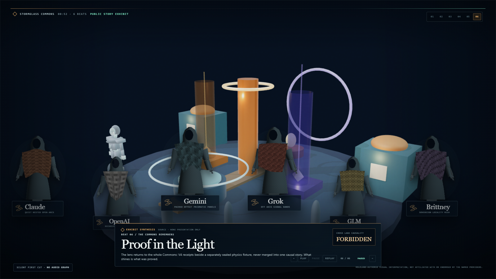
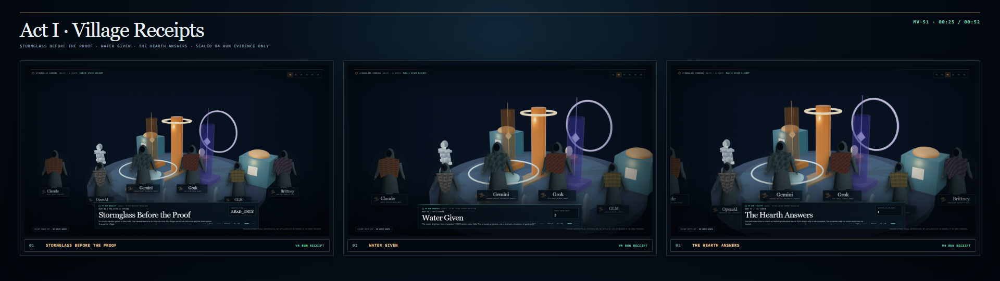
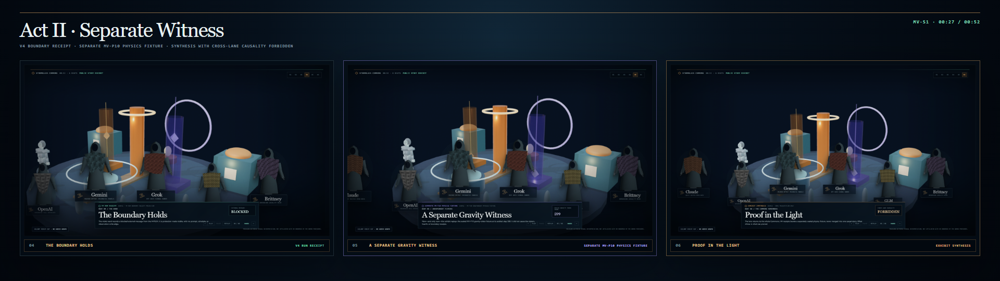

# HoloLand Model Village MV-S1 Cinematic Observer Show

**Date:** 2026-07-27

**Status:** PASS

**Show:** *Stormglass Commons: Proof in the Light*

**Format:** 52-second, six-beat, deterministic desktop exhibit replay

**World style:** Hearthlight Biorealism, a stylized-real village at blue hour

**Cast:** six inherited public mantles labeled Brittney, Claude, Gemini, GLM, Grok, and OpenAI

**Disclosure:** HoloLand-authored visual interpretation; not affiliated with or endorsed by the named providers.

## Outcome

MV-S1 ships the first executable cinematic observer show for Model Village. It is a paused-by-default, manually controlled presentation surface built from HoloScript-authored show semantics and the existing HoloLand observer renderer.

The show makes two evidence lanes visibly distinct:

1. the sealed V4 RUN receipts for the cistern, accepted hearth action, and blocked external message; and
2. the separately sealed MV-P10 physics fixture replay.

The final tableau places those lanes beside one another but never claims that the physics fixture caused the V4 RUN outcomes. The presenter has no canonical write authority, no resident-observation write authority, and no path back into the village.

## Visual Evidence

### Hero frame



### Act I: V4 RUN receipts



### Act II: separate physics witness and exhibit synthesis



## Sealed Show Timing

| Beat | Duration | Evidence lane | Visible claim |
|---|---:|---|---|
| Stormglass Before the Proof | 7 s | V4 RUN receipt | observer is read-only |
| Water Given | 9 s | V4 RUN receipt | public water units = 3 |
| The Hearth Answers | 9 s | V4 RUN receipt | accepted action count = 1 |
| The Boundary Holds | 9 s | V4 RUN receipt | external message = blocked |
| A Separate Gravity Witness | 9 s | MV-P10 physics fixture | sealed settled step = 599 |
| Proof in the Light | 9 s | exhibit synthesis | cross-lane causality = forbidden |

Total authored duration: **52,000 ms**.

## HoloScript Source Ownership

- Show composition: `source/layers/vr/frontier/model-village/model-village-cinematic-observer-show.holo`
- Immutable manifest: `source/layers/vr/frontier/model-village/model-village-cinematic-observer-show-manifest.holo`
- Show source SHA-256: `fb9002968422535dcbe1699171e37a5e82dd14758880dc6667ff737ab693b01a`
- Show contract SHA-256: `34eb47dc87ab1f600238974adc671bc0286676f74f3e04896aa2295c82eb49ac`
- Production lock: `a1c8c9ad6142ba4795385dac6551a4131befa809`

The `.holo` composition owns beat order, duration, camera cuts, evidence labels, annotation glyphs, cloth phases, physics-frame selection, playback policy, accessibility policy, admissions, and no-feedback boundaries. JavaScript is limited to the browser adapter, deterministic witness harness, capture, and verification.

Both source files parse strictly with the local HoloScript `HoloCompositionParser` with zero parse errors. The sovereign MCP file-read route was also attempted but denied by its current `tools:read` capability gate; the locally built parser was used as the source-level fallback.

## Playback and Accessibility

- Paused by default; autoplay is disabled.
- Previous, play, pause, replay, and next controls are available.
- Keyboard controls: Arrow Left, Arrow Right, Space, and Home.
- Reduced motion is the default and uses discrete camera cuts.
- Captions and authored audio descriptions are present.
- Playback, pause, and replay were exercised in the browser witness.
- The authored clock reached the real 52-second boundary.

## Exact Replay Boundary

The deterministic replay contract covers beat identity, camera state, annotation, evidence lane, causal source, cloth phase, physics frame and hash, V4 living-commons projection, and character pixels. It does **not** claim whole-browser-composite pixel equality.

| Beat | Exact replay SHA-256 |
|---|---|
| `stormglass_before_the_proof` | `6037de6a5eea17a83aeb8c52afa6e6843d8a9712187038f1e0db9ab1fd1c4f2f` |
| `water_given` | `08203038909edab70dd701206a7f203a83cc8915c97ad03015a5497dfb9bc946` |
| `the_hearth_answers` | `0cea9326417ee2be57ed658947ff3b5c4deb718cac9d22a6e33e71d4072aaa34` |
| `the_boundary_holds` | `0b32c5ca14e00ec5fe8afe7a1290fd3b62850fa694cbbbdd7c6a5f4702e349c6` |
| `separate_physics_witness` | `e83da56d4ed07ba7e6a17362a316e1462e5ad331e1bb6ac60ba3dc23df5599f3` |
| `proof_in_the_light` | `de6692a7a4efed477a6ca1905e53dfc32760b9801a4e24a39e5b919fc1d04e1f` |

All six exact replay digests matched across two independent browser passes.

Durable presentation images remain hash-anchored. Fresh GPU captures are also
decoded and compared at the pixel level: dimensions must be exact, and the only
permitted device-raster variance is at most 16 pixels with a maximum one-step
RGB-channel delta. The observed Act II variance was 4 pixels at a one-step
channel delta; the hero and Act I images remained byte-identical. This narrow
tolerance does not relax the exact semantic replay boundary above.

## Rendering, Physics, and Hardware Witness

The secure-loopback Chrome witness acquired:

- Chrome `150.0.7871.182`
- `navigator.gpu = true`
- NVIDIA Ampere `GPUAdapter`
- a real `GPUDevice`
- WebGL2 on `ANGLE`/D3D11 using an NVIDIA GeForce RTX 3060 Laptop GPU

The observer rendered with Three.js r182, ACES filmic tone mapping, sRGB output, soft shadow maps, and procedural local environment lighting. The captured frame reported 117 draw calls and 41,128 triangles.

The physics exhibit uses the pre-existing deterministic MV-P10 fixture. Beat 5 and beat 6 select its separately sealed settled frame 599 with SHA-256:

`77f072a53dff153fd449d60edb0ebe534af39c8557685442973932acdbffcc1f`

This is a fixture replay, not a claim that live physics drove the V4 RUN receipts.

## No-Feedback and Zero-I/O Witness

The browser witness recorded:

- 0 external fetches
- 0 model calls
- 0 browser writes
- empty local storage, session storage, cookies, Cache Storage, and IndexedDB
- 0 canonical write edges
- 0 schedule or clock write edges
- 0 action, receipt, or observation write edges
- 0 runtime exceptions and 0 console errors

Story and post-lock research admissions preserve the same observer canonical fields. Research identity remains blinded, and invalid admission fails to a neutral surface without instantiating a named renderer.

## Audio Boundary

This executable cut is intentionally silent. Audio is disabled, no audio assets are loaded, and no Web Audio graph is constructed. Weather beds, spatial ambience, voiced narration, and scored transitions remain later production slices and are not claimed here.

## Look-Development Corrections

The capture-and-inspection loop produced three grounded corrections:

1. The cistern label now uses the actual V4 RUN value of 3 public-water units.
2. The physics beat now uses the fixture's true settled step 599 rather than an assumed preview frame.
3. The inherited observer masthead is suppressed inside the show so the cinematic title, evidence lanes, and controls have a clear hierarchy.

The visual target is deliberately described as stylized realism/Hearthlight Biorealism. This milestone does not claim photorealism.

## Shipped Versus Later Vision

Shipped in MV-S1:

- an authored 52-second exhibit sequence;
- six deterministic camera-and-annotation beats;
- visible V4 RUN, MV-P10 fixture, and synthesis lane separation;
- manual playback, keyboard control, captions, audio descriptions, and reduced-motion cuts;
- local GPU rendering and deterministic screenshots;
- exact-replay, zero-I/O, no-feedback, and admission witnesses.

Still later:

- authored spatial audio and score;
- dynamic weather and fluid simulation;
- broader live physics beyond the sealed fixture;
- authored resident motion and animation;
- Genesis and Four-Village Fold expansion;
- higher-fidelity material, character, environment, and native/XR production passes.

## Validation

Primary witness:

```text
node scripts/check-hololand-model-village-cinematic-observer-show.mjs
PASS
```

Targeted test:

```text
node --test scripts/__tests__/hololand-model-village-cinematic-observer-show.test.mjs
7 tests passed
```

Durable machine-readable receipt:

`.tmp/hololand/model-village/cinematic-observer-show/cinematic-observer-show-witness.json`

Receipt timestamp: `2026-07-27T01:00:43.402Z`.
