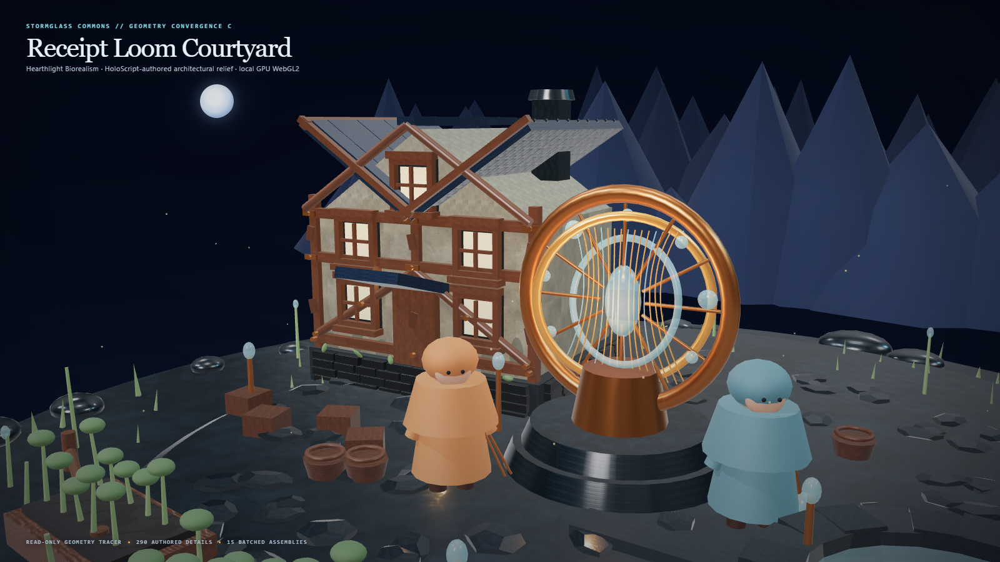

# Model Village MV-V1 — Geometry Convergence C

Date: 2026-07-27
Status: PASS, bounded architectural-development witness
World: Stormglass Commons
Style: Hearthlight Biorealism

## Result

The Receipt Loom courtyard now inherits the immutable Art Convergence A scene
and Material Convergence B surfaces, then materializes five additional
HoloScript-authored architectural kits on the hero cottage:

- 61 masonry elements: one dark mortar/foundation backing and 60 individually
  placed basalt blocks across the front and east foundation faces;
- 140 roof elements: 126 overlapping slate tiles, ten ridge caps, and four
  timber fascia boards;
- 50 window elements: five dark reveals, five set-back hearth-glass panels,
  and 40 proud trim, sill, drip-cap, and mullion pieces;
- 25 timber-joinery elements: 13 bronze pegs, six repair plates, and six scarf
  keys;
- 14 weathering elements: eight low plaster damp marks and six moss pockets.

The resulting 290 detail instances execute in 15 `InstancedMesh` batches. The
bridge hides only the 16 inherited flat window proxy parts and one inherited
foundation proxy before applying their HoloScript-declared replacements. The A
and B sources, checkers, manifests, material synthesis, and accepted B hero are
hash-pinned and remain unchanged.

## Visual review

The durable image was visually inspected at its native 1600×900 resolution
against Material Convergence B and the Stormglass Commons concept.

Accepted gains:

- the cottage now has a readable stone course and mortar bed instead of one
  uninterrupted foundation slab;
- overlapping roof pieces create edge thickness, a shingle silhouette, a
  repaired ridge, and timber fascia;
- four facade windows plus one gable window carry layered dark reveals,
  set-back warm panes, proud frames, sill/drip profiles, and mullions;
- bronze peg heads, repair plates, and timber scarf keys make structural
  intersections read as assembled and maintained;
- restrained damp and moss detail begins the visible repair/weather history
  required by Hearthlight Biorealism;
- a HoloScript-owned inspection camera keeps both the cottage detail and the
  Receipt Loom civic context legible.

Five GPU image iterations were inspected. The initial frame kept the cottage
too small. Later passes tightened the camera, added the missing gable window,
reduced the basalt sheen, separated the Loom from the cottage, and replaced the
light inherited foundation bed with a dark mortar backing. The fifth frame is
the accepted Geometry C witness.

The result is materially closer to the concept than B, but it is still
procedural stylized architecture. It does not yet match the concept's building
count, handcrafted mesh irregularity, vegetation density, atmosphere, resident
quality, cloth, water, warm practical-light coverage, or cinematic grading.



## Provenance route

```text
HoloScript Geometry Convergence C
  -> deterministic 290-instance placement plan
  -> immutable Art Convergence A application
  -> immutable Material Convergence B texture bindings
  -> 15 batched architectural assemblies
  -> Chromium plan and material-byte verification
  -> WebGL2 / ANGLE D3D11 render
  -> inspected durable hero and witness receipt
```

No model, texture, decoder, or HDRI network request is used. JavaScript is the
deterministic materialization, browser binding, GPU capture, and receipt bridge.
The `.holo` source owns kit purpose, quantities, seeds, primitives, dimensions,
camera, batching budget, inherited-proxy boundary, and claim boundary.

## Hardware witness

| Field | Result |
|---|---|
| GPU | NVIDIA GeForce RTX 3060 Laptop GPU |
| Browser | Chrome 150.0.7871.182 |
| API | WebGL 2.0 |
| Backend | ANGLE Direct3D11 / D3D11 |
| Software renderer | false |
| Resolution | 1600×900 |
| Draw calls, shadow-inclusive | 503 |
| Triangles | 71,108 |
| Geometries | 412 |
| Textures | 21 |
| Materials | 30 |
| Detail instances | 290 |
| Detail batches | 15 |
| Shadow-casting detail batches | 12 |
| External requests | 0 |
| Page errors | 0 |

These are single captured-frame render counters, not a production frame-time
distribution or a real-time performance claim.

## Receipt

- Receipt schema:
  `hololand.model-village.geometry-convergence-witness.v1`
- Receipt SHA-256:
  `11d6153d0704049194d9baadbae86e41cd1968d0f85aae8c1021fdfdeb79c2b3`
- Overlay source SHA-256:
  `1f6f495e63bfd17afeb8d83fc6640efbd1f9fe0e1708224f6a53fdd70f12e530`
- Overlay SceneIR SHA-256:
  `cab8f47f484004456bde55e6c6ce0743d5e7d9a091765cccc334f9c963abd6c1`
- Deterministic geometry-plan SHA-256:
  `fc05193f42883cf0a1368b4cdc8201cd4e7d1f2c9fa61dc886ec875550805538`
- Hero SHA-256:
  `ddc7eed44c2793c4ba51cf1ce818a3eca46c97701d3ac33a241c3307b5d05648`
- Ephemeral receipt:
  `.tmp/hololand/model-village/geometry-convergence-c/geometry-convergence-c-witness.json`

## Truth boundary

Verified:

- five HoloScript-owned architectural detail kits;
- 290 deterministic placement instances and 15 batches;
- exact geometry-plan hash agreement between Node and Chromium;
- inherited B material-byte agreement inside Chromium;
- immutable A and B witness inheritance;
- local hardware WebGL2/D3D11 render;
- read-only, zero-model-call, zero-network-request execution;
- continued public-family and exact-model identity neutrality.

Not claimed:

- production resident convergence or named model-family embodiments;
- scanned or production-authored architectural assets;
- atmosphere, vegetation, cloth, water, or audio convergence;
- full modular-building or full-world convergence;
- gameplay-physics convergence;
- photorealism, path tracing, ray-traced global illumination, or HDRI;
- production frame-time distribution or real-time performance.

## Next visual gates

1. Atmosphere Convergence D: sealed mist/rain state, practical lantern
   coverage, wetness accumulation, restrained smoke, water movement, foliage
   response, and contact-shadow tuning.
2. Resident Convergence E: receipted production bodies, cloth, hair, faces,
   animation, and separate admitted family-mantle projection.
3. Performance Convergence F: representative frame-time distributions,
   batching/LOD refinement, and laptop plus target-device profiles.
4. District scale-out: reuse the authored architectural grammar across the
   Water Court, Repair Bridge, Harvest Lattice, workshop, and mezzanine without
   weakening the live-blinded research boundary.
