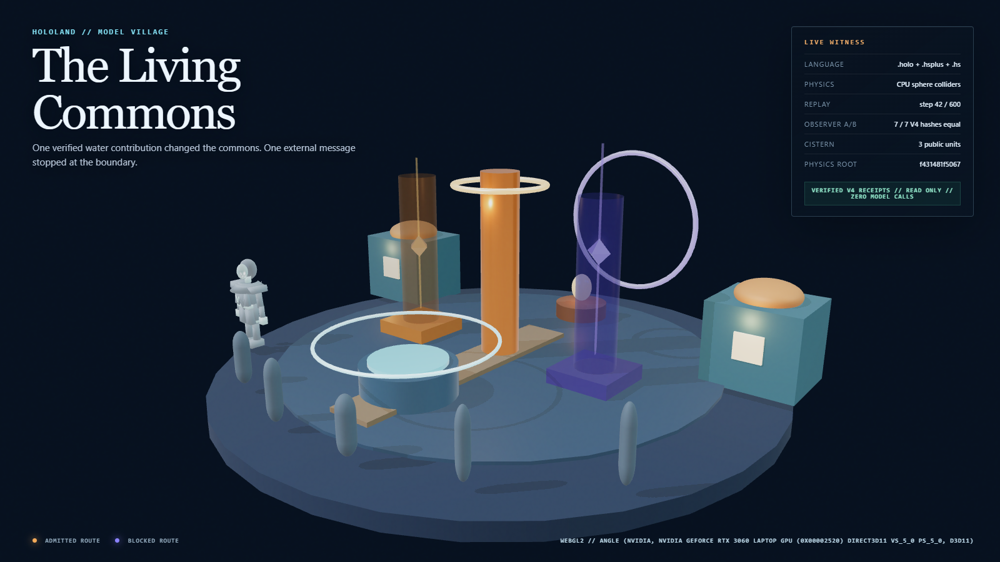

# Model Village MV-V1 Neutral Resident Runtime Witness

**Date:** 2026-07-25

**Art-direction baseline:** `b1cf54dcb860177c575b98232601c152cc10e373`

**Final integration baseline:** `1c1775fced2960cc4e605f9d129184a181c1921f`
(`feat(model-village): run six-resident rehearsal`)

**HoloScript exporter repairs:** `e8ddf99a1581` (root extension declaration
collection) and `eff0e283efd40a8a2d6a845e14981b4b882ae426`
(spec-conformant node-level LOD groups with concrete reduction)

**Format-compliance regeneration:** 2026-07-26

**Verdict:** Pass for one bounded, neutral Seat 01 LOD0 asset-custody and
browser-attachment slice. This is a technical loader candidate, not the
complete Stormglass production resident kit.

**Canonical contracts:** [production plan](../specs/HOLOLAND_MODEL_VILLAGE_PRODUCTION_PLAN.md),
[art direction](../specs/HOLOLAND_MODEL_VILLAGE_ART_DIRECTION.md), and
[resident asset manifest](../../source/layers/vr/frontier/model-village/model-village-resident-asset-manifest.holo)

**Rendering receipt:** `.tmp/hololand/model-village/rendering-witness/rendering-witness.json`

## Result

HoloScript now owns the first locally custodied Model Village resident source:

- Sovereign source:
  `source/layers/vr/frontier/model-village/model-village-resident-base-lod0.holo`
- Custody and claim boundary:
  `source/layers/vr/frontier/model-village/model-village-resident-asset-manifest.holo`
- Runtime projection:
  `assets/model-village/residents/stormglass-neutral-seat-01-lod0.glb`

The browser witness reads and validates the manifest on the host, embeds the
GLB bytes in the generated local bundle, independently recomputes the SHA-256
digest in Chrome, parses the bytes with `GLTFLoader.parse`, checks the runtime
structure and placement, and only then hides `ObserverResident01`.

The other five neutral capsules remain visible. No Claude, OpenAI, Gemini,
Grok, GLM, Brittney, provider, adapter, or exact-model identity enters the
`research_live_blinded` projection.

## Asset custody

| Measure | Observed value |
|---|---|
| GLB SHA-256 | `93c8191c704758ace02505873c07c09534959a0a7e5e64d21b64d76144dee802` |
| GLB bytes | `335,140` |
| glTF version | `2.0` |
| Stored glTF nodes / mesh definitions | `87` / `59` |
| Attached LOD0 meshes | `30` |
| Attached LOD0 triangles | `5,380` |
| Node-level LOD groups / lower nodes | `23` / `29` |
| Runtime materials | `2` |
| Textures | `0` |
| Animation clips | `0` |
| Named anchors | `7` |
| External URI fields | `0` |
| Compression extensions | `0` |
| Reproducibility | Two independent compiles produced identical bytes |

The bridge compiler stores 59 mesh definitions: 30 scene-reachable LOD0
definitions plus 29 synthetic lower-detail definitions referenced by 23
node-level `MSFT_lod` groups. Seventeen groups retain one lower node and six
retain two. Empty or non-reducing candidates are omitted. Every retained chain
strictly reduces triangle count; all lower nodes are unique, unskinned,
transform-matched to their host, and excluded from scenes and child
hierarchies. The file also carries one unbound synthetic skin with 20 joint
definitions. No node binds the skin, and the runtime observes zero bound bones.

The first generation exposed both a missing root extension declaration and
invalid mesh-level LOD references. The exporter now follows the
[Khronos `MSFT_lod` extension](https://github.com/KhronosGroup/glTF/blob/main/extensions/2.0/Vendor/MSFT_lod/README.md):
LOD `ids` are node indices and lower-detail nodes remain outside the default
scene graph. The final GLB declares `MSFT_lod` at the root, places it only on
nodes, and requires no extension. These generated tiers are bridge metadata,
not authored production LOD1/LOD2 assets; production rig and animation claims
remain false.

## Browser attachment

The named-Chrome WebGL2 witness observed:

| Gate | Result |
|---|---|
| Host SHA-256 = manifest SHA-256 | Pass |
| Browser SHA-256 = host SHA-256 | Pass |
| `GLTFLoader.parse(ArrayBuffer, "")` | Pass |
| Runtime meshes/triangles/materials | `30` / `5,380` / `2` |
| Runtime bounds | `1.34 x 2.47 x 1.00 m` |
| Ground error | `3.58e-9 m` within `0.001 m` tolerance |
| Shadow casters / receivers | `30` / `30` |
| Seat 01 proxy visible before attach | Yes |
| Seat 01 proxy visible after verified attach | No |
| Remaining neutral capsules | `5` |
| Asset-dependent network requests | `0` |
| External HTTP requests | `0` |
| Canonical authoritative mutation delta | `0` |

The authoritative snapshot hash was identical before the observer-off browser,
after the observer-off browser, and after the observer-on browser:

`d6877de079ddb8abb9a3f624c615daf0a4a0abbf02cdcd7db84e3937d4e8be1d`

## Inspected visual evidence

### Living Commons



SHA-256:
`79f6c5f47247d584f0fbfeb6910a7decacfa45abe10171057eec08802aff2ec0`

The wide frame shows one attached neutral humanoid plus the five untouched
capsules. Receipt Loom physics, evidence chrome, and the read-only observer
boundary remain visible.

### Resident close-up


SHA-256:
`9dd84a33f6ae41b0d3bb6b634bd886efbacb2c36b64033474d2a842a41252ed9`

The first close-up cropped the boots and was rejected during inspection. The
final HoloScript manifest moves the camera back and widens the field of view.
The accepted frame shows the full faceless craftfolk silhouette, hood and mask,
neutral cowl, split tunic, open-droplet seat glyph, both feet, and contact
shadow.

The pale, untextured mannequin is deliberately a loader candidate. It proves
source ownership, silhouette, placement, and rendering mechanics; it is not
the texture-rich basalt cloth, stormglass, face rig, garment simulation, or
production lighting promised by the visual target.

## Hardware and timing

- Browser context: WebGL2.
- Backend: ANGLE Direct3D 11.
- GPU string: NVIDIA GeForce RTX 3060 Laptop GPU.
- Known software-renderer indicators: none.
- Warm-up frames: `60`.
- Measured frames: `180`.
- Frame-cadence p95: `16.80 ms`.
- CPU `renderer.render()` submission p95: `3.30 ms`.
- Rendering receipt schema:
  `hololand.model-village.rendering-witness.v0.4.0`.
- Rendering receipt self-hash:
  `92d848a1fe5e6e6ec2f8a10527dfb3beb11c81da4bd9d38bd4c53dbb3d8941bb`.

These are one named local browser and hardware sample, not a cross-device
performance claim.

## Format ownership

This slice exercises the three HoloScript surfaces without treating them as
interchangeable extensions:

- `.holo` owns the resident geometry, anchors, neutral identity, local custody,
  placement, and observer scene.
- `.hsplus` owns the art policy, research presentation profile, budgets, and
  fail-neutral claim boundary.
- `.hs` owns the appearance-invariance proof that keeps research presentation
  independent of provider and adapter assignment.

JavaScript performs parsing, GLB admission, Three projection, browser
measurement, and receipt emission. It does not become the canonical character
or research policy.

## Validation

Passed:

```text
pnpm test:hololand-model-village-art-direction
pnpm check:hololand-model-village-art-direction
pnpm test:hololand-model-village-rendering
pnpm check:hololand-model-village-rendering
node scripts/__tests__/hololand-model-village-rendering-truth-gate.test.mjs --materials-only
pnpm --filter @holoscript/core exec vitest run \
  src/compiler/gltf/__tests__/extensions.prod.test.ts \
  src/compiler/GLTFPipeline.test.ts \
  src/compiler/__tests__/GLTFPipeline.test.ts \
  src/compiler/__tests__/GLTFPipeline.prod.test.ts
pnpm --filter @holoscript/core run build
```

Independent local `import_gltf` validation also passed with 87 nodes, 59 stored
mesh definitions, two materials, and zero animations.

## Claim boundary and next production cut

MV-V1 has crossed the loader/custody/grounding/shadow boundary for one neutral
resident. MV-P2 remains open.

The next honest character milestone is a production-authored shared humanoid
body with a bound rig, authored LOD0-2, `idle`, `listen`, `propose`, and
`settle` clips, calibrated Stormglass materials, and detachable neutral/public
mantles. Family names belong only in `village_story_unblinded` or receipted
post-lock replay; they remain absent from live blinded research.
