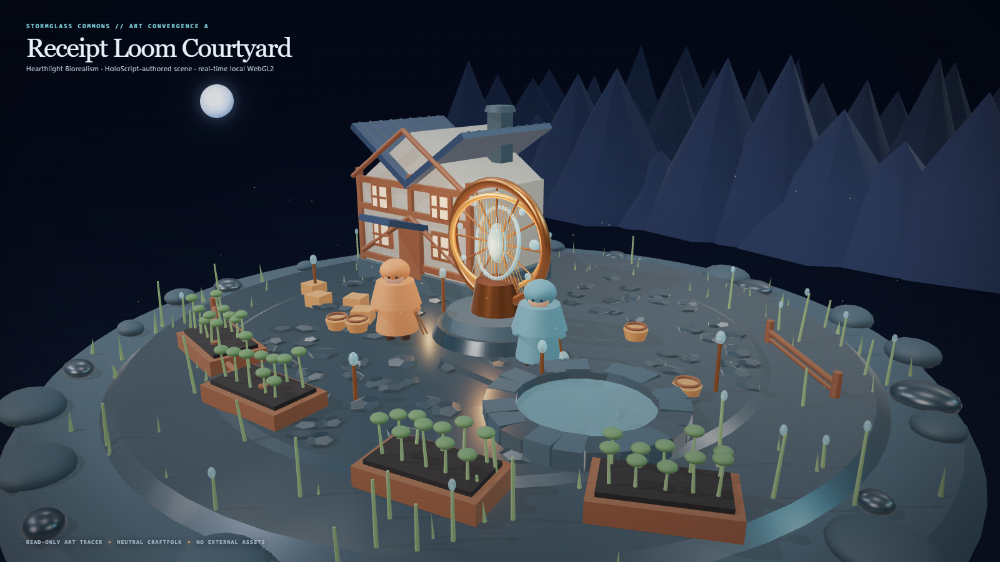

# HoloLand Model Village MV-V1 — Receipt Loom Courtyard Art Convergence A

Date: 2026-07-27

Status: accepted bounded tracer

World: Stormglass Commons

Style: Hearthlight Biorealism

## Outcome

The first environment-quality tracer is now implemented as HoloScript source
and rendered through the local HoloLand browser/GPU path. It establishes a
specific production grammar rather than extending the former primitive
greybox:

- a timber, lime-plaster, slate, and basalt cottage kit;
- a three-ring aged-bronze Receipt Loom with stormglass nodes and receipt
  threads;
- a terraced wet-basalt courtyard with 118 deterministic cobbles;
- a hand-set 22-stone cistern rim and visible water surface;
- raised working gardens, reeds, stormglass buds, railings, lanterns, baskets,
  crates, and tools;
- a layered mountain silhouette, indigo blue-hour sky, and locked storm moon;
- two neutral Craftfolk staging forms with tools and layered costume
  silhouettes.

The authored source is
[`model-village-receipt-loom-courtyard.holo`](../../source/layers/vr/frontier/model-village/model-village-receipt-loom-courtyard.holo).
The accepted 1600×900 capture is
[`model-village-receipt-loom-courtyard-art-convergence-a-2026-07-27.png`](../assets/model-village/model-village-receipt-loom-courtyard-art-convergence-a-2026-07-27.png).

## Visual review

The capture was visually inspected after three rejected/tuned GPU iterations.
It is a material improvement over the existing Model Village greybox:

- the Loom is a clear lower-center hero;
- the cottage, cistern, residents, and planted foreground form a readable
  near/mid/far composition;
- warm receipt light separates from the cool moon/ridge palette;
- wet basalt, bronze, stormglass, plaster, timber, cloth, water, soil, and
  foliage read as distinct material families;
- the village occupies 70.67% of viewport width and 77.57% of viewport height
  at the locked 1600×900 camera.

This is not yet a claim of concept-art photorealism. The accepted tracer is
still procedurally modeled and stylized. It lacks authored/baked high-frequency
surface maps, production resident meshes, dense natural foliage, cloth
simulation, and the architectural breadth visible in the concept. Those gaps
are intentionally preserved below as the next production work rather than
hidden behind the word “realistic.”

### Reference


### Accepted runtime capture



## Source and research boundary

The browser is a presentation adapter. Visible world semantics, palette,
camera, lighting, kit counts, quality budget, resident status, and claim
boundaries are owned by the `.holo` composition.

The tracer is read-only:

- canonical writes: disabled;
- model calls: zero;
- external browser requests: zero;
- public family identity: absent;
- exact model identity: absent;
- resident status: neutral Craftfolk staging form;
- production resident claim: false;
- live blinded research compatibility: retained.

Named Claude, OpenAI, Gemini, Grok, GLM, and Brittney embodiments remain a
separate unblinded production presentation layer. This art tracer neither
reveals nor joins those identities into the live research condition.

## Hardware witness

The accepted capture passed on the owned laptop:

| Field | Witness |
|---|---|
| GPU | NVIDIA GeForce RTX 3060 Laptop GPU |
| API | WebGL 2.0 |
| Browser backend | ANGLE Direct3D11 / D3D11 |
| Software renderer | false |
| Output | sRGB |
| Tone mapping | ACES Filmic |
| Exposure | 1.08 |
| Shadows | PCF Soft |
| Environment | local procedural Three RoomEnvironment/PMREM |
| Triangles | 80,692 |
| Draw calls | 742, shadow-inclusive |
| Materials | 23 |
| External requests | 0 |
| Screenshot | 1600×900, 942,357 bytes |

Witness receipt:
`c026e0e820df5cce22588f0c52451f99948898fde5ef8bfac31d9b6a684f1555`

Hero SHA-256:
`83dd9e31b0df2222737a1f10c76d3f64635a1d86ce6aef583fcb41d6dc89821a`

The durable hash manifest is
[`model-village-receipt-loom-courtyard-manifest.holo`](../../source/layers/vr/frontier/model-village/model-village-receipt-loom-courtyard-manifest.holo).

## Validation

```powershell
node --test scripts/__tests__/hololand-model-village-receipt-loom-courtyard.test.mjs
node scripts/check-hololand-model-village-receipt-loom-courtyard.mjs `
  --timeout-ms 90000 `
  --hero-output docs/assets/model-village/model-village-receipt-loom-courtyard-art-convergence-a-2026-07-27.png
```

The focused suite proves:

- both `.holo` sources parse through `HoloCompositionParser`;
- the courtyard compiles through `SceneIRCompiler`;
- all ten authored presentation kits are present;
- family-identity leakage fails closed;
- canonical-write and network-fetch mutations fail closed;
- the accepted browser is real WebGL2 on D3D11 hardware;
- sRGB, ACES, exposure, PCF Soft shadows, and local PMREM are applied;
- the render stays inside declared triangle, draw-call, material, and framing
  budgets;
- the screenshot is exactly 1600×900;
- the browser makes no external requests.

## Typed continuation

The next visual-realism units should proceed in this order:

1. Replace the cottage’s flat procedural surfaces with local, provenance-bound
   PBR sets: albedo, normal, roughness, and controlled wetness masks.
2. Replace both neutral staging forms with two production resident GLBs while
   keeping identity presentation separate from experiment state.
3. Add close-contact realism: cloth secondary motion, water response, foliage
   wind, tool/body contacts, foot planting, and wet-footstep decals.
4. Optimize repeated garden, slate, prop, and stone geometry into instanced or
   merged batches before scaling this density to the full Commons.
5. Promote the approved cottage/Loom/courtyard material grammar into the
   canonical observer only after a research-boundary review.
6. Scale outward district by district, holding the same locked camera,
   screenshot, frame-cost, and no-feedback receipts for each slice.
