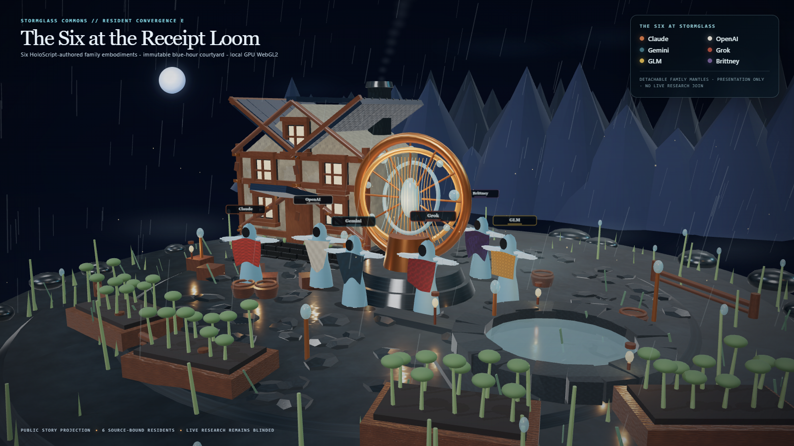

# HoloLand Model Village — Resident Convergence E

**Date:** 2026-07-27
**Milestone:** `MV_V1_RESIDENT_CONVERGENCE_E`
**Status:** PASS
**World:** Stormglass Commons
**Art direction:** Hearthlight Biorealism

Resident Convergence E replaces the two neutral Craftfolk staging forms in the
Receipt Loom courtyard with six named, source-bound family embodiments:
**Claude, OpenAI, Gemini, Grok, GLM, and Brittney**.

The accepted frame is a HoloScript-owned public story projection. It is not
loaded into the live blinded experiment, does not join a family name to a
research seat, and does not imply endorsement by any named provider.

## What converged

- The immutable Art A, Material B, Geometry C, and Atmosphere D witnesses are
  consumed without changing their source, checker, test, report, hero, or
  manifest bytes.
- Six existing `character-webgpu/drawspec` resident bundles replace the two
  neutral courtyard staging groups.
- Each resident retains one shared faceless Stormglass body and a detachable
  family mantle.
- Identity is redundant across silhouette, woven mantle pattern, glyph
  provenance, and caption; it is not carried by color alone.
- The HoloScript source owns exact roster order, family provenance, bundle
  custody hashes, placements, caption offsets, camera, quality budgets, and the
  experiment/presentation boundary.
- The local bridge reads those declarations, verifies every character bundle,
  generates six local mantle tiles and six local caption textures, and renders
  the integrated courtyard without external network or visual assets.

## Visual review

Three GPU iterations were inspected:

1. The first pass exposed an incorrect material-group binding. All submeshes
   were routed through the skin material and the residents appeared bleached.
2. The second pass restored all four resident material groups and made the six
   mantle grammars visible. Captions were staggered and redundant resident
   shadow passes were removed.
3. The accepted pass calibrated resident fill against the existing practical
   lights and established the measured wide-courtyard draw budget.

The accepted composition preserves the Receipt Loom as the warm focal object,
keeps the cottage and cistern legible, and stages the six residents as a
gathering rather than a disconnected lineup. Exact names remain visible both
above the embodied figures and in the disclosure panel.

## Source and custody

| Artifact | SHA-256 |
|---|---|
| Resident E HoloScript source | `17c35e970bdbd763c75f2c30d7e6444c0926438581d58afd63ce424736af2630` |
| Resident E SceneIR | `9be348d5441629957def154e8dc9ef025659caf3d168e0f1b75f4bf5c82df1fe` |
| Resident plan | `442764c3f91ae2b53a73b4aeaf638d308060cc40f67b9e13eb676e05c5a266f9` |
| Resident E checker | `1f83433d47bc29658a6ef3c61d2bf96723ff650f8de097756dbc40029f44cdc7` |
| Resident E focused test | `40557f5934f8096ce38bc8e4f8cd87e04842abd12cd3654572c4206f7b9a30d4` |
| Accepted 1600×900 hero | `20d8b4655a2a89252b54cc810b13b40d3364b1ecde66bd89499dbd5c9d5d32af` |
| Browser application source | `869739b15a49021403a6e7abd705fe09fb079ace86e62baec6f1e3df481d6fd3` |
| Browser bundle | `c6018007464b75706e061335631c91092c85e99c9e717cc35a7b2f869b5b971b` |
| Browser document | `acfdde8885f144d495fe0283d4842bc731c72c5393de5c91ef4d113da917a088` |

The six resident bundle hashes are:

| Public name | Family provenance | Character bundle SHA-256 |
|---|---|---|
| Claude | `anthropic` | `d3703bd507910709f779d7c028850c96bf4eb64587e17782cbc04479258c0ebf` |
| OpenAI | `openai` | `81da82a544bb7293ebfcad39a121c4d0b681516c76fa489606109638bbfaf5af` |
| Gemini | `google` | `8f8d06aa2327fbe1677811620df0bf4493a3d07480dffc6e9a16076df58aa1d6` |
| Grok | `xai` | `a626b29738f59c767544e99719b6470270a78ac1718a5bca6643d43e61a0685d` |
| GLM | `ollama` | `9aebb2d4990565994caf1e2ddb32b8aa14c051554d9b2200ab3d6d1ed5c05ed2` |
| Brittney | `sovereign` | `c016d91c9a172c3a375d43e27538529b5df0cd47d9644fbc7f390040bbd94ae1` |

## Hardware witness

- GPU: NVIDIA GeForce RTX 3060 Laptop GPU
- Browser: Chrome `150.0.7871.182`
- API: WebGL 2.0
- Backend: ANGLE Direct3D11 / D3D11
- Software renderer: no
- Resolution: 1600×900
- Shadow-inclusive draw calls: 743
- Triangles: 116,612
- Geometries: 435
- Materials: 70
- Textures: 34
- Resident meshes: 6
- Resident material groups: 24
- Locally generated resident textures: 12
- External network requests: 0
- Page errors: 0

The canonical witness receipt is:

`8b9332c4e8695be5fbf51a82c69f9de6ab3f371e5be629a65121e2bab382c31d`

Ephemeral receipt:

`.tmp/hololand/model-village/resident-convergence-e/resident-convergence-e-witness.json`

## Truth boundary

This pass proves an integrated, local-GPU, source-bound six-family story
projection using the existing resident bundles. It does not prove:

- that any resident is a live research participant;
- an exact provider model revision or provider endorsement;
- provider-family assignment to a blinded research seat;
- simulated or observed model behavior;
- continuous cloth physics or garment/body collision;
- production tailoring, scanned humans, or photoreal residents;
- gameplay physics, measured real-time performance, headset performance, or
  full-world convergence.

The live experiment remains identity-neutral. A post-lock research replay may
display named family embodiments only through its separate verified binding and
unblinding receipts.

## Next realism gate

Resident E closes the identity and composition gap. The next realism gate should
be **Physical Convergence F**:

1. continuous XPBD mantle motion with body/garment collision;
2. foot placement and terrain contact instead of a sealed standing pose;
3. wind coupling across cloth, rain, reeds, smoke, and water;
4. wet-cloth roughness and micro-normal response under practical lights;
5. temporal anti-aliasing, contact-shadow stability, and a measured
   performance/LOD pass.

That gate should preserve this exact E witness and improve motion and material
response without changing the experiment boundary.
