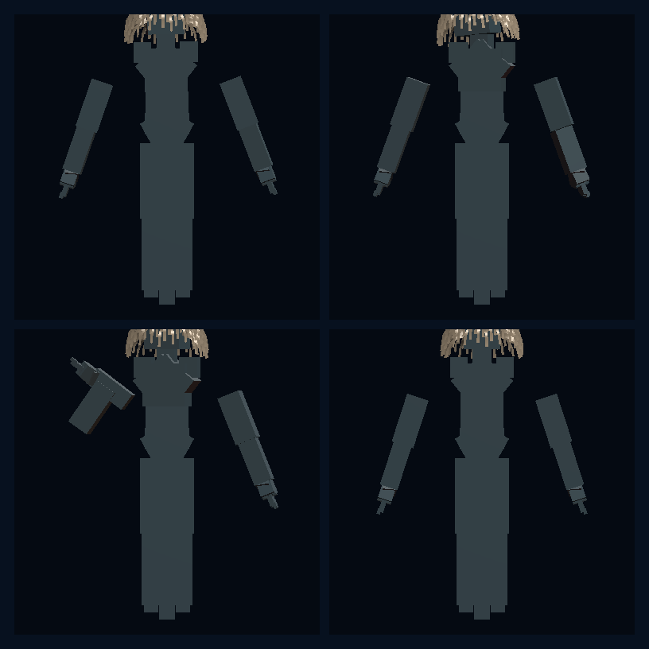

# Model Village MV-V2 Sovereign Resident Rig

**Status:** PASS, bounded technical witness

**Date:** 2026-07-26

**Claim:** An identity-neutral HoloScript resident source compiles
deterministically through the sovereign `character-webgpu` target to a live
skinned character draw spec, and four receipt-gated semantic pose pairs render
distinct, exactly replayable native-WebGPU pixels.

This does not close MV-P2. The witnessed body is procedural rig geometry, not
the finished faceless Stormglass garment resident.

## Outcome

MV-V2 establishes a native character lane beside the MV-V1 GLB loader bridge.
The canonical source is
`source/layers/vr/frontier/model-village/model-village-resident-shared-rig.holo`.
It is provider-, model-, and family-neutral and authors:

- the supported `humanoid_65` rig contract, whose live palette contains 55
  joints;
- body scale and an explicit Stormglass base/scatter material response;
- a Marschner-hair material input and the current disclosed hood-style geometry
  boundary;
- two pose samples for each of `idle`, `listen`, `propose`, and `settle`;
- the receipt class required before each state may be shown.

The source compiled twice to byte-identical output without a fallback. The
bundle, semantic hashes, screenshots, and current limitation flags are pinned
by
`source/layers/vr/frontier/model-village/model-village-resident-rig-manifest.holo`.

## Native GPU witness



The screenshot is a real 384 x 384-per-cell render from HoloScript's native
offscreen WebGPU character renderer on the local NVIDIA GeForce RTX 3060 Laptop
GPU through Dawn/D3D12. It is not concept art and has not been retouched.

| Evidence | Observed |
|---|---:|
| Serialized bundle | 661,871 bytes |
| Live joint palette | 55 |
| Vertices | 4,238 |
| Indices / triangles | 9,252 / 3,084 |
| Material groups | 3 |
| Material models | skin-SSS, Marschner hair, refractive eye |
| Semantic states | idle, listen, propose, settle |
| Repeated compile | byte-identical |
| Semantic replay | zero changed pixels for all four replays |
| External HTTP(S) fetches | 0 |

The first GPU render included pipeline warm-up at 62.338 ms. The remaining
measured authored samples were 1.548-6.844 ms each in this bounded offscreen
capture. This is not a real-time frame-rate benchmark.

| State | Changed pixels from sample A to B | Visible pixels in sample B |
|---|---:|---:|
| idle | 7,951 | 31,194 |
| listen | 16,898 | 32,420 |
| propose | 19,244 | 32,003 |
| settle | 15,048 | 30,819 |

## Rendering correction discovered by visual review

The first inspected GPU capture rendered the authored steel-blue resident as
brown. The cause was a fixed human-skin subsurface scatter color in the native
character host. HoloScript engine commit
`3614129c2fc123b7d1b47feda65888b4fb7f9b5b` adds the operative
`@subsurface_scattering(scatter_color)` authoring channel while preserving the
human preset when it is omitted.

That correction passed:

- 7 focused `CharacterHostFromComposition` tests;
- the `@holoscript/engine` build and enforced type check;
- all 3 `CharacterWebGPUCompiler` tests;
- the regenerated HoloLand bundle and GPU pixel gate.

This is the useful language novelty in the slice: the `.holo` file is not only
a scene description. It is an executable, identity-neutral character/material/
semantic-motion contract that compiles to owned GPU data and carries its own
admission boundary.

## Architecture decision

The general GLTF compiler remains a compatibility bridge. Its current generic
path adds a synthetic armature but does not bind scene mesh nodes to that skin.
MV-V2 therefore does not promote that armature as the Model Village rig.

The sovereign lane is:

```text
neutral .holo character source
  -> character-webgpu compiler
  -> CharacterDrawSpec bundle
  -> CharacterHost pose palette
  -> native WebGPU renderer
  -> pixel, bundle, source, and replay hashes
```

The MV-V1 GLB remains useful for observer loader, scale, grounding, shadow, and
custody proof. The two lanes have different evidence boundaries.

## Custody and tool boundary

The checker denied one relative startup fetch attempt for
`/holoscript_wasm_bg.wasm`; the parser/compiler used its local fallback and the
run still passed. No HTTP(S) fetch was attempted. This proves a guarded-process
run with external fetch denial, not an OS-level air gap.

The preferred local HoloScript MCP scanner/compiler calls were also attempted.
The local scanner required `tools:read`, the local compiler required
`tools:write`, and this seat held only `tools:codebase`; the hosted compiler
transport closed. The proof therefore used the same local built HoloScript
packages directly and records that tool-authorization boundary rather than
claiming MCP execution.

## Honest visual assessment

The revised steel/ice palette reads clearly and the four states are
distinguishable. The procedural generator still exposes hard segment seams at
the shoulders and wrists, block geometry, human hair/eye geometry, and no
faceless hood or garment silhouette. Those defects are useful red evidence:
this is a functioning rig/material/motion witness, not production character
art or realistic rendering.

## Remaining MV-P2 work

The next resident milestone is MV-V3:

1. author the actual faceless Stormglass garment body on the shared skeleton;
2. author real LOD0, LOD1, and LOD2 meshes rather than generated bridge tiers;
3. replace two-sample witnesses with continuous `idle`, `listen`, `propose`,
   and `settle` clips;
4. add locally custodied textures and cloth parameters;
5. bind the neutral body to one observer seat behind the existing hash,
   grounding, shadow, no-network, and nonmutation gates;
6. only then derive the six neutral silhouettes and detachable public family
   mantles.

Until those gates close, `completeMvP2Claimed` remains false.
