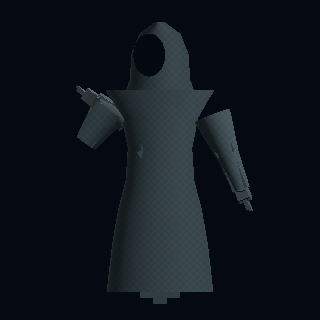
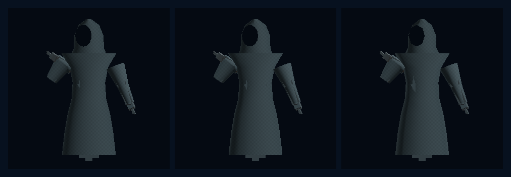
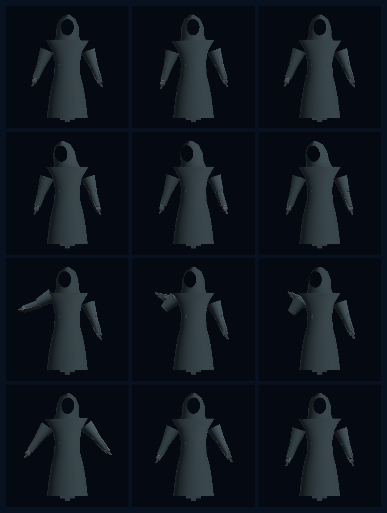

# Model Village MV-V3 Stormglass Production Body

**Status:** PASS, bounded production-shaped character witness

**Date:** 2026-07-26

**Claim:** Identity-neutral HoloScript source now drives an operative faceless
hooded garment, a native woven-cloth material, three genuinely different
source-authored LOD meshes, and continuously interpolated receipt-gated
semantic motion on the sovereign WebGPU character renderer.

This closes the MV-V3 body/LOD/motion slice. It does not close all of MV-P2.

## Outcome

The canonical source is
`source/layers/vr/frontier/model-village/model-village-resident-production-body.holo`.
It uses existing general-purpose language surfaces rather than a Model
Village-only format:

- `@clothing(style: "stormglass_hooded_tunic")` authors the cowl, tunic,
  sleeves, closed faceless visor, and garment color;
- `@lod(levels: [...])` authors radial topology for LOD0, LOD1, and LOD2;
- `@body`, `@skeleton`, and `@subsurface_scattering` retain the shared body and
  55-joint humanoid contract;
- four semantic clip objects author three keyframes each, continuous
  quaternion interpolation, presentation profiles, and the receipt needed
  before the state may be shown.

HoloScript engine commit
`06ff5a6fb2491aea45ac17813789833fb10101f0` makes those clothing and LOD
channels operative in the sovereign `character-webgpu` compiler. The source
compiled twice at every LOD to byte-identical bundles without a fallback.

## Native GPU witnesses

The hero is a direct 320 x 320 render from HoloScript's native offscreen
WebGPU character renderer. It was captured on the local NVIDIA GeForce RTX
3060 Laptop GPU through Dawn/D3D12 and was not retouched.

The three cells are LOD0, LOD1, and LOD2 from left to right at the same
semantic pose. The visibly increasing hood faceting is backed by monotonic
topology reduction, not an image resize or metadata-only tier.

| LOD | Distance | Garment segments | Vertices | Triangles | Bundle bytes |
|---|---:|---:|---:|---:|---:|
| LOD0 | 0 m | 24 | 2,089 | 1,524 | 217,887 |
| LOD1 | 12 m | 14 | 1,869 | 1,214 | 187,850 |
| LOD2 | 28 m | 8 | 1,737 | 1,028 | 166,662 |

All three use the same 55-joint palette and the same three native material
groups: `skin-sss`, `woven-cloth`, and `lambert` visor. Closed-hood characters
do not emit the procedural human hair or eye material groups.

## Continuous semantic motion

Rows are `idle`, `listen`, `propose`, and `settle`; columns sample normalized
times 0.125, 0.5, and 0.875. The validation run rendered nine times per clip,
not only the three contact-sheet cells.

| Clip | Authored keys | Rendered samples | Min / max adjacent changed pixels | Replay delta |
|---|---:|---:|---:|---:|
| idle | 3 | 9 | 7,453 / 11,497 | 0 |
| listen | 3 | 9 | 6,523 / 10,191 | 0 |
| propose | 3 | 9 | 3,262 / 8,378 | 0 |
| settle | 3 | 9 | 6,199 / 9,211 | 0 |

The evaluator uses shortest-path normalized quaternion interpolation with
smoothstep segment easing. Every adjacent sample changed thousands of pixels,
and the 0.375 replay was pixel-identical for all four clips.

## Look-development correction

The first numerically passing capture was visually rejected. It clipped the
hood out of frame, left a large block-leg shape below the robe, placed the
visor ambiguously in the hood surface, and separated the sleeves from the
torso.

The final pass:

- expanded the render framing so the complete hood is visible;
- extended and tapered the tunic toward the floor;
- widened the shoulder cowl and sleeve roots;
- moved the dark visor forward so the faceless read is unambiguous;
- retained deliberate angular craftfolk shoulders so lower LODs degrade
  coherently.

The result is a recognizable Stormglass resident silhouette rather than the
MV-V2 segmented human proxy. It is still procedural character art, not a
finished studio asset.

## Physics and rendering boundary

The garment has a native woven-cloth fragment model: rough highlight, grazing
fibre sheen, rim response, and deterministic world-space micro-weave breakup.
That is an operative rendering channel; changing the HoloScript garment color
or topology changes the GPU bundle and pixels.

It is not yet realistic cloth simulation. Sleeves and robe sections are
rigid-skinned to the humanoid palette. The source explicitly says
`cloth_physics: "authored_parameters_only_not_simulated"`, and the evidence
manifest keeps `clothSimulationObserved: false`.

The slice also has no authored UVs or texture maps, no fabric normal map, no
motion-capture retargeting, and no cinematic lighting pass. “Realistic
rendering” here means a real native GPU material and live skinned geometry,
not photorealism.

## Custody and validation

The final run observed:

- zero external HTTP(S) fetches;
- one denied relative startup request for `/holoscript_wasm_bg.wasm`, followed
  by the existing local parser/compiler fallback;
- no external DCC or provider asset;
- unchanged experiment, observer, and MV-V2 canonical sources;
- a passing local hardware audit confirming the RTX 3060 Laptop GPU and
  current driver.

This is a guarded-process custody witness, not an OS-level air gap.

The immutable source, bundle, screenshot, LOD, and motion hashes are pinned in
`source/layers/vr/frontier/model-village/model-village-resident-production-body-manifest.holo`.

## Remaining MV-P2 work

The next gate is MV-V4:

1. add locally custodied UVs and authored fabric/normal/mask textures;
2. make cloth parameters operative in a measured garment-physics pass;
3. replace rigid sleeve seams with blended skin weights or an imported
   sovereign mesh;
4. attach this neutral body to one observer seat behind the existing hash,
   grounding, shadow, no-network, and nonmutation gates;
5. author and validate one detachable public family mantle;
6. only then multiply to the full Claude, OpenAI, Gemini, Grok, and other
   model-family cast.

Until those gates close, `completeMvP2Claimed` remains false.
