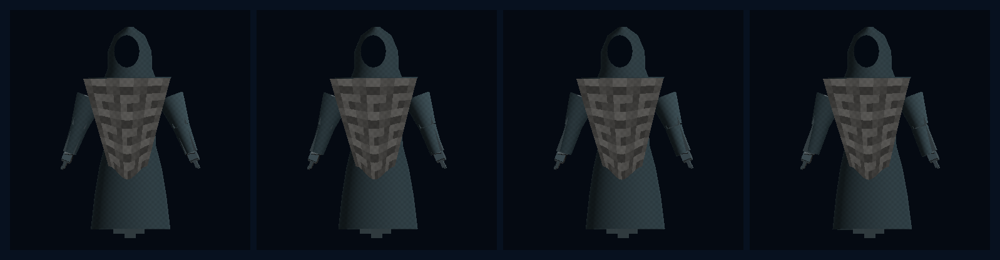
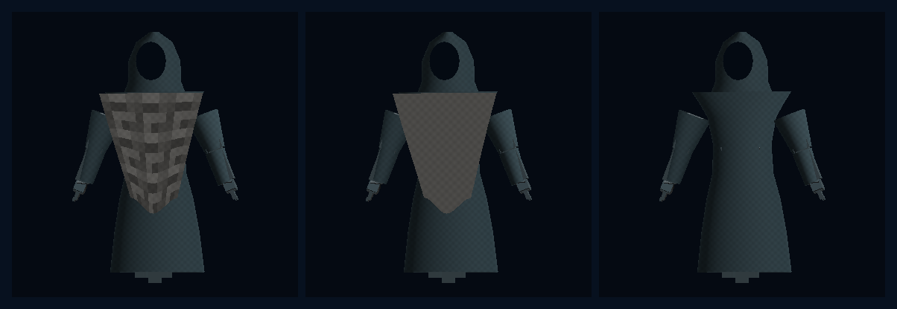

# Model Village MV-V4 OpenAI Cloth Mantle

**Status:** PASS, bounded story-presentation witness

**Date:** 2026-07-26

**Claim:** A story-only HoloScript source now drives the first named
model-family embodiment: OpenAI. The source compiles to a detachable shaped
mantle with locally custodied UV material maps, deterministic fixed-step cloth,
native WebGPU pixels, and a read-only observer attachment resolved from a
verified binding-receipt target.

This closes the first cloth/texture/mantle/attachment mechanism slice. It does
not close all of MV-P2 and does not assign OpenAI to a research seat.

## Source and language path

The canonical source is
`source/layers/vr/frontier/model-village/model-village-openai-cloth-mantle.holo`.
It uses general HoloScript language/runtime surfaces:

- `@clothing` selects the Stormglass body and the detachable
  `openai_recursive_interlock` mantle, including three repository-relative map
  references;
- `@cloth_simulation` authors XPBD, 120 Hz fixed steps, five iterations, wind,
  gravity, damping, tether/constraint stiffness, and a 0.18 m displacement
  ceiling;
- `@lod`, `@body`, `@skeleton`, `@subsurface_scattering`, and `@locomotion`
  remain normal character-language inputs;
- a second object authors the receipt-gated read-only observer-attachment
  policy without a static resident or seat binding.

The HoloScript engine feature landed in
`98c59f5328b929384819b479c101f1dd5fd7a3ee`; the shaped mantle revision is
`0ed0591de119c631aeb36200f30cedb3e41ac5a1`. The source compiled twice to the
same 247,746-byte bundle without fallback: 55 joints, 2,180 vertices, 1,668
triangles, and 2,180 UV pairs.

## Native GPU hero

This is a direct 384 x 384 capture from the HoloScript native offscreen WebGPU
character renderer on the local NVIDIA GeForce RTX 3060 Laptop GPU through
Dawn/D3D12. It was not retouched. The pearl recursive-cell design is an
original HoloLand interpretation, not OpenAI logo geometry.

The first passing render was rejected because the mantle read as a rectangular
apron with a harsh checker. The accepted pass widens the pinned shoulders,
tapers to a curved point, introduces slight view yaw, and lowers material-map
contrast so it reads as a detachable heraldic layer over the neutral body.

## Deterministic cloth

The four cells sample absolute times 0.2, 0.4, 0.6, and 0.8 seconds. The solver
always restarts from bind-space state and advances an integer step count.

| Time | Fixed steps | Max displacement | Position digest |
|---:|---:|---:|---|
| 0.0 s | 0 | 0.0000 m | `cfc78611` |
| 0.2 s | 24 | 0.0071 m | `60666b8e` |
| 0.4 s | 48 | 0.0216 m | `b8333dc4` |
| 0.6 s | 72 | 0.0324 m | `f73e5f3f` |
| 0.8 s | 96 | 0.0451 m | `91442a3c` |

The five samples have distinct position digests. Adjacent GPU frames changed
8,146 to 11,801 pixels. Replaying 0.6 seconds reproduced both the cloth digest
and the GPU image with zero changed pixels. The observed maximum stayed below
the authored 0.18 m bound.

This is an operative deterministic local-space cloth slice. It does not yet
implement body collision, self-collision, imported garment topology, or a
production tailoring workflow.

## Local UV material maps and detachability

The mantle resolves three local 4 x 4 semantic tiles:

| Map | Values | SHA-256 |
|---|---:|---|
| Albedo luminance | 16 | `6de8ffa331be8964b0fefae46037777a5bfad3f3b47c4fcb083c117e45f185fe` |
| Tangent-space normal XY | 32 | `01a40edd50cbae0d7d73c59d464cebca1256862795cdd8edb8463c61df3557b5` |
| Roughness | 16 | `5e045e55e95479b9b74157e89cf7f46d1daf5fa521a418740d3862082df5cc34` |

From left to right: textured mantle, the same mantle with its map tile removed,
and the neutral body with the mantle detached. Texture removal changed 14,928
pixels. Detachment reduced the character from 2,180 to 2,089 vertices, removed
the fourth woven-cloth material group, and changed 14,930 pixels.

These tiny tiles prove source-to-UV-to-shader material flow under local custody;
they are not a claim of production high-resolution textures.

## Observer attachment without a static family-seat join

The source does not name a target seat, resident, transform, adapter, persona,
or exact model revision. It declares:

- target object from
  `verified_family_binding_receipt.residentTargetObject`;
- target seat from `verified_family_binding_receipt.seatId`;
- story gallery placement from `public_gallery_layout_manifest`;
- post-lock placement from `verified_family_binding_receipt`;
- `researchSeatBinding`, `researchResidentBinding`,
  `researchPersonaBinding`, and `adapterAssignmentBinding` all `none`.

The checker used a verified, noncanonical in-memory fixture targeting
`ObserverResident01` / `seat-01`, resolved the existing observer pose, and
applied `[-6, 0.84, 3.7]` to the live CharacterHost model matrix. That proves
the runtime attachment mechanism. The fixture explicitly has
`canonicalAssignment: false`; it does not claim that OpenAI belongs to Seat 01.

The OpenAI name and mantle are allowed only in `village_story_unblinded`.
`research_live_blinded` remains denied. The overlay has no canonical write
authority, resident-observation write authority, or causal effect.

## Custody and claim boundary

The final witness observed:

- zero external HTTP(S) fetches;
- one denied relative startup request for `/holoscript_wasm_bg.wasm`, followed
  by the existing local parser/compiler path;
- zero external texture fetches;
- no DCC or provider asset;
- unchanged experiment, observer, and neutral MV-V3 body sources;
- byte-identical repeated compilation and pixel-identical cloth replay.

This is guarded-process and repository custody evidence, not an OS-level air
gap or a headset frame-rate claim.

The immutable hashes and measured values are pinned in
`source/layers/vr/frontier/model-village/model-village-openai-cloth-mantle-manifest.holo`.

## Next MV-P2 gate

MV-V5 should generalize the admitted mantle contract rather than copy this
source five times:

1. promote family mantle style/pattern/material descriptors into a typed keyed
   catalog consumed by one shared body;
2. add Claude, Gemini, Grok, GLM, and Brittney as detachable story overlays;
3. verify all six share identical body, rig, clip, physics, tool, and
   capability channels;
4. add a browser/observer consumer for verified post-lock attachments without
   weakening the current fail-neutral profile gate;
5. budget/consolidate resident materials and validate grayscale/CVD identity
   channels;
6. keep `completeMvP2Claimed: false` until the full observer and six-resident
   production gates pass.
