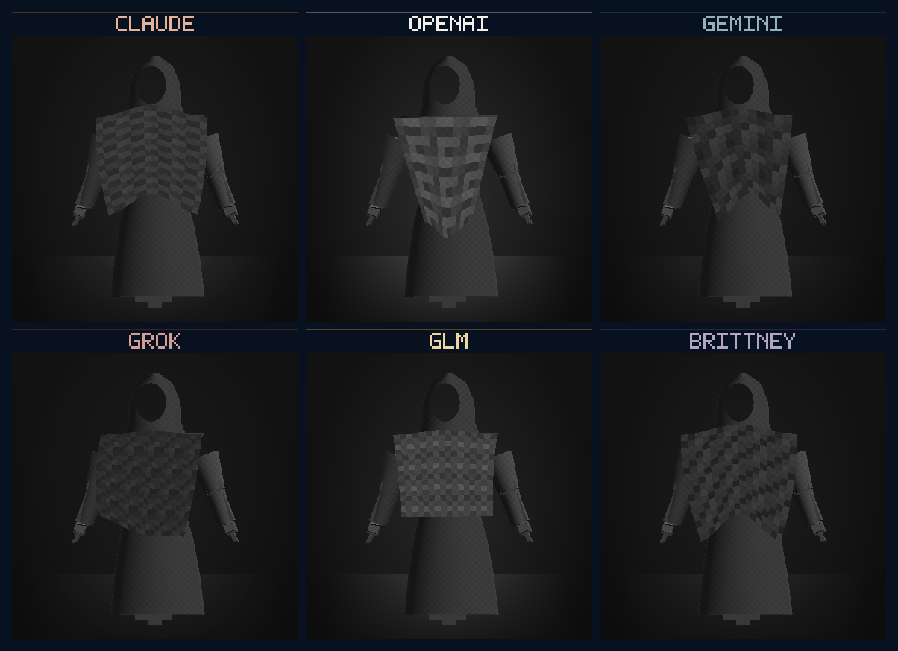
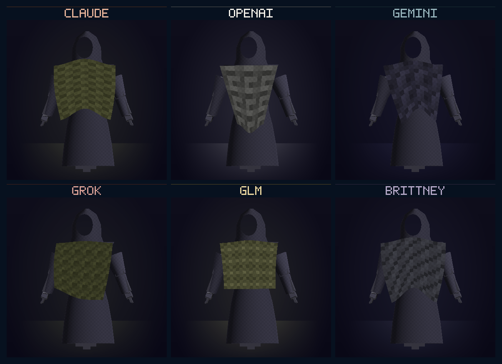

# Model Village MV-V5 — Typed Six-Family Mantles

**Date:** 2026-07-26  
**Status:** PASS — bounded native lineup witness  
**Milestone:** MV-V5  
**Claim boundary:** Six detachable story mantles now compile and render; the
browser consumer and complete MV-P2 production kit remain open.

## Result

One HoloScript composition now authors the named public cast — **Claude,
OpenAI, Gemini, Grok, GLM, and Brittney** — on one shared Stormglass body.
The sovereign `character-webgpu` compiler accepts `objectId`, so each resident
is selected from that single source instead of cloned into a family-specific
file. HoloScript owns a typed six-entry mantle catalog and uses a shared
same-topology procedural surface with family-specific silhouette parameters.

This is the first operative full-cast lineup. The figure pixels come from the
local native WebGPU/Dawn character renderer; the contact sheet adds only
labels, accent rules, and a Stormglass presentation background outside visible
character pixels.

## Source and policy boundary

- Source:
  `source/layers/vr/frontier/model-village/model-village-family-mantle-catalog.holo`
- Manifest:
  `source/layers/vr/frontier/model-village/model-village-family-mantle-catalog-manifest.holo`
- Presentation profile: `village_story_unblinded`
- Forbidden profile: `research_live_blinded`
- Exact model revisions: absent
- Provider endorsement claimed: false
- Canonical write authority: false
- Causal effect: false
- Static family-to-research join: false
- Research resident, seat, persona, role, and adapter bindings: all `none`

Every family object has no authored placement. All inherit the inert
`[0, 0, 0]` catalog rest position. A public gallery layout may place story
figures; any post-lock resident target must come from a verified family-binding
receipt. Catalog order and object name do not assign a research seat.

The required independent-project disclosure remains:

> HoloLand-authored visual interpretation; not affiliated with or endorsed by the named providers.

## Language and runtime work

HoloScript commit scope introduces:

- `AgentAvatarMantleCatalog.ts`, with six typed style IDs, family IDs, original
  HoloLand pattern/glyph IDs, accent colours, and procedural geometry profiles.
- General mantle construction in `AgentAvatarGarment.ts`; the OpenAI-only
  conditional is removed.
- Generic composition mapping for every catalog style, including catalog
  colour fallback.
- `character-webgpu` `objectId` propagation for deterministic selection inside
  a multi-resident composition.
- Regression tests proving one neutral body/garment prefix, one joint palette,
  same mantle topology, six distinct mantle position hashes, and compiler
  selection of the requested resident.

This is a sovereign compiler capability, not a provider-specific bridge: a
single `.holo` source is now a typed multi-character asset catalog whose
members can be compiled independently.

## Geometry and compiler evidence

Every family produced:

- 55 joints
- 2,180 vertices
- 1,668 triangles
- 2,180 UV pairs
- `skin-sss`, `woven-cloth`, `lambert`, `woven-cloth` material groups
- XPBD cloth at 120 Hz with five iterations
- zero stubbed authored traits
- byte-identical repeated compile output
- no compiler fallback

Detachment returns every resident to the same 2,089-vertex neutral
body/garment. Position, normal, tangent, index, joint-index, and joint-weight
hashes are byte-identical across all six neutral builds. The detachable mantle
adds 91 vertices in every case, while all six mantle position hashes differ.

Bundle sizes range from 247,731 to 247,881 bytes. The small differences are
serialized identity and material-reference strings, not different body data.

## Materials, cloth, and native GPU proof

Each mantle resolves a locally custodied 4 x 4 albedo-luminance, tangent-normal,
and roughness tile. The six tile IDs are unique, no provider assets are
required, and the witness attempted zero external network fetches.

At 0.6 seconds:

- every family advances exactly 72 fixed cloth steps;
- 366 vertices are dynamic;
- maximum displacement is 0.03136–0.03241 m, below the authored 0.18 m bound;
- every replay has the same cloth digest and zero changed pixels;
- detachment changes 14,695–19,057 native rendered pixels.

The live device reported NVIDIA Ampere / GeForce RTX 3060 Laptop GPU through
D3D12. The witness exercised shader-module, render-pipeline, texture, buffer,
and command-encoder creation through the native WebGPU device.

## Readability witnesses

All six colour, grayscale, and simulated-deuteranopia frames have distinct
pixel hashes. This is a bounded legibility check, not a complete accessibility
study. Names remain the redundant textual channel; silhouettes and patterns do
not rely on hue alone.

## Honest visual boundary

The witness is a considered procedural **Hearthlight Biorealism technical
lineup**, not the final cinematic bar. It proves shaped cloth, pattern, colour,
motion, native pixels, and a coherent family grammar. It does not yet prove
production tailoring, self-collision, body collision, high-resolution textile
scans, facial performance, environment integration, or headset performance.

## Verification

Passed:

- HoloScript engine targeted character tests: 17
- HoloScript core character compiler tests: 6
- HoloScript engine build
- HoloScript core build plus public type tests
- HoloLand six-family focused tests: 4
- Full MV-V5 source/catalog/compiler/material/native-GPU/manifest checker
- Local hardware baseline
- Zero external HTTP(S) fetches

Runtime receipt:

`.tmp/hololand/model-village/family-mantle-witness/family-mantle-witness.json`

## Next bounded action

MV-V6 should build the admitted browser/Studio consumer. It must load the six
compiled residents, apply public-gallery placement separately from research
seat order, display the independent-project disclosure, fail neutral without
verified profile admission, and preserve the canonical experiment hashes.
