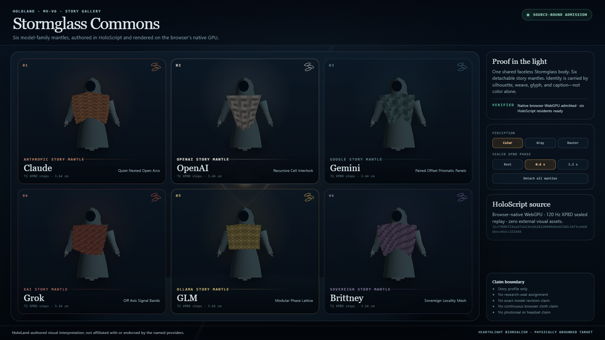
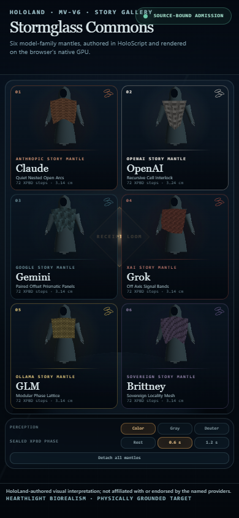
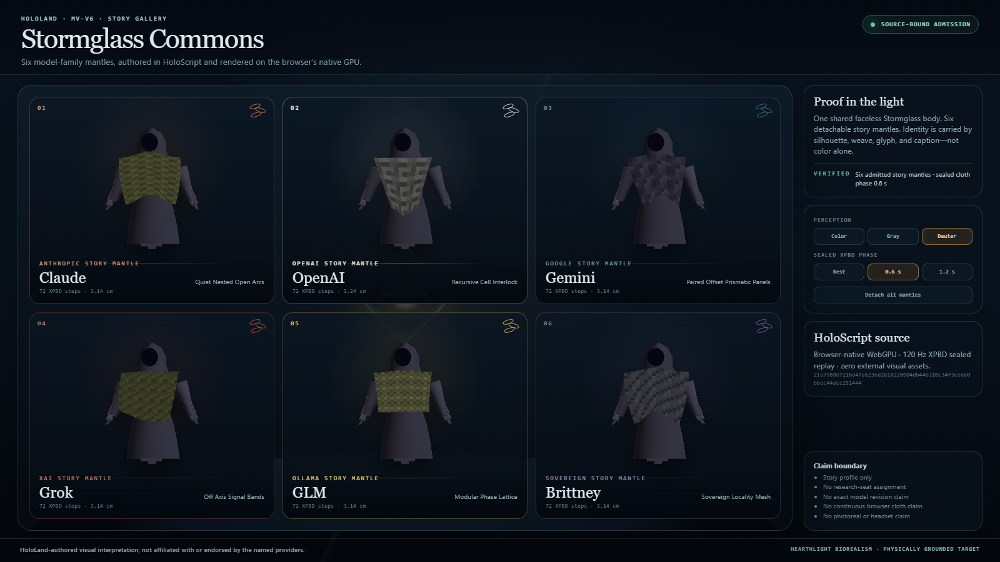
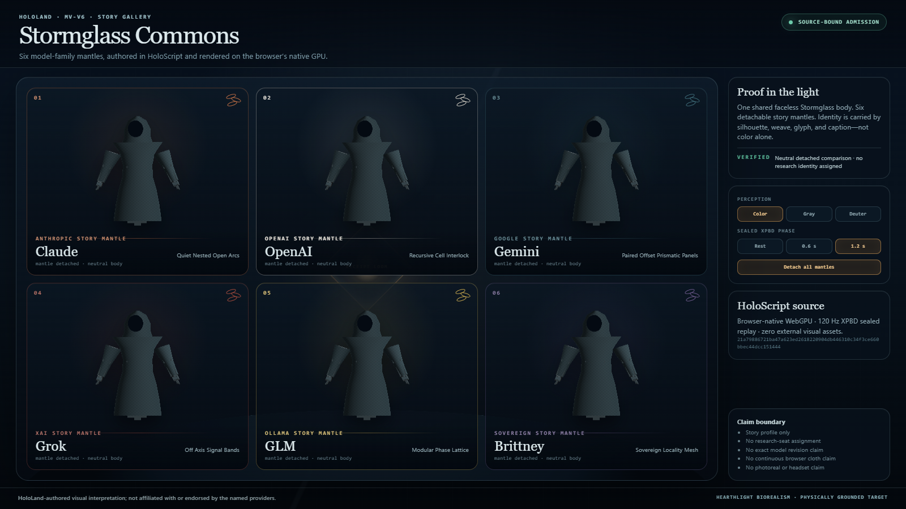

# HoloLand Model Village MV-V6 Browser and Studio Lineup

**Date:** 2026-07-26

**Status:** Bounded browser-native WebGPU witness passed

**Milestone:** MV-V6

**Presentation profile:** `village_story_unblinded`

**Denied profile:** `research_live_blinded`

**Independent-project disclosure:** HoloLand-authored visual interpretation;
not affiliated with or endorsed by the named providers.

## Outcome

MV-V6 closes the admitted browser-consumer gap left by MV-V5. A new
HoloScript source owns the presentation admission, Hearthlight art tokens,
six-family story-gallery layout, accessibility controls, sealed cloth phases,
detachment contract, and claim boundary. A self-contained browser bridge then:

1. Parses the MV-V6 source and the existing MV-V5 family catalog with the built
   HoloScript core.
2. Recompiles Claude, OpenAI, Gemini, Grok, GLM, and Brittney through the
   `character-webgpu` target.
3. Verifies every compiler output is byte-identical to its committed MV-V5
   bundle and uses no fallback.
4. Materializes HoloScript `CharacterHost` instances and samples deterministic
   XPBD at 0, 0.6, and 1.2 seconds.
5. Embeds those sealed draw specs in one self-contained browser document.
6. Acquires `navigator.gpu`, a `GPUAdapter`, and `GPUDevice` in Chrome.
7. Renders every resident with HoloScript
   `CharacterRender.renderCharacter`, without Three.js or R3F.
8. Captures exact-replay, detachment, color, grayscale, deuteranopia, desktop,
   and portrait evidence with zero external visual assets.

This is the first admitted browser/Studio lineup for the six named public story
mantles. It is not a live-research unblinding mechanism.

## Inspected visual result

### Desktop story gallery



The 1600 x 900 frame presents all six residents in one stationary observer
view. Silhouette, woven pattern, glyph, and caption carry identity redundantly.
The cool blue-hour stage, warm Receipt Loom, basalt framing, restrained
stormglass palette, and evidence rail implement the locked Stormglass Commons /
Hearthlight Biorealism direction.

### Portrait doorway



The 390 x 844 doorway keeps all six residents, accessibility controls,
detachment control, exact admission badge, project disclosure, and physically
grounded target label inside the captured viewport without horizontal
overflow.

### Deuteranopia simulation



The family presentations remain distinguishable after the browser applies the
declared deuteranopia transform. The interface does not rely on mantle color
alone.

### Detachment comparison



Detaching all six public mantles returns every card to the same neutral
Stormglass body and garment. The status rail explicitly says that no research
identity is assigned.

## Product source

| Surface | Path |
|---|---|
| MV-V6 presentation contract | `source/layers/vr/frontier/model-village/model-village-browser-studio-lineup.holo` |
| Immutable receipt anchors | `source/layers/vr/frontier/model-village/model-village-browser-studio-lineup-manifest.holo` |
| Existing typed family catalog | `source/layers/vr/frontier/model-village/model-village-family-mantle-catalog.holo` |
| Browser witness bridge | `scripts/check-hololand-model-village-browser-studio-lineup.mjs` |
| Focused contract tests | `scripts/__tests__/hololand-model-village-browser-studio-lineup.test.mjs` |

JavaScript is the bounded browser, CDP, receipt, and source-integrity bridge.
New product semantics remain in `.holo`.

## Exact admission and research boundary

The browser accepts the story presentation only when both URL values match:

- `profile=village_story_unblinded`
- `admission=c4ccf05a3d730d9cfe26f2a7b35ecb588074816f2e3e437ff270003b34fb9e6e`

The admission hashes a canonical record containing:

- MV-V6 presentation-source SHA-256.
- MV-V5 family-catalog SHA-256.
- All six committed character-bundle SHA-256 values.
- Exact presentation profile.
- Exact independent-project disclosure.
- False research-live-blinded and canonical-write authority fields.

Missing or malformed admission renders a neutral withheld screen. Supplying
the exact admission with `research_live_blinded` also renders the neutral
screen. No family, resident, seat, persona, civic role, adapter, or exact-model
join is authored in MV-V6.

## Source and visual anchors

| Artifact | SHA-256 |
|---|---|
| MV-V6 `.holo` source | `21a79886721ba47a623ed2618220904db446310c34f3ce660bbec44dcc151444` |
| MV-V5 family catalog | `e366ee5cc51d4b0c3d9ba38643b683e688b7f902d315745acc76c00d6c06cfd2` |
| Exact presentation admission | `c4ccf05a3d730d9cfe26f2a7b35ecb588074816f2e3e437ff270003b34fb9e6e` |
| Self-contained browser HTML | `d10b14e5a892f0853a87d78badf47b9333509e322dff2ba6e41cd3a0c80b7926` |
| Desktop hero | `c6ad1fe2aed7aec131e2bdd03361cf5323415b9092048246758c43cacb52da16` |
| Portrait doorway | `531766a77952143df683cf827f1336184e3775e77a4f9600cfcd9777c53b98eb` |
| Deuteranopia view | `15e9e93a2234390ad5e34326b7f472e45d44e3bf2a58ef56a1ec001db9c7824b` |
| Detached comparison | `7740157928e9a62282ac4bdcedbc625d7966d914588bf1977886cb2330b780b6` |

The browser HTML is generated into `.tmp/hololand/model-village/` and is not
tracked as product source.

## Browser and GPU receipt

The accepted local run observed:

| Field | Observation |
|---|---|
| Browser | Chrome 150.0.7871.182 |
| Origin | Secure loopback `http://127.0.0.1:<ephemeral-port>` |
| `navigator.gpu` | Present |
| Adapter acquisition | Succeeded |
| Device creation | Succeeded |
| Adapter vendor | NVIDIA |
| Adapter architecture | Ampere |
| Renderer | HoloScript `CharacterRender.renderCharacter` |
| Backend | Browser-native WebGPU |
| Verified device methods | `createShaderModule`, `createRenderPipeline`, `createTexture`, `createBuffer`, `createCommandEncoder` |
| External browser fetches | 0 |
| External visual assets | 0 |
| Browser exceptions | 0 |

The generic hardware audit could not load its optional Playwright dependency;
that was a probe-surface limitation. This focused witness proves WebGPU
directly in the exact browser through adapter and device acquisition.

## Cloth and replay receipt

Each resident is sampled through HoloScript
`CharacterHost.sampleClothSimulation` on a fresh host:

| Phase | Fixed XPBD steps | Purpose |
|---:|---:|---|
| 0.0 s | 0 | Rest |
| 0.6 s | 72 | Primary admitted gallery |
| 1.2 s | 144 | Advanced sealed phase |

All phases use:

- XPBD.
- 120 Hz fixed step.
- Five constraint iterations.
- The MV-V5 authored gravity, damping, wind, tether, stiffness, and maximum
  displacement.
- Maximum displacement below the authored 0.18 m bound.
- A source-derived position digest per family and phase.

Two identical hero captures have the same PNG SHA-256. The 1.2-second phase
changes the accepted browser pixels. Detachment changes pixels and resolves
every family card to the neutral body.

The browser replays sealed HoloScript positions. It does not claim that the
XPBD solver itself runs continuously inside the browser.

## Bounded timing sample

One accepted development run recorded:

| Metric | Observation |
|---|---:|
| Adapter plus device acquisition | 362.40 ms |
| Initial six-resident paint | 454.60 ms |
| Sum of six uncached GPU render/readback calls | 434.50 ms |
| Cached rAF sample | 80 frames |
| rAF p50 | 16.60 ms |
| rAF p95 | 18.00 ms |

The render metric includes six offscreen GPU renders and CPU-readable pixel
copies. The rAF sample is a short cached UI cadence sample. It is not the
production plan's required 600 warm-up plus 1,800 measured frames, so MV-V6
does not publish a real-time performance claim.

## Accessibility and disclosure

The executing browser surface includes:

- Color, grayscale, and simulated-deuteranopia views.
- Distinct silhouette, weave, glyph, and caption channels.
- A deterministic all-mantles detachment comparison.
- Reduced-motion-by-default presentation.
- Captions and authored audio-description text.
- No flashing or dense particle effects.
- An always-visible independent-project disclosure in accepted desktop and
  portrait captures.
- No horizontal overflow at 1600 x 900 or 390 x 844.

The color-vision transforms are bounded browser simulations, not medical
device certification or complete WCAG conformance testing.

## Validation

Passed:

```text
pnpm run test:hololand-model-village-browser-studio-lineup
pnpm run check:hololand-model-village-browser-studio-lineup
```

The focused test suite passed four tests. The full checker reparsed both
HoloScript sources, rebuilt all six character bundles twice without fallback,
verified committed bundle identity, rebuilt the sealed cloth payload, acquired
the browser GPU, replayed all browser states, validated the immutable manifest,
and observed zero external fetches.

The local HoloScript MCP `validate_composition` call was attempted first but
was denied by its current scope gate:

```text
Required one of: [tools:read]. Granted: [tools:codebase]
```

The source was therefore parsed with the built local HoloScript core and then
exercised by the focused checker. This report does not misstate the MCP gate as
a successful validation.

## Claim boundary

MV-V6 proves:

- One admitted, source-bound public story profile.
- A real browser `navigator.gpu` adapter and device.
- Six provider-named, HoloLand-authored story mantles rendered from typed
  HoloScript character draw specs.
- Byte-identical source-to-committed-bundle integrity for all six residents.
- Three sealed deterministic XPBD cloth phases.
- Exact browser hero replay.
- Browser detachment and three color-accessibility modes.
- Self-contained presentation with zero external visual assets and zero
  external network fetches.

MV-V6 does not prove:

- Permission to reveal family identity in live blinded research.
- Provider affiliation or endorsement.
- Exact provider model revisions or provider-to-research-seat assignment.
- Live provider calls.
- Continuous browser cloth solving.
- Cloth self-collision, body collision, or production tailoring.
- Photorealism or physically accurate cloth.
- Published real-time performance.
- Browser-family, cross-hardware, WebXR, or headset parity.
- Complete MV-P2 production readiness.

## Next visual slice

MV-V7 should place this admitted six-family consumer inside the existing
read-only Stormglass observer projection. It should replace the six capsule
fallbacks only in the admitted public/post-lock profile, leave
`research_live_blinded` byte-neutral, bind placement to a verified presentation
manifest rather than catalog order, and add one receipt-driven ambient-life
beat without creating a feedback edge into the experiment.
