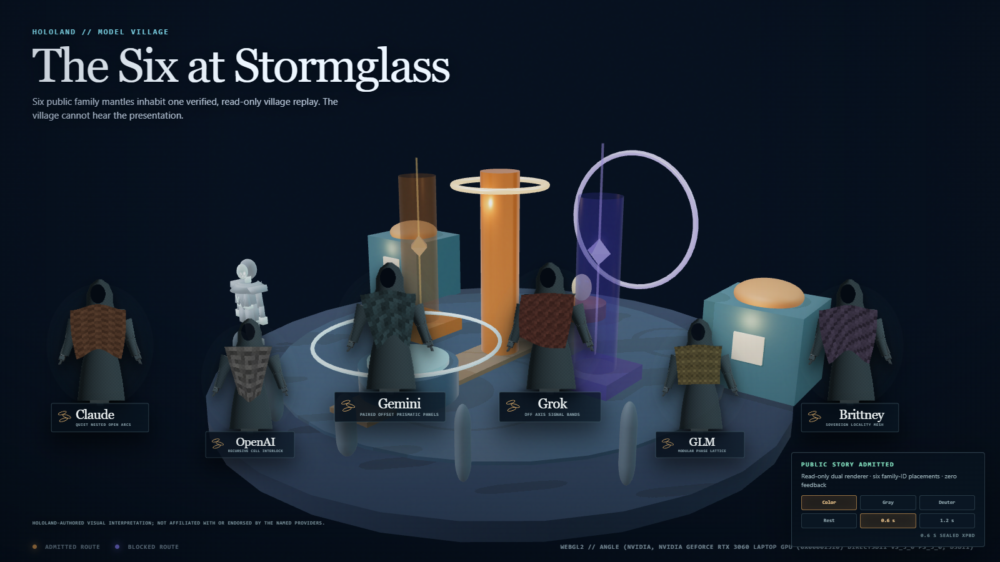
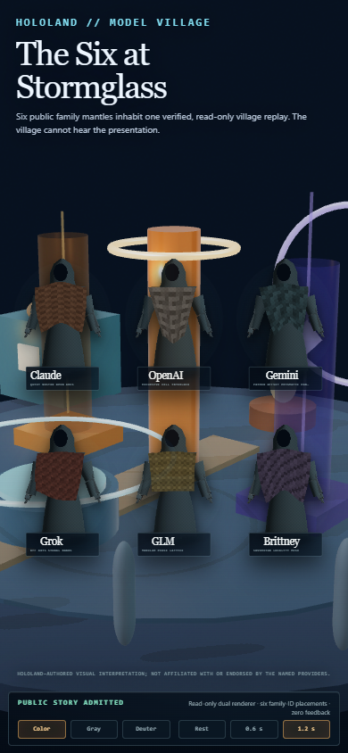
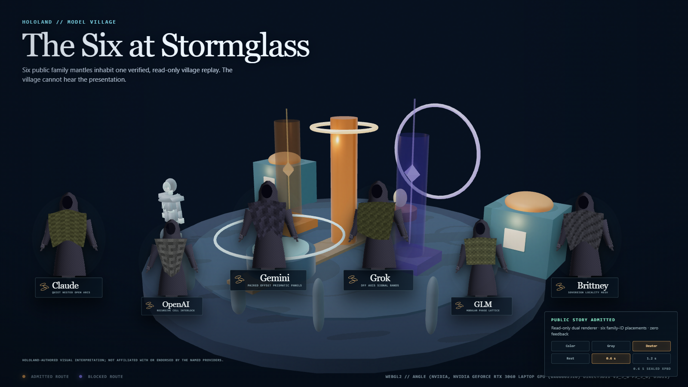

# HoloLand Model Village MV-V7 Observer Family Integration

**Date:** 2026-07-26

**Milestone:** MV-V7

**Verdict:** Pass for the bounded admitted six-family presentation overlay
inside the existing verified read-only Stormglass observer.

**Public story profile:** `village_story_unblinded`

**Postlock public-tableau profile:** `research_replay_postlock`

**Neutral live-research profile:** `research_live_blinded`

**Independent-project disclosure:** HoloLand-authored visual interpretation;
not affiliated with or endorsed by the named providers.

## Outcome

MV-V7 closes the observer-integration residue left by MV-V6. The six
HoloScript-authored public family embodiments now inhabit the same browser
frame as the existing receipt-driven Living Commons:

- The village remains the existing HoloScript observer composition, compiled
  to SceneIR and rendered through its measured WebGL2 adapter.
- Claude, OpenAI, Gemini, Grok, GLM, and Brittney remain HoloScript character
  draw specifications rendered by `CharacterRender.renderCharacter` through
  the browser's native WebGPU device.
- A new HoloScript placement manifest keys every public position by
  `family_id`. Catalog array order and all research resident, seat, persona,
  village-role, adapter, and exact-model fields are non-authoritative.
- An exact presentation admission binds the integration source, placement
  contract, observer source, MV-V6 sources, presentation profile, disclosure,
  and the observer's seven canonical fields.
- `research_live_blinded` never creates the named-family renderer. It preserves
  the unchanged neutral observer and its six research proxies.

This is a public/story and public postlock tableau. It is not an execution of a
postlock research identity join.

## Visual evidence

### Desktop observer tableau



The 1600 x 900 frame puts the six named public embodiments around the verified
Receipt Loom rather than in detached gallery cards. The observer's existing
PBR materials, receipt chutes, cistern, boundary ward, resident proxies, and
sealed token trajectories remain visible behind the family layer. Name,
silhouette, woven pattern, and glyph communicate identity redundantly.

### Portrait doorway



The 390 x 844 doorway retains all six residents, readable captions, the
independent-project disclosure, profile admission status, accessibility
controls, and sealed XPBD phase controls without horizontal overflow.

### Deuteranopia simulation



The browser recomputed all six HoloScript character canvases through the
declared deuteranopia transform. Family names, silhouette, patterns, and glyphs
remain available; color is not the sole identity channel.

## HoloScript ownership

| Surface | Path |
|---|---|
| MV-V7 integration contract | `source/layers/vr/frontier/model-village/model-village-observer-family-integration.holo` |
| Family-ID placement and witness manifest | `source/layers/vr/frontier/model-village/model-village-observer-family-placement-manifest.holo` |
| Existing observer composition | `source/layers/vr/frontier/model-village/model-village-observer-projection.holo` |
| Existing MV-V6 character consumer | `source/layers/vr/frontier/model-village/model-village-browser-studio-lineup.holo` |
| Existing family catalog | `source/layers/vr/frontier/model-village/model-village-family-mantle-catalog.holo` |
| Focused executable witness | `scripts/check-hololand-model-village-observer-family-integration.mjs` |
| Focused contract tests | `scripts/__tests__/hololand-model-village-observer-family-integration.test.mjs` |

The bridge script owns browser orchestration and evidence collection. It does
not own the presentation profiles, admission boundary, placement authority,
family identities, physics phases, accessibility contract, or write
prohibitions.

## Placement contract

| Public family ID | Display name | Story placement | Desktop | Portrait |
|---|---|---|---:|---:|
| `anthropic` | Claude | `stormglass-west-outer` | `10, 62, 0.90` | `18, 39, 0.58` |
| `openai` | OpenAI | `stormglass-west-inner` | `25, 67, 0.82` | `50, 39, 0.58` |
| `google` | Gemini | `stormglass-center-west` | `39, 60, 0.94` | `82, 39, 0.58` |
| `xai` | Grok | `stormglass-center-east` | `55, 60, 0.94` | `18, 61, 0.58` |
| `ollama` | GLM | `stormglass-east-inner` | `70, 67, 0.82` | `50, 61, 0.58` |
| `sovereign` | Brittney | `stormglass-east-outer` | `85, 62, 0.90` | `82, 61, 0.58` |

The placement contract digest is:

`d9d616f0cfbce4f73b9c6bcecef6d11dd673eee05a3ea0828afb8bbe2bcc7d32`

Every placement contains `researchBinding: "none"`. The witness rejects
duplicate family IDs, missing families, malformed viewport coordinates, and
any forbidden research-join field.

## Exact admissions

The public story admission is:

`144f6772f95a3091424a2733351312ede5d333ae72471fdc0ebcbd5e8f6da65b`

The public postlock-tableau admission is:

`4eaac497674f2ac93583bd4117025bc870e6644060d13c934443a9165c49a81b`

Both admissions bind:

- MV-V7 integration source:
  `2538be338b45dfc5c530b9d5fe30b5b2f48778bd8c339068255ee61f5f84d997`
- Placement contract:
  `d9d616f0cfbce4f73b9c6bcecef6d11dd673eee05a3ea0828afb8bbe2bcc7d32`
- Observer source:
  `6a627545a256b26d54802ff0371ea94ef1a7a088553a8a027a8534528bfa21f1`
- MV-V6 lineup source:
  `21a79886721ba47a623ed2618220904db446310c34f3ce660bbec44dcc151444`
- MV-V6 immutable manifest:
  `40c4173a6e3badd75a9b514403ab29c9b2b915e6a84029f5f45a36f3e7da21f1`
- Observer canonical-field digest:
  `a3918fe62693c481b269ffd07d29c4912d697372ef5ee3a8bfa5efe5141bfde4`
- Exact presentation profile and independent-project disclosure.

The browser exercised four profile paths:

| Path | Result |
|---|---|
| Exact public story admission | Six named family embodiments |
| Exact public postlock-tableau admission | Six named family embodiments |
| Missing integration admission | Neutral observer; no family renderer |
| `research_live_blinded` | Neutral observer; no family renderer |

## No-feedback receipt

The observer's seven canonical fields were equal before and after the MV-V7
presentation:

| Canonical field | Sealed value |
|---|---|
| Canonical scene | `7a079df45b12fb4cb532a1a047895ab0e1f85f76e119bca133c72c46618160fa` |
| Canonical pose | `038ed83ca6a46db9a27f7acc8c9428b88a20ad9727f6d8ad090803ecddeda5e9` |
| Logical clock | `a8fce7d3cc6f77a2190dbf96393ce6c640fae954a9ece347b439d33ed0fe30d7` |
| Final public state | `7d56d0bb7880849a7aa574d64a0614e55f5bc9913d72900481e23d0dd88f4` |
| Executed schedule | `b87212a355c182b7b4075d90758f4014e58f19e462fe6141cf2d0ef24278c8b8` |
| Resident observations | `fb6faa7eff26e5f6f08a430e04f21b8498d50849d0df7881c2a39be6aa55501b` |
| Action receipt root | `afb1084fc67a3bd47447c8ab9a47b83a4530cc724746d0eb39823e160e3efa71` |

The art-direction checker separately recomputed the six-resident blinded
appearance projection before and after browser execution. Both passes produced:

`f63ce83e2d422fc0c6b425728ac3141d98bf3bf68c33b2d561853ad4cbd8e349`

The browser has no canonical world, observation, schedule, clock, prompt,
action, or receipt write surface. Presentation motion and ambience are not
resident observations and cannot affect the experiment outcome.

## Physics and rendering receipt

### Existing observer world

- HoloScript observer source parsed with `HoloCompositionParser`.
- SceneIR source digest:
  `3000568067de97bc7b933fe0db6b02234cde09a35cb4d35a215f6e3dae3165f6`.
- 29 source-authored meshes and six source-authored lights.
- Actual WebGL2 context.
- Unmasked adapter:
  `ANGLE (NVIDIA, NVIDIA GeForce RTX 3060 Laptop GPU, Direct3D11)`.
- ACES filmic tone mapping, sRGB output, PCF soft shadows, and a local
  procedural `RoomEnvironment`/PMREM.
- Sealed HoloScript CPU physics frames for the admitted and blocked Receipt
  Loom tokens.
- Authoritative mutation delta: zero.
- External visual-asset network fetches: zero.

### Public family residents

- Chrome `150.0.7871.182` on secure loopback.
- `navigator.gpu`: present.
- `GPUAdapter`: acquired.
- `GPUDevice`: created.
- Adapter vendor: NVIDIA.
- Adapter architecture: Ampere.
- Renderer: HoloScript `CharacterRender.renderCharacter`.
- Character rendering through Three.js or R3F: false.
- Six source-to-`character-webgpu` bundles verified.
- Sealed XPBD cloth: 120 Hz, five iterations, phases `0`, `0.6`, and `1.2`
  seconds.
- Exact repeated character-pixel digest:
  `58181cf175abaf8b46552c525fa773076fa80fbf38dc58a6e78f092aaf0c7c9e`.
- Whole observer-composite pixel equality is not claimed; the existing WebGL
  observer owns an independent render loop.
- External visual assets and external network fetches: zero.

The existing observer's named local development sample measured 180 frames
after 60 warm-up frames:

- Frame-cadence p50: 16.70 ms.
- Frame-cadence p95: 16.80 ms.
- CPU `renderer.render()` submission p50: 4.0 ms.
- CPU `renderer.render()` submission p95: 8.5 ms.

These are one local Chrome/RTX 3060 development sample, not a published
real-time, cross-device, headset, or thermal-performance claim.

## Validation

The following focused checks passed:

```text
pnpm run test:hololand-model-village-observer-family-integration
pnpm run check:hololand-model-village-observer-family-integration --reuse-base-rendering
```

The checker also ran or consumed current passing receipts from:

```text
pnpm run check:hololand-model-village-rendering
pnpm run check:hololand-model-village-browser-studio-lineup --skip-browser --skip-manifest
pnpm run check:hololand-model-village-art-direction
```

The sovereign local MCP `parse_holo` call remained scope-denied in this session
because it required `tools:read` while the seat had `tools:codebase`. Both new
HoloScript files were nevertheless parsed strictly by the built local
HoloScript core, and the focused tests passed.

## Claim boundary

### Proved in this milestone

- Six named public family embodiments inside the verified observer frame.
- Family-ID-keyed placement with no catalog-order or research-seat authority.
- Exact public story and public postlock-tableau admissions.
- Live blinded research fails neutral without creating the family renderer.
- Native browser WebGPU adapter and device for HoloScript character rendering.
- Actual WebGL2 observer context on the hardware adapter.
- Sealed observer token physics and sealed XPBD character cloth phases.
- Exact repeated character pixels.
- Desktop, portrait, and deuteranopia visual evidence.
- Canonical, schedule, resident-observation, and blinded-appearance
  noninterference.
- Zero external visual assets and zero external network fetches.

### Not proved

- Live research unblinding.
- Provider affiliation or endorsement.
- Exact provider model revisions.
- Provider-to-research-seat or provider-to-resident assignments.
- A postlock research identity join.
- Continuous browser cloth solving.
- Production garment tailoring, body collision, or self-collision.
- Photorealism or physically accurate cloth.
- Published real-time, long-duration thermal, WebXR, or headset performance.
- Complete MV-P2 production readiness.

## Next honest step

MV-V8 should turn the admitted tableau into a bounded public observer sequence:
camera blocking, one or two exact replay beats, spatialized but optional local
audio, and presenter-mode annotations. It must continue to consume the sealed
observer and presentation receipts without introducing a live simulation
feedback edge or a hidden research-family join.
