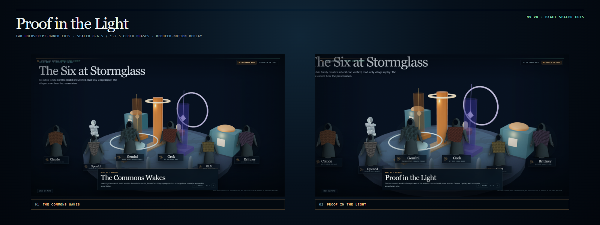
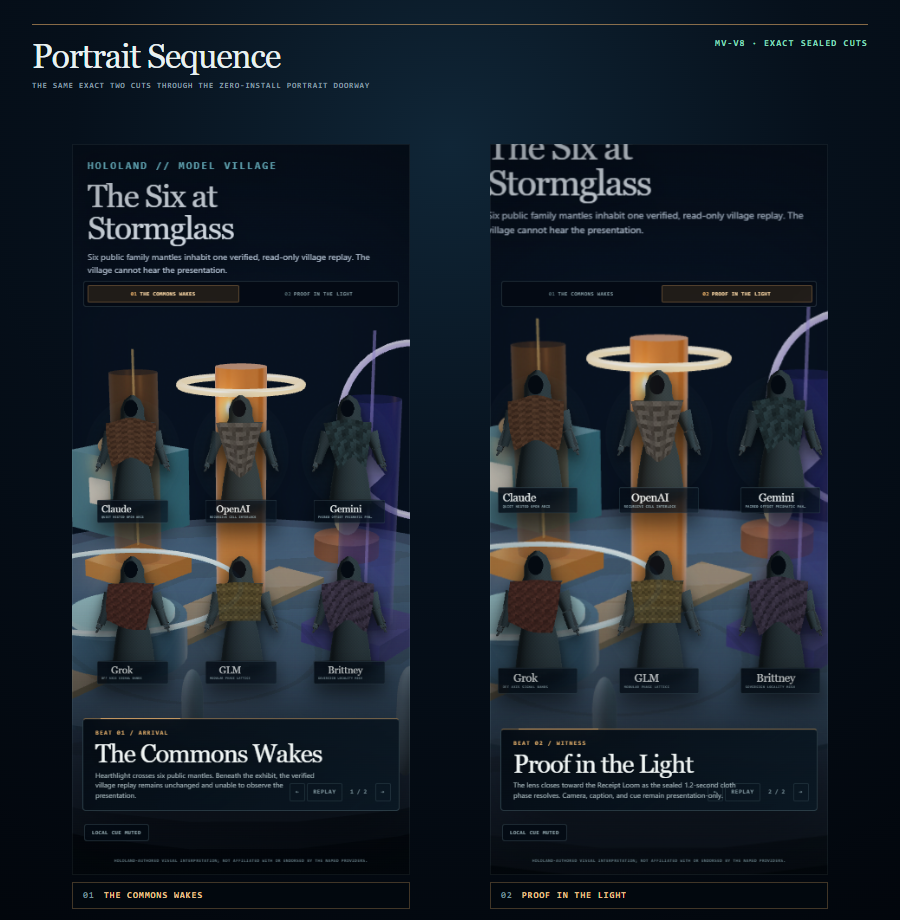

# HoloLand Model Village MV-V8 Observer Cinematic Sequence

**Date:** 2026-07-26

**Milestone:** MV-V8

**Verdict:** Pass for the bounded two-beat HoloScript-owned cinematic exhibit
over the admitted MV-V7 Stormglass observer.

**World:** Stormglass Commons

**Visual language:** Hearthlight Biorealism

**Public cast:** Claude, OpenAI, Gemini, Grok, GLM, and Brittney

**Independent-project disclosure:** HoloLand-authored visual interpretation;
not affiliated with or endorsed by the named providers.

## Outcome

MV-V8 turns the static MV-V7 public tableau into the first small cinematic
grammar for Model Village:

1. **The Commons Wakes** holds the wide blue-hour composition at the sealed
   `0.6 s` cloth phase.
2. **Proof in the Light** pushes the exhibit lens toward the Receipt Loom and
   changes to the sealed `1.2 s` cloth phase.

HoloScript owns the beat IDs, order, duration, camera transform, cloth phase,
presenter copy, audio-description text, optional local cue frequency and
duration, admission profiles, exact-replay boundary, and all no-feedback
prohibitions.

The browser script is an execution and evidence bridge. It loads the shipped
MV-V7 dual renderer, applies the declared discrete cuts, captures real browser
frames, constructs the optional local Web Audio graph, and proves the
admission and noninterference rules. It does not own the cinematic semantics.

## Visual evidence

### Desktop sequence



The desktop contact sheet shows the two exact sealed cuts at 1600 x 900. The
first beat establishes all six public family embodiments across the Commons.
The second beat tightens the frame around the village proof machinery while
preserving the cast, receipt-driven observer, and presenter caption.

### Portrait sequence



The 390 x 844 doorway retains both beats, six names, keyboard-equivalent
transport controls, visible captions, mute state, disclosure, and zero
horizontal overflow. Continuous camera animation is deliberately absent:
reduced-motion cuts are the default authored behavior.

## HoloScript ownership

| Surface | Path |
|---|---|
| MV-V8 cinematic semantics | `source/layers/vr/frontier/model-village/model-village-observer-cinematic-sequence.holo` |
| Immutable MV-V8 witness anchors | `source/layers/vr/frontier/model-village/model-village-observer-cinematic-sequence-manifest.holo` |
| Inherited MV-V7 observer integration | `source/layers/vr/frontier/model-village/model-village-observer-family-integration.holo` |
| Focused browser/GPU witness | `scripts/check-hololand-model-village-observer-cinematic-sequence.mjs` |
| Focused source-contract tests | `scripts/__tests__/hololand-model-village-observer-cinematic-sequence.test.mjs` |

The sequence source digest is:

`40987c3fd1ee7ba0ca49b8e93f45839a35b8f08f1ff0e754615c08d32894c03d`

The canonical two-beat contract digest is:

`639e49197c1129993e6e0185d1beba7840eb9015e1aee64a843bedf6b4761b0b`

## Beat contract

| Beat | Duration | Camera | Sealed cloth phase | Optional local cue |
|---|---:|---|---:|---:|
| `the_commons_wakes` | 3200 ms | wide, `1.00x` | `0.6 s` | 196 Hz / 420 ms |
| `proof_in_the_light` | 3600 ms | Receipt Loom push, `1.12x` | `1.2 s` | 293.66 Hz / 520 ms |

The sequence is manual by default. `Previous`, `Next`, `Replay`, `ArrowLeft`,
`ArrowRight`, and `Home` select discrete cuts. Autoplay is off and all CSS
motion is disabled under reduced-motion preferences.

## Exact replay boundary

MV-V8 defines exact replay narrowly and testably:

- beat ID and index;
- camera scale, translation, origin, and lens name;
- presenter eyebrow, title, caption, and audio-description text;
- sealed XPBD phase;
- HoloScript character pixel digest.

The first execution and the second execution produced the same exact digest
for each beat:

| Beat | Exact exhibit-state digest | Character-pixel digest |
|---|---|---|
| The Commons Wakes | `149a94ab6347acbaaaa9caeeafb6278aef343e359fc6f9f6c812c9af521e9bc6` | `58181cf175abaf8b46552c525fa773076fa80fbf38dc58a6e78f092aaf0c7c9e` |
| Proof in the Light | `bc61f97e6e57f237bf72753f22f38f7fb9d34ca6fb3358e3a1282842a9515e31` | `3fb95ed4fe027421d217cbad614486cfae23d09be2a6679894ff44a2236f4233` |

Whole observer-composite pixel equality is not claimed. The inherited
WebGL2 observer retains its own render loop; MV-V8 exactness stops at the
sealed exhibit state and character pixels.

## Exact admissions and research boundary

The public story admission is:

`74063b7348cacfa78b803cf2bab57bfea6f6a74e0befc8124dc03f13e6ec9241`

The public postlock-exhibit admission is:

`cfebf7be7ad70d985039e9d03443ae7ac4df3974893a8e6c0d86758e93890e85`

Each binds:

- MV-V8 source digest;
- two-beat sequence-contract digest;
- the matching exact MV-V7 admission;
- observer seven-field canonical digest;
- presentation profile;
- independent-project disclosure.

The browser exercised four paths:

| Path | Result |
|---|---|
| Exact public story admission | Two-beat sequence over six public embodiments |
| Exact public postlock admission | Same bounded public exhibit |
| Missing MV-V8 admission | Neutral observer; named renderer not instantiated |
| `research_live_blinded` | Neutral observer; named renderer not instantiated |

The postlock profile is a public postlock exhibit. It is not a research
resident, seat, persona, role, adapter, provider, or exact-model join.

## Rendering, physics, and hardware evidence

The focused checker ran on secure loopback in Chrome `150.0.7871.182`.

### Inherited observer

- HoloScript observer source compiled to SceneIR.
- Actual WebGL2 context.
- Unmasked adapter: NVIDIA GeForce RTX 3060 Laptop GPU through ANGLE/D3D11.
- Local procedural environment/PMREM, PBR materials, ACES tone mapping, sRGB
  output, PCF soft shadows.
- Sealed HoloScript CPU physics frames for Receipt Loom admitted and blocked
  tokens.
- External visual asset fetches: zero.

### Public family renderer

- `navigator.gpu`: present.
- `GPUAdapter`: acquired.
- `GPUDevice`: created.
- Adapter vendor: NVIDIA.
- Adapter architecture: Ampere.
- Renderer: HoloScript `CharacterRender.renderCharacter`.
- Six HoloScript character canvases.
- Sealed XPBD cloth phases at 120 Hz and five iterations.
- Three.js/R3F used for character rendering: false.

This is a current local Chrome/RTX 3060 hardware witness. It is not a
cross-device, headset, long-duration thermal, or published performance claim.

## Optional local audio

The HoloScript sequence owns two procedural cue specifications. The browser
bridge proved:

- audio is muted by default;
- no audio graph is constructed automatically;
- explicit opt-in constructs a Web Audio oscillator/gain graph;
- the graph is connected to the local browser destination;
- muting disables its gain;
- external audio assets and network requests are zero;
- audio has no world, schedule, action, receipt, or observation write edge.

Headless Chrome reported the context as `suspended`, which is expected without
a real user activation. Therefore MV-V8 does **not** claim audible output,
spatial audio, adaptive music, voice/TTS, or a human-approved mix. A human
listening pass remains necessary before any mix-quality claim.

## No-feedback receipt

The seven canonical fields remained byte-identical through public story,
public postlock, missing-admission, and blinded-research paths:

| Canonical field | Sealed value |
|---|---|
| Canonical scene | `7a079df45b12fb4cb532a1a047895ab0e1f85f76e119bca133c72c46618160fa` |
| Canonical pose | `038ed83ca6a46db9a27f7acc8c9428b88a20ad9727f6d8ad090803ecddeda5e9` |
| Logical clock | `a8fce7d3cc6f77a2190dbf96393ce6c640fae954a9ece347b439d33ed0fe30d7` |
| Public state | `7d56d0bb7880849a7aa574d64a0614e55f5bf5bc9913d72900481e23d0dd88f4` |
| Executed schedule | `b87212a355c182b7b4075d90758f4014e58f19e462fe6141cf2d0ef24278c8b8` |
| Resident observations | `fb6faa7eff26e5f6f08a430e04f21b8498d50849d0df7881c2a39be6aa55501b` |
| Action receipt root | `afb1084fc67a3bd47447c8ab9a47b83a4530cc724746d0eb39823e160e3efa71` |

The blinded six-resident research-appearance projection also remained equal
before and after the cinematic witness. The browser has no canonical world,
schedule, clock, prompt, action, receipt, or resident-observation write
surface.

## Shipped fact versus larger vision

MV-V8 is a shipped two-beat enabling slice. It does not close the broader
MV-S1 vision.

| Shipped now | Still vision / later receipted work |
|---|---|
| Two discrete 6.8-second cuts | The 52-second, six-beat `Proof in the Light` show |
| Manual playback and exact exhibit replay | Authored continuous motion between beats |
| Optional local procedural cue graph | Human-approved mix and real spatial audio |
| Existing sealed token and XPBD phases | Weather, fluid physics, and larger physics spectacle |
| Desktop and portrait browser evidence | WebXR/headset staging and performance |
| One Stormglass Commons exhibit | Genesis sequence and Four-Village Fold |

This distinction is intentional. The format paper and MV-S1 plan may describe
the larger desired experience in future tense. The executable report records
only what the source, browser, hardware, and receipts prove today.

## Validation

The following checks passed:

```text
node scripts/check-hololand-model-village-observer-cinematic-sequence.mjs
node --test scripts/__tests__/hololand-model-village-observer-cinematic-sequence.test.mjs
pnpm run test:hololand-model-village-observer-family-integration
node scripts/check-hololand-model-village-observer-family-integration.mjs --reuse-base-rendering
pnpm run test:hololand-model-village-browser-studio-lineup
node scripts/check-hololand-model-village-browser-studio-lineup.mjs
pnpm run test:hololand-model-village-rendering
pnpm run test:hololand-model-village-art-direction
pnpm run check:hololand-model-village-art-direction
pnpm run check:generated-output
```

The two contact-sheet anchors also reproduced on a second complete MV-V8
browser execution:

- Desktop:
  `dee2f909fcb25281e7214f3f283f6febeb516346667404abcc5087527362774a`
- Portrait:
  `9e8ee049710213caca19aef9bae07bbb6e47bf103af836881c7694ea251c659e`

## Claim boundary

### Proved

- Two HoloScript-owned discrete cinematic beats.
- Exact camera, caption, phase, and character-pixel replay.
- Six public model-family embodiments in the verified observer.
- Browser WebGPU character rendering over the actual WebGL2 observer.
- Desktop and portrait contact sheets from real browser frames.
- Captions, audio-description text, keyboard controls, reduced-motion cuts,
  mute control, disclosure, and portrait overflow protection.
- Optional local procedural audio graph, muted by default.
- Live blinded research and invalid admission fail neutral without the named
  renderer.
- Canonical, schedule, resident-observation, and research-appearance
  noninterference.
- Zero external visual/audio assets and zero external network fetches.

### Not proved

- The MV-S1 52-second six-beat show.
- Audible output or a human-approved mix.
- Spatial audio, adaptive music, voice, or TTS.
- Continuous camera animation.
- Whole observer-composite pixel equality.
- Live research unblinding or a postlock research identity join.
- Provider affiliation, endorsement, or exact model revisions.
- Photorealism.
- Published real-time, long-duration thermal, WebXR, or headset performance.

## Next honest step

MV-S1 can now consume MV-V8 as its camera/presenter/exact-replay primitive and
expand toward the six-beat 52-second show. The next bounded slice should add
one authored transition and one human-listened spatial audio cue without
changing the canonical, observation, or research-identity boundary.
