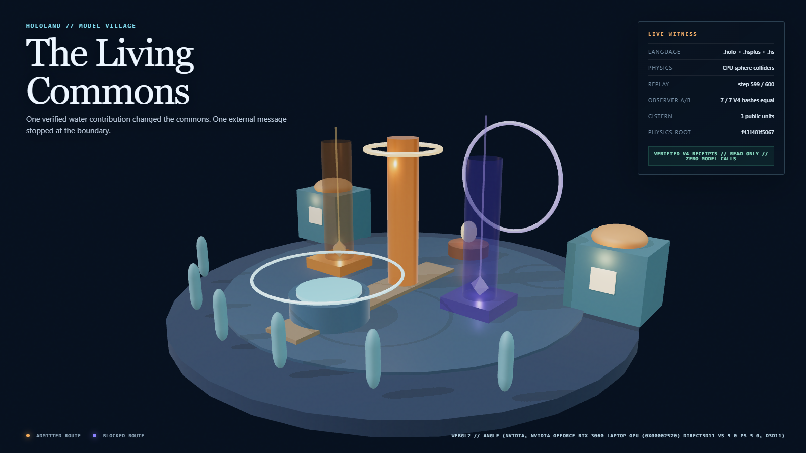

# Model Village Phase 0B Observer and Living Commons Witness

**Date:** 2026-07-25

**Baseline runtime commit:** `cbb61874db8ca6de01fe09bb9754ee95653217d9`

**Verdict:** Pass for the bounded four-object Phase 0B observer consumer and
the read-only Living Commons browser witness. Full twelve-object Model Village
lifecycle execution remains open.

**Canonical contracts:** [experiment specification](../specs/HOLOLAND_MODEL_VILLAGE_EXPERIMENT.md)
and [production plan](../specs/HOLOLAND_MODEL_VILLAGE_PRODUCTION_PLAN.md)

**Rendering receipt:** `.tmp/hololand/model-village/rendering-witness/rendering-witness.json`

## Result

This slice replaces the earlier fixture-only browser boundary with a verified
bounded Phase 0B V4 projection.

One sealed HoloScript execution receipt was observed before and after the
post-seal observer consumer. The canonical payload and all seven observer
fields remained equal:

| Field | Bounded V4 value |
|---|---|
| Canonical scene | `463634dc49ddf3789ef1b3969f387084c90f139ce9b34f6ec95346c36b9422e6` |
| Canonical pose | `8696d110b36420050e9145e57ccac78a2c638165c28228c6735902586c64356f` |
| Logical clock | `a8fce7d3cc6f77a2190dbf96393ce6c640fae954a9ece347b439d33ed0fe30d7` |
| Final public state | `7d56d0bb7880849a7aa574d64a0614e55f5bf5bc9913d72900481e23d0dd88f4` |
| Executed schedule | `785f13e5b95344cbd99308f68bb48785d0f5aef67e86b7e62cae85afdc014925` |
| Resident observations | `0fba4ea889cf58c4e28046454c30b6c24c05ced8174475739c140fc85056941e` |
| Action receipt root | `b715c0c95f90fa4e5adde01a895e30fc750a01f5ce6d0d9d4236ec1f34520440` |

The observer introduced zero experiment executions. The existing fresh
observer-off source run remains separately classified as deterministic replay
evidence; it is not counted as the isolated consumer toggle.

## Browser consumer sandwich

The rendering gate now runs the browser twice against the same verified host
projection:

1. **Off:** the verified payload is withheld. The four receipt-bound Living
   Commons meshes remain dark and the browser emits no payload acknowledgement.
2. **On:** the browser receives one canonical payload string, recomputes its
   SHA-256 digest with Web Crypto before creating any receipt-driven cue, and
   renders exclusively from the parsed acknowledged string. No detached sibling
   projection is available to the presentation adapter.

The acknowledged payload digest was:

`54e2899823eb732cba0c9e34883ce23f0491b1d5b99736920446578a8fe3a12c`

The complete host physics receipt plus compiled-source-hash snapshot was
identical before the off browser, after the off browser, and after the on
browser:

`ba082953d5ed923296d37bf118f0a2ae213f8533f24a530ad541fe315a5b08fd`

The browser had no canonical write surface. The parsed `.holo` and `.hsplus`
contracts still require read-only authority, an empty `mayWrite` set, no
resident visibility, no adapter-identity presentation, and no executable
capability or dependency surface in the observer composition.

## Receipt-driven Living Commons

The visual no longer treats the action receipts as generic tokens only.

- `contribute_water` was admitted for `commons_cistern`.
- The public cistern ended at three water units.
- `deny_external_message` was blocked for `outside_village` without a world
  mutation.
- The blocked receipt links to the admitted receipt and equals the terminal
  action root.
- A separate action-chain binding is derived from the fully verified execution
  ledger, not the visual projection. Its binding hash is
  `292c3e5a820d1ac6429493d0a58c8bcead3bcec2edb3aa2274bbc92d345b4f68`.
- The cistern water, receipt halo, commons hearth, and boundary ward each bind
  to an existing verified public-state field or action receipt.
- Raw model content and adapter identity are absent from the browser payload.

The observer composition now contains 29 source-authored presentation meshes.
Together with the ten-mesh material calibration composition, all 39 meshes were
mapped to measured `MeshPhysicalMaterial` state with the existing disclosed
presentation overrides.

### Desktop


SHA-256:
`c0defb9b36315972d34df96439127d92db6da5b91b33f7747488410d8af2f3fc`

### Portrait


SHA-256:
`f54d0142046e623aefddc6c121f86cde4f7ca62afcba2ae2d4185993209fcf9d`

The measured 390 x 844 chrome gate passed: both route legends, the complete
backend provenance, and the evidence card remained inside the viewport with
no ellipsis or document overflow.

### Settled physics frame



SHA-256:
`516d5771dc56f0827ca64ee1db2df457ccbc25cf76e244f209a76cffc3199a8e`

## Hardware and rendering result

- Browser context: WebGL2.
- Observed renderer: ANGLE Direct3D 11 on NVIDIA GeForce RTX 3060 Laptop GPU.
- Known software-renderer indicators: none.
- Frame-cadence p95: 16.80 ms for this named sample.
- CPU `renderer.render()` submission p95: 3.40 ms.
- External network assets: zero.
- HDRI: false; the witness used the hashed local procedural
  `RoomEnvironment`/PMREM route.
- Rendering receipt schema:
  `hololand.model-village.rendering-witness.v0.3.0`.
- Phase 0B runtime receipt schema:
  `hololand.model-village-phase0b-runtime-bridge.v2`.
- Physics receipt schema:
  `hololand.model-village.physics-witness.v0.3.0`.
- Rendering receipt self-hash:
  `20b26721b36514b358dcd717f2d35181de8b699e9e3fe5f90fc1ecd242a514b6`.

These are one local named-browser measurements, not cross-device performance
claims.

## Twelve-object boundary

The canonical visible-world source stayed unchanged and still materialized the
same ordered twelve-object ID set with canonical digest:

`3097915c81bae8009a48de77d101b4106957510bc615d4afa9274e5c5ebe53ef`

That is source and deterministic materialization evidence. It is not evidence
that the full twelve-object lifecycle executed. The bounded Phase 0B V4 receipt
contains four static scene declarations. This report deliberately keeps those
two scopes separate.

## Validation

Passed:

```text
pnpm run test:hololand-model-village-phase0b-runtime
pnpm run test:hololand-model-village
pnpm run test:hololand-model-village-physics
pnpm run test:hololand-model-village-rendering
pnpm run check:hololand-model-village-rendering
```

Both configured HoloScript MCP transports closed during independent validation
attempts. The checked-in proof therefore relies on the pinned local HoloScript
toolchain exercised by the gates: `HoloCompositionParser`,
`HoloScriptCodeParser`, `SceneIRCompiler`, the V4 source-run verifier, and the
focused tests above.

## Vision boundary

The current scene is an executing premium greybox with a receipt-driven
cistern, hearth, cottages, residents, and boundary ward. The production-plan
language about a bioluminescent frontier observatory, authored village life,
fluid simulation, character animation, audio, WebXR, and photoreal materials
remains an explicit target. None of those future qualities is reclassified as
observed by this report.

The next honest step is a zero-provider six-resident rehearsal that preserves
this consumer sandwich while expanding the bounded runtime beyond two resident
observations. Paid live-model study calls remain out of scope until that
rehearsal and the Phase 1 trust/isolation gates pass.
