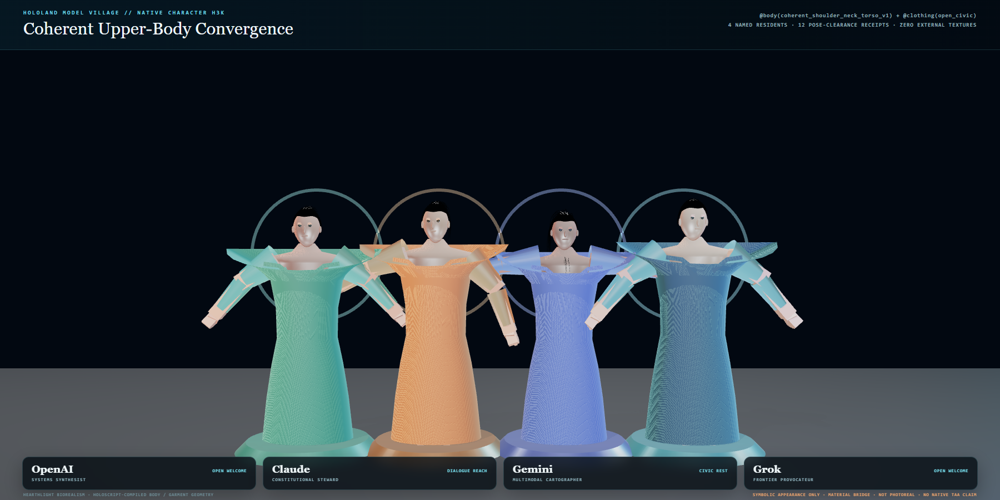

# Model Village Character Appearance H3K — Coherent Upper Body and Pose-Safe Garment

Date: 2026-07-28  
Milestone: `MV_CHARACTER_APPEARANCE_H3K_UPPER_BODY_OCCLUSION`  
Board task: `task_1785285799229_gbdf`

## Outcome

H3K replaces the native character renderer's intersecting block torso, shoulder, and neck
segments with one connected ten-ring elliptical loft selected by the typed
`coherent_shoulder_neck_torso_v1` body control. The source-authored open civic tunic now
fits the same torso and shoulder proportions and emits an exact tunic index range for
collision and occlusion proof.

The HoloLand witness compiles four explicitly named symbolic model-family residents:
OpenAI, Claude, Gemini, and Grok. These are appearance identities only. The composition
does not bind provider adapters, live models, research seats, wallets, observations, or
canonical village writes.

## HoloScript source stack

- `.holo` owns the named residents, their typed body/face/hair/clothing/LOD controls, the
  read-only world boundary, and the upstream source hashes.
- `.hsplus` owns the three-pose admission matrix and fail-closed clearance policy.
- `.hs` owns the flat deterministic resident/pose seed manifest used by the witness.
- The `character-webgpu` compiler emits the native mesh, material groups, coherent
  upper-body geometry receipt, and garment-fit receipt consumed by the render.

Upstream HoloScript canon is pinned to
`5836a2dee69f278b89ef801312c7bb6fe003bf0f`. The upstream changes were promoted through
HoloRepo as two source changes: the connected upper-body topology and the pose-safe civic
tunic fit.

## Admission evidence

| Gate | Measured result |
|---|---:|
| Native compiled resident bundles | 4 / 4 |
| Coherent upper-body receipts | 4 / 4 |
| Native garment receipts | 4 / 4 |
| Resident-pose clearance receipts | 12 / 12 |
| Posed tunic/torso triangle intersections | 0 |
| Worst-case outward clearance | 0.023852 m |
| Minimum covered-ray ratio | 1.000 |
| Repeated compile byte identity | PASS |
| Stripped-upper-body causal geometry delta | PASS |
| Compiler fallback or stub count | 0 |

The pose matrix covers `civic_rest`, `open_welcome`, and `dialogue_reach` for every named
resident. The collision proof uses the garment receipt's 1,008-index continuous tunic
shell, excluding intentional open-collar and sleeve-seam geometry. It skins the native
body and garment with the same HoloScript joint palette, performs posed triangle
intersection checks, and casts outward rays from covered torso rings. Admission requires
zero intersections, at least 15 mm clearance, and at least 95% ray coverage; no threshold
was reduced after the initial clipping failure.

## Real GPU render

The retained hero capture is a 1,800 × 900 Chrome render using:

- `ANGLE (NVIDIA GeForce RTX 3060 Laptop GPU, Direct3D11)`
- ACES filmic tone mapping, physical materials, environment lighting, and soft shadows
- 4× browser MSAA (`antialias: true`, `samples: 4`)
- two accepted 20-frame captures with render p95 values of 9.8 ms and 28.5 ms
- zero external network requests and zero page errors

The render uses the exact compiled and posed HoloScript meshes that supplied the admission
receipts. Three.js is a presentation material/render bridge only; it does not replace,
clip, or remodel the native body or wardrobe geometry.



## Truth boundary and next realism gaps

This is a coherent native topology and garment-occlusion milestone, not a photoreal
character claim. It deliberately uses no external skin, hair, or wardrobe textures. The
current capture still exposes the next bounded work:

- production skin response, microdetail, and authored complexion variation;
- smoother inherited arm/hand topology and pose deformation;
- denser groom geometry with robust strand coverage;
- better cloth surface detail and shoulder/collar tailoring;
- native WebGPU TAA/motion-vector convergence and measured LOD transitions;
- Quest/WebXR validation and headset performance evidence.

No native TAA, motion reprojection, photorealism, production groom, biometric likeness,
Quest/WebXR, or VR performance claim is made by H3K.

## Reproduction

With `HOLOSCRIPT_ROOT` pointing at the promoted HoloScript source/build projection:

```powershell
node scripts/check-hololand-model-village-character-appearance-h3k.mjs --compile-only
node scripts/check-hololand-model-village-character-appearance-h3k.mjs --require-manifest
node --test scripts/__tests__/hololand-model-village-character-appearance-h3k.test.mjs
```

The final machine receipt is written to
`.tmp/hololand/model-village/character-appearance-h3k/final/character-appearance-h3k-witness.json`.
