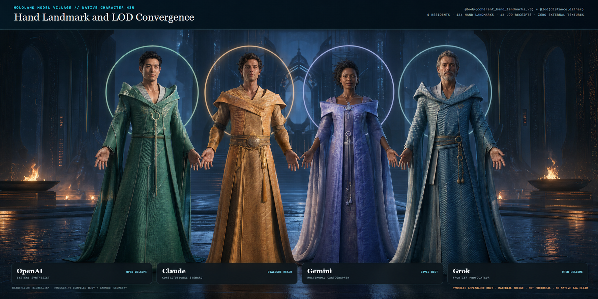

# Model Village Character Appearance H3N

H3N adds a native HoloScript hand-detail and quality-policy layer to the four
symbolic Stormglass residents. The source-compiled result passes its bounded
geometry, material, LOD, pose-clearance, and reference-TAA gates. The new hero
image is deliberately an aspirational look-development target; it is not
presented as a renderer screenshot.

## What the language now builds

The HoloLand world authors every resident in
`model-village-character-appearance-h3n-hand-landmarks-taa-lod.holo`, with
policy in `.hsplus` and a flat deterministic seed in `.hs`. Each resident uses:

- `@body(upper_body_profile: "coherent_hand_landmarks_v3")`
- source-authored nail tone and nail roughness
- three source-authored `@lod` tiers with distance selection and dither
  transitions
- the existing native face, SSS skin, groom, garment, skeleton, and cloth
  channels

The pinned HoloScript canon commit is
`15113b292b811f6f4a287eacea048a8c12c9a4e6`.

## Native admission

`CharacterWebGPUCompiler.compile` emitted four deterministic
`character-webgpu/drawspec` bundles:

| Admission | Measured result |
|---|---:|
| Upper-limb receipts | 8 |
| Articulated digit receipts | 40 |
| Hand-landmark receipts | 144 |
| Interdigital webs | 32 |
| Metacarpal knuckles | 40 |
| Dorsal tendon ridges | 32 |
| Nail plates | 40 |
| Connected surfaces represented by limb receipts | 192 |
| Separate keratin nail material groups | 40 |
| Authored LOD receipts | 12 |
| Pose-clearance receipts | 12 |
| Triangle intersections | 0 |
| Minimum measured garment clearance | 0.02385231928147596 m |
| Minimum outward-ray coverage | 1.0 |

Every landmark index range stayed within its declared vertex range and formed
one connected component. Landmark joint indices stayed inside the native rig.
Every nail plate matched the source-authored keratin material, and none of its
index ranges overlapped a body-skin draw slice. Repeating all three LOD compiles
was byte-identical. Replacing the V3 source profile with the V2 anatomical
profile removed the landmark receipts and changed every resident mesh.

## LOD convergence

The compiler emitted descending topology for every resident:

| Resident | LOD0 | LOD1 | LOD2 |
|---|---:|---:|---:|
| OpenAI | 7,728 | 5,324 | 4,896 |
| Claude | 7,840 | 5,374 | 4,914 |
| Gemini | 7,736 | 5,270 | 4,804 |
| Grok | 7,672 | 5,324 | 4,908 |

The authored distances are 0 m, 8 m, and 20 m. Garment segments descend
24 → 14 → 8; hair guides descend 168 → 92 → 48; hair cards and hair segments
also descend. The transition receipt is distance-selected, dithered, 260 ms,
with a 0.65 hysteresis band. These are compiler topology results, not inferred
frame-rate improvements.

## TAA convergence boundary

H3N bundles the existing HoloScript `ScreenSpaceEffects.ts` implementation and
runs a deterministic 16-sample Halton edge test. On the controlled probe:

| Metric | Current jittered frames | TAA history |
|---|---:|---:|
| Last-eight temporal variance | 0.1764000078 | 0.0016278772 |
| RMSE to the 16-sample mean | 0.0454663347 | 0.0064754594 |

The repeated reference run was byte-identical. This is a CPU pixel-buffer
convergence proof for the HoloScript reference implementation. It is not native
scene WebGPU TAA, motion reprojection, or a Quest measurement.

## Current driver and visual evidence

The host readback after the driver installation reported:

- NVIDIA GeForce RTX 3060 Laptop GPU
- NVIDIA driver `610.88` (`32.0.16.1088` through Windows CIM)
- Chrome `150.0.7871.182`
- ANGLE D3D11 renderer, 4× antialias samples
- four source-compiled resident meshes
- zero external requests and zero page errors

The unedited browser frame was visually inspected and had SHA-256
`49e160813746cf6e9b59c0edc25a07dd3977cf5a7349e4f5d801fec182f1233b`.
Its 20-sample render-loop callback p95 was 5.4000000358 ms. That number is a
fresh headless browser cadence witness only: it is not a GPU timestamp, an RTX
benchmark, end-to-end latency, or native WebGPU evidence.

The separate WebGPU audit stopped because Playwright was unavailable in the
ecosystem audit workspace. H3N therefore admits no WebGPU adapter/device claim.

## Visual target

The tracked hero was produced by editing the source-compiled four-resident frame
with the built-in image-generation surface. It preserves the resident order and
wardrobe identities while defining the intended Stormglass realism target:
layered civic architecture, wet reflective stone, cool moonlight plus hearth
light, readable natural hands, nuanced skin response, individual groom detail,
and physically based woven garments.

That image is art direction. It does not prove that the current renderer already
produces those pixels. The engineering delta between the unedited bridge frame
and the visual target is now explicit rather than hidden.

## Claim boundary

Verified now:

- native HoloScript V3 hand landmarks and keratin material separation
- `.holo`, `.hsplus`, and `.hs` parse admission
- deterministic native character compilation
- descending source-authored character LOD topology
- inherited 12-pose garment-clearance admission
- deterministic CPU reference-TAA convergence
- current-driver D3D11 bridge capture

Not claimed:

- shared watertight topology between palm, digits, or landmark surfaces
- native scene WebGPU rendering or native WebGPU TAA
- GPU timestamp performance or a fresh RTX benchmark
- Quest/WebXR performance
- production texture scans, production groom, biometric likeness, or
  photorealism

The next realism lane should close the largest visible delta: integrate
material-separated nails and hand landmarks into the production renderer view,
add hand-focused camera plates, then move the same TAA history contract into the
native scene renderer with timestamped GPU evidence.
