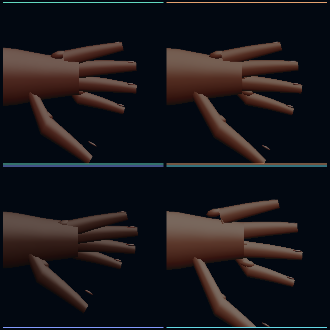

# Model Village Character Appearance H3O: Native Hand Material Plates

## Outcome

H3O proves that four symbolic Model Village residents authored in HoloScript
compile through `CharacterWebGPUCompiler.compile`, enter the native
`CharacterHost`, and render through HoloScript's Dawn/WebGPU
`renderCharacter` path on this machine. The native readback separates the
`keratin-nail` material role from skin and shows a causal pixel change when
only the nail color and roughness change.

This is a renderer-foundation result, not a finished-realism result. Visual
inspection of the contact sheet shows five articulated fingers per plate, but
the silhouette, joint volumes, nails, and surface response are still visibly
procedural. The plate is current renderer evidence and a useful gap detector;
it does not match the aspirational Stormglass/Hearthlight concept art yet.

## Source-to-pixel path

The checked path is:

`HoloScript composition -> CharacterWebGPUCompiler.compile -> buildCharacterHostFromComposition -> renderCharacter -> Dawn/WebGPU texture readback`

The HoloScript implementation is pinned to commit
`b76b9f2c62a8de753fca6e55b11e7e60385bce02`. Each resident compiled twice to
byte-identical output. Every compiled character exposed 16 scheduled material
groups, including 10 non-overlapping `keratin-nail` groups. Five left-hand
digit ranges and five left-hand nail ranges defined each close-up plate.

The four residents are symbolic appearance identities named OpenAI, Claude,
Gemini, and Grok. They are not provider model instances, research-seat
bindings, wallet identities, or biometric likenesses.

## Native GPU evidence

The 2026-07-29 native run requested a high-performance Dawn adapter and received:

- Vendor: NVIDIA
- Architecture: Ampere
- Device: NVIDIA GeForce RTX 3060 Laptop GPU
- Backend: D3D12
- Driver: `32.0.16.1088`
- Native GPU texture readback: measured
- Three.js/WebGL dependency: absent
- Browser dependency: absent

Changing only the `keratin-nail` material produced these readback deltas:

| Resident | Figure pixels | Changed pixels | Absolute channel difference | Host wall clock |
|---|---:|---:|---:|---:|
| OpenAI | 30,587 | 207 | 21,143 | 145.38 ms |
| Claude | 30,772 | 213 | 21,747 | 2.57 ms |
| Gemini | 26,511 | 221 | 24,032 | 3.29 ms |
| Grok | 31,890 | 193 | 19,373 | 3.13 ms |

The first value includes pipeline/shader warm-up, submission, and texture
readback. All four values are host wall-clock observations. They are not GPU
timestamps, frame times, end-to-end display latency, or RTX benchmarks.

The native adapter reports support for `timestamp-query`, but this run did not
request that feature or execute a timestamp query. Therefore H3O makes no
fresh RTX performance claim. The causal readback is legitimate hardware
execution evidence; the timing column is diagnostic only.

## Current hardware and browser boundary

`pnpm check:codex-hardware` passed on 2026-07-29 with Node `v24.15.0`, pnpm
`9.15.9`, WASM SIMD available, and the RTX 3060 Laptop GPU visible with 6,144
MiB VRAM. The NVIDIA Windows driver was `32.0.16.1088`.

The required Chrome audit was attempted against Chrome `150.0.7871.182`, but
the canonical audit could not load its Playwright prerequisite. That result is
inconclusive about browser WebGPU: it is neither a browser-WebGPU pass nor a
hardware failure. H3O did not use Chrome and keeps
`browserWebgpuMeasured: false`.

## Claim boundary

H3O does not claim:

- browser WebGPU execution;
- GPU timestamp frame time or a fresh RTX benchmark;
- native WebGPU TAA;
- Quest/WebXR behavior;
- production skin textures, production groom, or photorealism;
- biometric likeness or live provider-model binding;
- whole-world visual convergence.

## Next bounded realism lane

The next useful lane is geometry and material convergence, not another
evidence-only wrapper:

1. Attach nail topology to each distal phalanx with a consistent nail bed,
   free edge, thickness, and cuticle transition.
2. Replace the segmented finger silhouette with joint-volume-preserving
   phalanx blending and palm-web topology.
3. Calibrate skin and keratin response under a fixed Stormglass light rig,
   then add native GPU timestamp queries as a separate performance receipt.

## Artifacts

- Source: `source/layers/vr/frontier/model-village/model-village-character-appearance-h3o-native-hand-material-plates.holo`
- Policy: `source/proofs/model-village-character-appearance-h3o-native-hand-material-plates-policy.hsplus`
- Seed: `source/proofs/model-village-character-appearance-h3o-native-hand-material-plates-seed.hs`
- Checker: `scripts/check-hololand-model-village-character-appearance-h3o.mjs`
- Focused test: `scripts/__tests__/hololand-model-village-character-appearance-h3o.test.mjs`
- Machine-readable witness: `docs/assets/model-village/model-village-character-appearance-h3o-native-hand-material-plates-2026-07-29.json`
- Native contact sheet: `docs/assets/model-village/model-village-character-appearance-h3o-native-hand-material-plates-2026-07-29.png`
