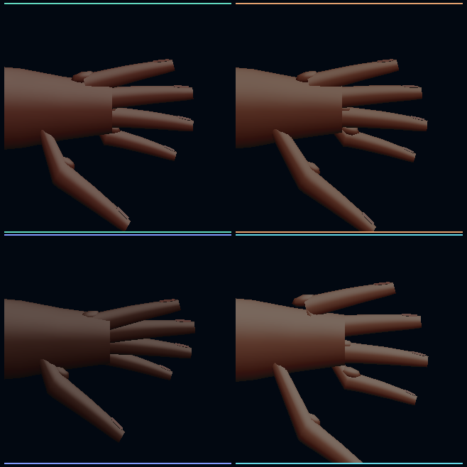

# Model Village Character Appearance H3P: Hand Topology Convergence

## Outcome

H3P replaces the most visible H3O hand-geometry placeholders in the
HoloScript-owned V3 profile:

- each digit now uses nine longitudinal volume rings and twelve radial
  segments, with a bounded adjacent-radius drop and an oval anatomical
  cross-section;
- each interdigital web is a four-ring, twelve-sided volumetric patch instead
  of an eight-vertex rectangular prism;
- each nail is a 50-vertex keratin plate whose 25 underside samples follow and
  slightly embed into the emitted distal-phalanx loft.

The compatibility profiles remain unchanged. HoloScript's hash-pinned
legacy/V2 fixtures passed after both geometry commits.

Visual inspection under the fixed H3O light rig confirms that the detached
nail fragments are gone, the longitudinal finger taper is smoother, and the
twelve-sided refinement reduces the remaining faceted lighting bands. The
plate still exposes a deliberately procedural palm silhouette, simplified
joint deformation, analytic skin response, and separate overlapping web/nail
surfaces. It is a topology-convergence result, not a photorealism result.

## HoloScript ownership

The runtime geometry is implemented in
`packages/engine/src/character-render/AgentAvatarMesh.ts` and promoted through
two HoloRepo changes:

- `76e2afe54a66e24a694b185e2946041ee7ae967d` — nine-ring
  volume-preserving digits, volumetric webs, and surface-conforming nail
  plates;
- `1a9290762e1c1b1671c0a3ae9fb7d25999f0d0c1` — twelve-sided V3
  digit/web refinement and nail underside sampling against that exact loft.

The final mesh source hash is
`1a54bb937002ade95305872e57cdbf67c866a2a219a14d9416884d9a661784ac`.
The HoloLand `.holo` composition selects
`coherent_hand_landmarks_v3`; the `.hsplus` policy admits the explicit topology
receipt; the `.hs` seed pins the flat expected profile and boundary values.

Focused upstream validation passed:

- 47 Vitest assertions across `AgentAvatarMesh`,
  `CharacterHostFromComposition`, and `character-render`;
- the complete `@holoscript/engine` ESM/CJS build and declaration emit;
- commit-time ESLint, enforced-package TypeScript, workspace dependency,
  native-render, language-strata, and executable-spec gates.

## Native source-to-pixel evidence

The checked path is:

`HoloScript composition -> CharacterWebGPUCompiler.compile -> buildCharacterHostFromComposition -> renderCharacter -> Dawn/WebGPU texture readback`

Four symbolic residents—OpenAI, Claude, Gemini, and Grok—compiled twice to
byte-identical native draw specifications. Each left-hand close-up admitted:

- 5 `volume-preserving-three-phalanx-v2` digits;
- 4 `volumetric-interdigital-web-v2` patches;
- 5 `surface-conforming-nail-plate-v2` plates;
- 25 underside attachment samples per nail;
- no claim that the separate keratin surface is watertight with skin.

Across the four rendered plates, the receipt therefore covers 20 digits, 16
webs, and 20 nails. Changing only the `keratin-nail` material still produced a
causal readback delta:

| Resident | Figure pixels | Changed pixels | Absolute channel difference | Host wall clock |
|---|---:|---:|---:|---:|
| OpenAI | 29,553 | 341 | 38,543 | 156.97 ms |
| Claude | 29,688 | 337 | 36,963 | 3.40 ms |
| Gemini | 26,029 | 335 | 40,895 | 4.33 ms |
| Grok | 30,752 | 250 | 27,182 | 3.09 ms |

The first wall-clock observation includes pipeline warm-up. None of these
values is a GPU timestamp, frame time, end-to-end display latency, or RTX
benchmark.

## Hardware boundary

The native Dawn run selected:

- NVIDIA GeForce RTX 3060 Laptop GPU;
- Ampere architecture;
- D3D12 driver `32.0.16.1088`;
- native texture readback measured;
- `timestamp-query` supported but not requested or measured;
- no browser, Three.js, or WebGL dependency in this witness.

H3P does not claim browser WebGPU, native TAA, production skin textures,
production groom, biometric likeness, Quest/WebXR behavior, a watertight
nail/skin union, photorealism, or whole-world convergence.

## Next bounded realism lane

The next geometry-adjacent lane is fixed-light material calibration:

1. calibrate skin, nail-bed, free-edge, and cuticle response under the same
   Stormglass light rig;
2. add palm silhouette and joint-deformation convergence without changing the
   compatibility profiles;
3. measure GPU timestamps in a separate performance receipt so rendering
   quality and performance claims remain causally distinct.

## Artifacts

- HoloScript world source:
  `source/layers/vr/frontier/model-village/model-village-character-appearance-h3p-hand-topology-convergence.holo`
- HoloScript+ policy:
  `source/proofs/model-village-character-appearance-h3p-hand-topology-convergence-policy.hsplus`
- HoloScript seed:
  `source/proofs/model-village-character-appearance-h3p-hand-topology-convergence-seed.hs`
- Checker:
  `scripts/check-hololand-model-village-character-appearance-h3p.mjs`
- Focused test:
  `scripts/__tests__/hololand-model-village-character-appearance-h3p.test.mjs`
- Native contact sheet:
  `docs/assets/model-village/model-village-character-appearance-h3p-hand-topology-convergence-2026-07-29.png`
- Machine-readable witness:
  `docs/assets/model-village/model-village-character-appearance-h3p-hand-topology-convergence-2026-07-29.json`
