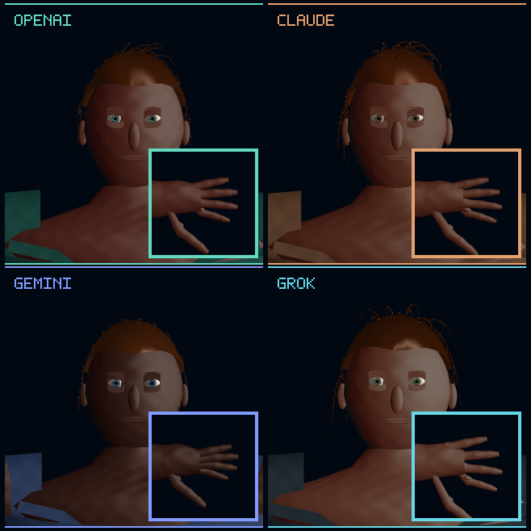

# Model Village H3T — Source-authored skin-surface response

Date: 2026-07-29

Status: verified bounded realism lane

Art direction: `hearthlight_biorealism`



## Outcome

H3T moves the Model Village residents from one coupled skin-noise control to
three independently authored surface channels:

- low-amplitude albedo variation;
- roughness variation;
- analytic fine-normal response.

The implementation lives in the HoloScript character compiler, host bridge,
material ABI, renderer, and WGSL shader. The HoloLand `.holo` source opts each
symbolic resident into `calibrated-skin-surface-v1`; the proof does not inject a
post-render beauty filter or bridge-only material override.

The contact sheet is a native Dawn WebGPU readback from the pinned HoloScript
runtime. Each source-bound face uses the same raking-light direction and includes
its source-bound V5 hand as an inset. The labels OpenAI, Claude, Gemini, and Grok
are symbolic village identities. They do not bind provider APIs, model calls,
research seats, or biometric likenesses.

## Causal readback

Each counterfactual changes one authored material field while preserving the
geometry. Values below are changed pixels / absolute RGB channel difference.

| Resident | Albedo | Roughness | Fine normal | Nail bed | Face p90-p10 luminance |
|---|---:|---:|---:|---:|---:|
| OpenAI | 13,099 / 18,929 | 4,898 / 5,666 | 27,429 / 155,401 | 45 / 638 | 59.1484 |
| Claude | 13,686 / 19,173 | 4,854 / 5,514 | 27,869 / 152,794 | 44 / 626 | 63.0786 |
| Gemini | 11,629 / 16,203 | 5,782 / 6,998 | 26,324 / 154,206 | 46 / 847 | 49.3570 |
| Grok | 14,657 / 20,439 | 4,359 / 4,837 | 28,742 / 148,263 | 32 / 462 | 71.6562 |

All sixteen counterfactuals produced a non-zero native pixel delta. The face
plates each retained more than 41,000 foreground pixels and exceeded the
predeclared luminance-contrast floor of 12. The compiled character bundles were
byte-identical across repeated compilation and each retained 43 material groups,
the v3 skin receipt, civic facial landmarks, and the V5 hand-surface receipt.

The hand-material audit also retained zero index overlap between skin,
keratin-nail, and nail-bed roles. That makes the nail-bed result a material-role
counterfactual rather than evidence from overlapping triangles.

## Machine boundary

The proof adapter identified itself as:

```text
vendor: nvidia
architecture: ampere
device: nvidia-geforce-rtx-3060-laptop-gpu
description: D3D12 driver version 32.0.16.1088
```

This is device-executed native WebGPU readback evidence, not an RTX benchmark.
The recorded host wall-clock values include submission and readback, the first
plate includes warm-up work, and no GPU timestamp query was measured. H3T does
not claim browser WebGPU, Quest WebXR, frame time, end-to-end latency, TAA
convergence under motion, or multi-resident world performance.

## Exact artifacts

- Source composition:
  `source/layers/vr/frontier/model-village/model-village-character-appearance-h3t-skin-surface-response.holo`
- Parsed policy:
  `source/proofs/model-village-character-appearance-h3t-skin-surface-response-policy.hsplus`
- Flat seed:
  `source/proofs/model-village-character-appearance-h3t-skin-surface-response-seed.hs`
- Native evidence:
  `docs/assets/model-village/model-village-character-appearance-h3t-skin-surface-response-2026-07-29.json`
- Contact-sheet PNG SHA-256:
  `f09bd010a623e82ebc33058c0f904dc57758eba51c2002d284ceab07a5378b36`
- Evidence receipt SHA-256:
  `d59e3e78ce21df58b79aa8135f1ff1e5a170fb971eba98fe43e28fb454e92602`
- Pinned HoloScript commit:
  `f165a58722c0808bc4ab9753ab1c68136870e10d`

## Vision boundary and next lane

The intended destination is warmer, more natural, cinema-quality village
portraiture with production skin maps, richer eyes and hair, tailored clothing,
and temporal stability in motion. H3T proves a narrower foundation. It does not
claim measured tissue optics, production skin texturing, production grooming,
photorealism, or full-world visual convergence.

The next bounded lane is H3U: take these source-authored surfaces through
browser/Quest LOD transitions and temporal convergence under controlled camera
and resident motion, with device-specific evidence and no reuse of host callback
cadence as GPU timing.
