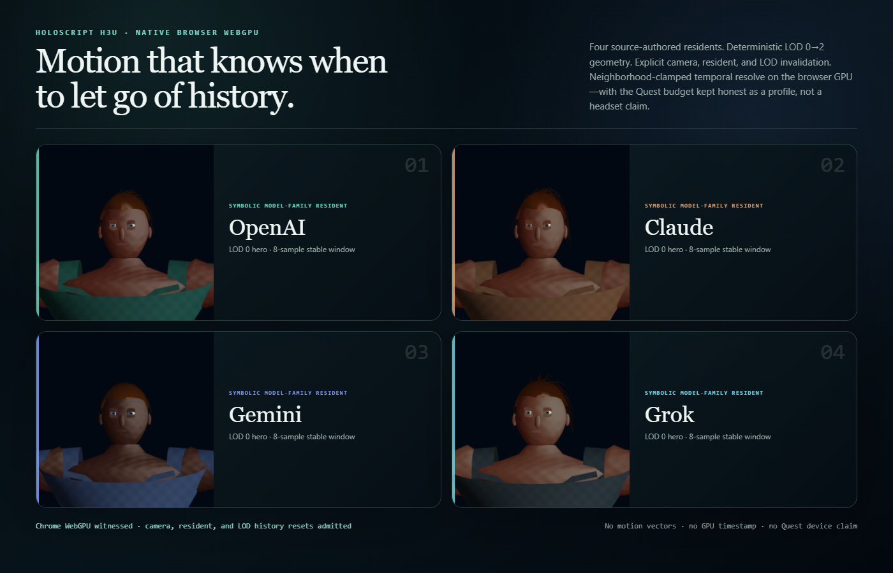

# Model Village H3U — browser temporal LOD convergence

Date: 2026-07-29

Status: verified bounded browser lane

Art direction: `hearthlight_biorealism`



## Outcome

H3U moves the Model Village temporal/LOD path from the earlier Three.js
presentation bridge to a HoloScript-owned WebGPU primitive and a real Chrome
GPU device. The `.holo` source authors four symbolic residents—OpenAI, Claude,
Gemini, and Grok—with three distance LODs. The proof compiles and witnesses LOD
0 and LOD 2, renders the source-derived character draw specs through
`renderCharacter`, and resolves history through `resolveTemporalFrameGPU`.

The browser-balanced profile executes an eight-sample stable window after each
of four state boundaries:

1. initial history;
2. controlled camera motion;
3. controlled resident motion;
4. LOD 0 to LOD 2.

Every first frame discarded history exactly: the resolved frame had zero pixel
difference from the new current frame. Every stable window reached its declared
sample count. Camera, resident, and LOD changes all produced non-zero pixels for
all four residents.

## Compiler-owned LOD

The HoloScript compiler emitted byte-identical output on repeated compilation.
LOD 2 reduced native character geometry without changing the resident identity
or switching to a presentation-only mesh.

| Resident | LOD 0 vertices | LOD 2 vertices | Reduction |
|---|---:|---:|---:|
| OpenAI | 10,206 | 7,378 | 27.71% |
| Claude | 10,506 | 7,378 | 29.77% |
| Gemini | 9,234 | 7,354 | 20.36% |
| Grok | 9,954 | 7,370 | 25.96% |

The source also authors LOD 1. H3U does not claim a visual witness for that
middle tier.

## Causal browser readback

The table reports changed pixels at each browser-balanced transition. The
initial stage has no predecessor.

| Resident | Camera motion | Resident motion | LOD change |
|---|---:|---:|---:|
| OpenAI | 26,193 | 29,173 | 13,324 |
| Claude | 26,439 | 29,313 | 13,634 |
| Gemini | 25,069 | 27,968 | 13,426 |
| Grok | 26,852 | 29,552 | 13,189 |

Chrome acquired `navigator.gpu`, an NVIDIA/Ampere adapter, and a `GPUDevice`.
The checker verified render-pipeline and compute-pipeline methods and executed:

- 128 source-bound character renders;
- 128 browser-balanced neighborhood-clamped resolves;
- 64 Quest-budget-profile resolves.

The Quest-budget profile uses the same live browser GPU device and reuses each
already-rendered controlled state grid for four resolve samples. This proves the
four-sample policy and invalidation behavior execute; it is not a Quest render,
headset measurement, or WebXR session.

## Hardware and timing boundary

The host readback at capture time was:

```text
NVIDIA GeForce RTX 3060 Laptop GPU, driver 610.88, 6144 MiB
```

This is not an RTX benchmark. Chrome did not expose a device string or driver
version through `GPUAdapterInfo`, so the receipt keeps the browser adapter data
and host `nvidia-smi` readback as separate evidence fields.

The receipt includes browser-observed wall-clock durations for diagnostics.
Those values include JavaScript, pipeline work, submission, allocation, and
readback. They are not GPU timestamps, frame times, refresh-rate proof, or
end-to-end display latency. The H3U resolver intentionally records
`gpuTimestampMeasured: false`.

## Temporal limitation

H3U performs deterministic Halton jitter, neighborhood clamping, and explicit
history invalidation. It does not consume:

- motion vectors;
- a reactive mask;
- disocclusion input.

That makes it safe for the controlled state changes in this witness, but it is
not yet motion-reprojected production TAA. The implementation also crosses a
GPU-to-CPU readback boundary between `renderCharacter` and the temporal upload;
it is not yet an in-graph, GPU-resident world renderer.

## Exact artifacts

- HoloScript source:
  `source/layers/vr/frontier/model-village/model-village-character-appearance-h3u-browser-quest-temporal-lod.holo`
- Parsed policy:
  `source/proofs/model-village-character-appearance-h3u-browser-quest-temporal-lod-policy.hsplus`
- Flat seed:
  `source/proofs/model-village-character-appearance-h3u-browser-quest-temporal-lod-seed.hs`
- Browser evidence:
  `docs/assets/model-village/model-village-character-appearance-h3u-browser-quest-temporal-lod-2026-07-29.json`
- Hero PNG SHA-256:
  `cecdb8822f86b0899f3451741375bc65199a4fc7cfe504439736134228bd56db`
- Pinned HoloScript commit:
  `0c1a5313d0ed207744bf115ee3697a74e59046d2`

## Visual reading and next lane

The 2×2 hero uses source-bounded 256-pixel portrait frames so the eyes, hair,
skin response, and clothing remain visible while the temporal lane is tested.
It is still a stylized procedural character foundation, not photorealism. The
image makes the remaining gaps legible: facial shape language, shoulder and arm
deformation, authored garment construction, production skin maps, and
production grooming still need dedicated passes.

The next bounded temporal lane is H3V: keep current/history as GPU-resident
render-graph textures, add velocity/reactive/disocclusion inputs, and measure
GPU work only with timestamp queries. Quest claims remain closed until a headset
and WebXR session are actually observed. The next character-realism lane should
then correct shoulder/arm deformation before full-body hero framing returns.
