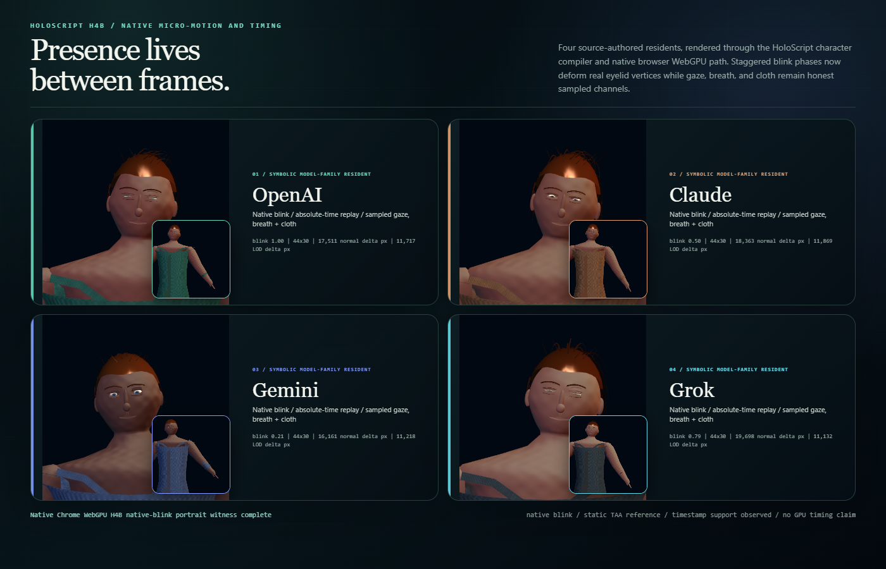

# Model Village Character Realism H4B — Micro-Motion and Timing

H4B gives the four symbolic model-family residents a shared HoloScript-native
presence primitive without flattening them into one synchronized loop. OpenAI,
Claude, Gemini, and Grok each author a separate deterministic seed, blink
cadence, saccade cadence, breath phase, cloth phase, and absolute source time.

## Shipped language/runtime foundation

HoloScript canon `1f295ee62e255883dc95394f5249700023bb39df` adds
`@micro_motion(profile: "human_presence_v1", ...)` as an operative character
trait. The pure sampler can evaluate any absolute time without replaying prior
frames. `CharacterHost` binds blink to native procedural-head deformation, and
`CharacterWebGPUCompiler` serializes matching config, sample, application, and
binding receipts.

- HoloScript capsule:
  `sha256:b09ef0fb23344c85f74a9432356937ae0a9c8cfe6aba399ead03557265a7a4e5`
- HoloScript promotion:
  `sha256:1e7faf86bb9cf8977833cee5ccc3c68588c8f2d257ecb6ba51c489d876c28caf`
- Core compiler test: 18 passed.
- Character-render suite: 17 files passed, 1 skipped; 159 tests passed, 1 skipped.
- Core and engine package builds passed in the promoted candidate.

## Browser witness

The H4B overlay was merged deterministically onto the admitted H4A resident
composition before compiling. Four repeated compiles were byte-identical. The
native Chrome WebGPU renderer produced the durable 1400×900 plate with no
external network requests.

| Resident | Native blink weight | Changed vertices | Sample digest |
|---|---:|---:|---|
| OpenAI | 1.000 | 3,099 | `fnv1a32:13337fad` |
| Claude | 0.500 | 3,099 | `fnv1a32:e2b56ad6` |
| Gemini | 0.206 | 3,101 | `fnv1a32:1036546d` |
| Grok | 0.794 | 3,099 | `fnv1a32:d6837f7c` |

The stagger is deliberate look development: the plate shows one full closure,
one half closure, one early closure, and one near closure rather than four
identical faces.

## Temporal and hardware evidence

- Browser: Chrome 150.0.7871.187.
- WebGPU adapter: NVIDIA, Ampere; adapter and device creation measured.
- Host readback: RTX 3060 Laptop GPU, driver 610.88, 6,144 MiB.
- `timestamp-query` support was observed in the adapter feature set.
- GPU timestamps were **not** measured because this character witness does not
  yet integrate timestamp queries.
- An 8-sample deterministic image-space jitter-history reference settled from
  mean absolute delta `1.21235` to `0.44147`, a terminal/first ratio of
  `0.36414`.

This temporal result is a static presentation convergence reference. It is not
production TAA, does not use motion vectors, and is not a world-scale
performance benchmark.

## Exact claim boundary

Verified now:

- HoloScript source owns the four timing profiles.
- Absolute-time samples and repeated compilation are deterministic.
- Blink changes real native facial vertices.
- Gaze, breath, and cloth channels are sampled and receipt-visible.
- Browser-native WebGPU rendering and static jitter-history settling passed.

Not claimed:

- Native eye rotation from the gaze sample.
- Native skeleton breathing.
- Native cloth simulation driven by the cloth phase.
- Production TAA or motion-vector integration.
- GPU timestamp measurements or a fresh RTX performance benchmark.
- Quest/WebXR performance, photorealism, or full-world MMO performance.

Evidence receipt:
`docs/assets/model-village/model-village-character-realism-h4b-micro-motion-timing-2026-07-30.json`
with canonical integrity
`1ed1459e2f86fa4f46ea9da0b08bb3ad1f35e62c4d629aa2d238ebf5b521f000`.
