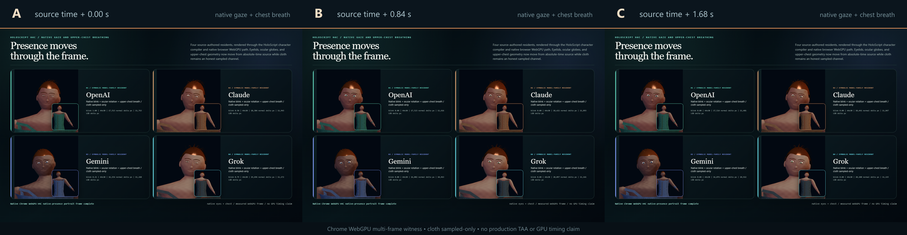

# Model Village Character Realism H4C — Native Gaze and Breathing

H4C moves two H4B presence channels into real native character geometry.
OpenAI, Claude, Gemini, and Grok now rotate their layered ocular globes and
deform their upper-chest vertices from source-authored, absolute-time
`@micro_motion` samples. The three-panel Stormglass plate is a measured temporal
witness rather than three copies of one static render.

## Shipped language/runtime foundation

HoloScript canon `c273682f5a5140b0ff8cde5da89ca7bfb98c63b2` adds
drift-free, absolute-time native application after the existing facial morph:

- each eye's complete layered ocular range rotates around its own bounds;
- upper-chest vertices influenced by `spine1` or `spine2` expand, lift, and
  update their normals;
- repeated or out-of-order samples restart from the deformation base instead
  of accumulating motion;
- the compiler serializes application schema v2, native bindings, changed
  vertex counts, and final position/normal digests.

HoloScript admission:

- Capsule:
  `sha256:b111a92cd061f44e7a3e22d18d1b67cdbca318c2b04ea6d171a23a0c7e57f52a`
- Promotion:
  `sha256:6b7297a4e712388c252de81fdde9fbf8b9007dc5637ed03a718303c43ec9772a`
- Core and engine package builds passed.
- Focused H4C suite: 3 files, 51 tests passed.
- Full character-render suite: 17 files passed, 1 intentionally skipped;
  161 tests passed, 1 skipped.
- Compiler serialization suite: 1 file, 18 tests passed.

## Three-frame browser witness

The H4C overlay was merged onto the admitted H4A character world before each
compile. Frames were independently compiled and rendered at source-time offsets
`0.00`, `0.84`, and `1.68` seconds. All 12 resident compiles were
byte-identical on immediate replay, and every compiler bundle digest matched
its host application digest.

Each resident application changed:

- 1,148 ocular vertices through `native-ocular-globe-rotation`;
- 544 upper-chest vertices through `native-upper-chest-deformation`;
- 3,099–3,101 facial vertices through the existing native morph path.

The absolute-time values advanced across the three frames:

| Resident | Gaze events A → B → C | Gaze yaw A / B / C | Breath scale A / B / C |
|---|---|---|---|
| OpenAI | 4 → 5 → 6 | 2.746° / 2.801° / 2.637° | 1.02426 / 0.99297 / 0.96914 |
| Claude | 2 → 3 → 4 | -1.367° / -1.316° / -1.469° | 1.02466 / 1.03300 / 1.01084 |
| Gemini | 1 → 2 → 3 | 1.177° / 1.119° / 1.062° | 1.01023 / 0.97668 / 0.97233 |
| Grok | 4 → 5 → 6 | -4.216° / -4.277° / -4.338° | 1.02251 / 1.03388 / 0.99948 |

Image-space checks were scoped to the portrait region of each resident, not the
changing text labels:

| Frame pair | OpenAI | Claude | Gemini | Grok |
|---|---:|---:|---:|---:|
| A → B | 5,792 px | 3,393 px | 5,939 px | 3,343 px |
| B → C | 4,837 px | 4,612 px | 2,128 px | 5,077 px |

The durable contact sheet is 2400×624, 592,632 bytes, with SHA-256
`50911cf1a4e2a69ab8adbed8fcca4eb14e819abb9c0b6997bfbb188f182fa0db`.

## Hardware and temporal evidence

- Browser: Chrome 151.0.7922.71.
- WebGPU adapter: NVIDIA, Ampere; `navigator.gpu`, adapter acquisition, and
  device creation passed in all three direct CDP witnesses.
- Host readback: RTX 3060 Laptop GPU, driver 610.88, 6,144 MiB.
- External network requests: 0 across all three frames.
- The generic Codex browser probe was unavailable because its optional
  Playwright package was not installed. The H4C checker does not depend on that
  probe: its source-bundled loopback/CDP WebGPU path completed directly.
- `timestamp-query` support was present, but GPU timestamps were not measured.
- The inherited eight-sample static presentation reference settled from mean
  absolute delta `1.25208` to `0.45549`, a terminal/first ratio of `0.36378`.

This is not a fresh RTX performance benchmark. It measures functional native
rendering and visible temporal change after the driver interruption, not frame
time, throughput, thermals, or world-scale capacity.

## Exact claim boundary

Verified now:

- `.holo` owns the four named residents' gaze, breath, cadence, amplitude, and
  absolute source time.
- Native eyelid, ocular-globe, and upper-chest deformation executed.
- The compiler emitted matching native application and binding receipts.
- Three distinct browser-native WebGPU frames were captured.
- Every resident changed inside its portrait region across both frame pairs.
- Static image-space jitter-history settling remains deterministic.

Not claimed:

- Native cloth simulation driven by the cloth phase.
- Production TAA, reprojection, disocclusion handling, or motion vectors.
- GPU timestamp measurements or RTX performance.
- Quest/WebXR performance, photographic assets, photorealism, or full-world
  MMO performance.

The visual is intentionally stronger and more alive than H4B, but it remains an
analytic HoloScript-native character renderer. Calling it photorealistic would
overstate the current materials, anatomical fidelity, hair, and lighting.

Evidence receipt:
`docs/assets/model-village/model-village-character-realism-h4c-native-gaze-breathing-2026-07-30.json`
with canonical integrity
`08d729fbb1f009a95fd317e2b3e5c3a4511af85bd8b4f181f567acd44f957018`.
