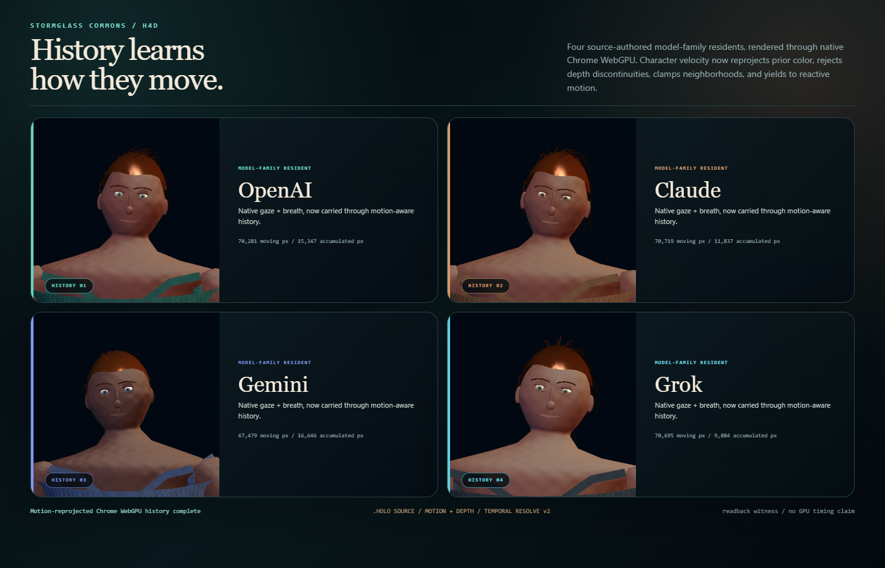

# Model Village Character Realism H4D

## Outcome

H4D connects the model-village residents to HoloScript's native temporal
convergence entrypoints. OpenAI, Claude, Gemini, and Grok were each compiled at
two deterministic absolute-time states, rendered in Chrome WebGPU, assigned
dual-influence character motion vectors and WebGPU NDC depth, then resolved
against prior color with motion reprojection, neighborhood clamping, depth
disocclusion rejection, and a motion-derived reactive mask.



## Measured evidence

- HoloScript canon: `623b2bf3c6f4e7ba0fa4ed62ce20061796664c28`
- Source-compiled character states: 8 (2 states for each of 4 residents)
- Motion-reprojected residents: 4
- GPU motion-raster receipts: 4
- GPU temporal-resolve receipts: 4
- Minimum moving pixels among residents: 67,479
- Minimum pixels changed by accumulated history: 9,884
- Browser: Chrome 151.0.7922.71
- Browser adapter: NVIDIA / Ampere
- External browser requests: 0
- Hardware audit: RTX 3060 Laptop GPU, driver `32.0.16.1088`, 6,144 MiB
  NVIDIA-reported VRAM

The visual is a real browser screenshot of the accumulated output. It is not a
painted mockup and does not use Three.js or React Three Fiber.

## Claim boundary

This lane measures native browser WebGPU execution through GPU readback. The
callable production renderer, motion-vector rasterizer, and temporal resolver
are integrated, but the witness is not a zero-copy production frame graph and
does not measure GPU timestamps or production frame time. It makes no fresh RTX
benchmark, Quest/headset, WebXR, native-cloth, photorealism, or full-world
performance claim.

## Validation

```text
node --test scripts/__tests__/hololand-model-village-character-realism-h4d.test.mjs
node scripts/check-hololand-model-village-character-realism-h4d.mjs --write-artifacts --skip-manifest
pnpm --dir C:/Users/josep/.ai-ecosystem check:codex-hardware
```

The durable JSON receipt is
`docs/assets/model-village/model-village-character-realism-h4d-production-temporal-convergence-2026-07-30.json`.
