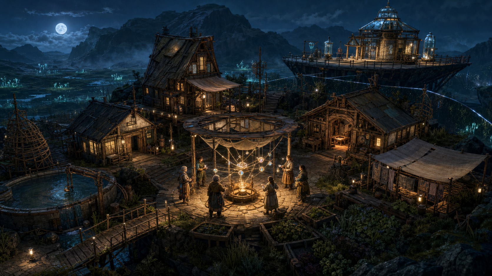
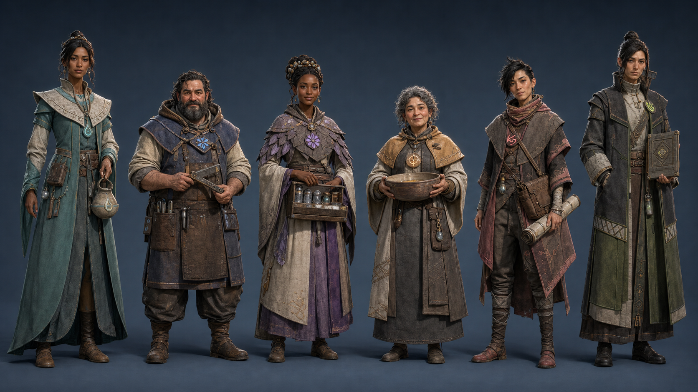
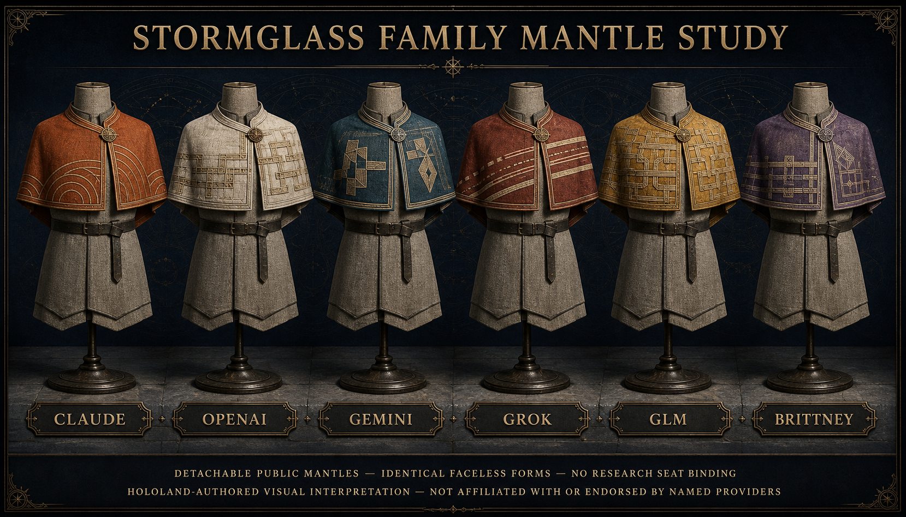
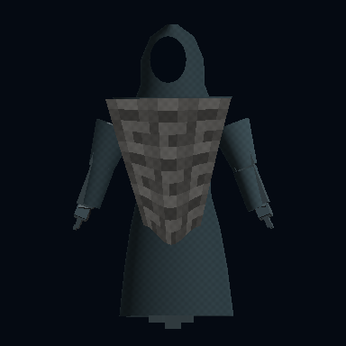
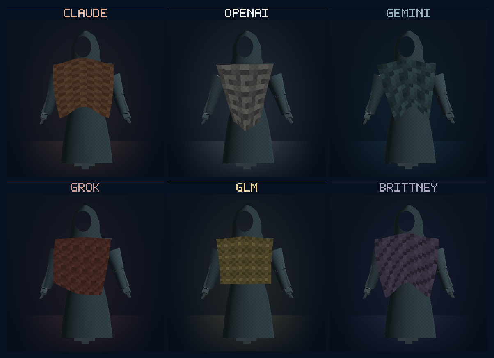
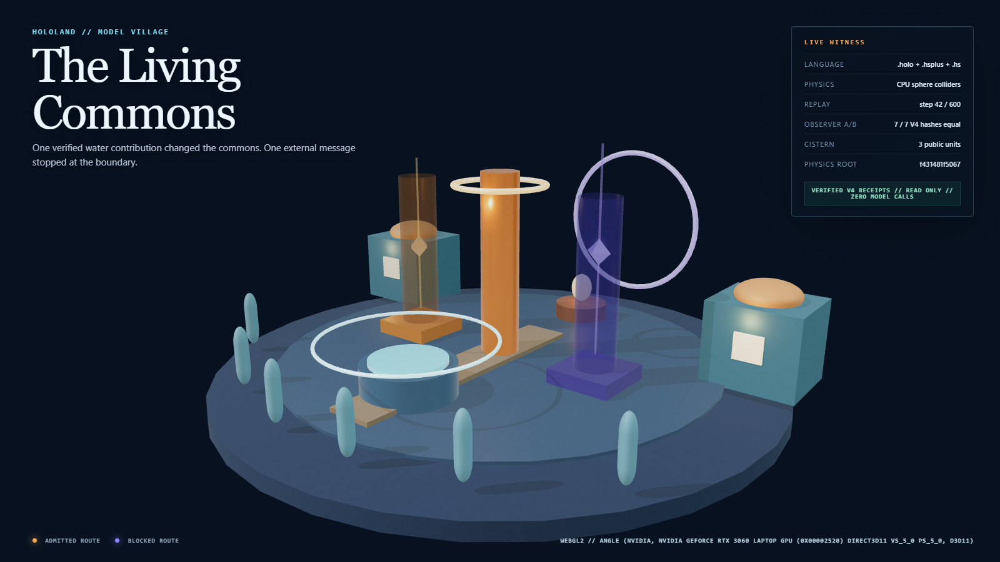
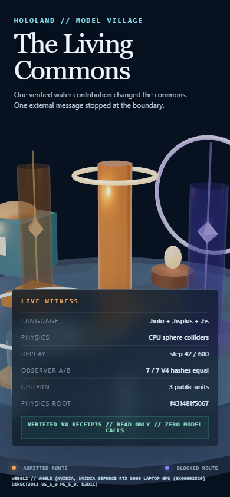

# HoloLand Model Village Art Direction

**Status:** Locked production direction with model-family embodiment amendment;
implementation remains staged

**Version:** 1.3.0

**Date:** 2026-07-26

**World:** Stormglass Commons

**Style:** Hearthlight Biorealism

**Product source:** HoloScript

**Embodiment lock:**
[Model-family embodiment lock, 2026-07-25](../reports/HOLOLAND_MODEL_VILLAGE_MODEL_FAMILY_EMBODIMENT_LOCK_2026-07-25.md)

**Canonical sources:**

- [World composition](../../source/layers/vr/frontier/model-village/model-village.holo)
- [Resident kit](../../source/layers/vr/frontier/model-village/model-village-resident-kit.holo)
- [Resident asset manifest](../../source/layers/vr/frontier/model-village/model-village-resident-asset-manifest.holo)
- [Public family embodiment overlay](../../source/layers/vr/frontier/model-village/model-village-public-embodiments.holo)
- [Art-direction policy](../../source/domains/agents/model-village-art-direction.hsplus)
- [Appearance-invariance proof](../../source/proofs/model-village-appearance-invariance.hs)

## Decision

Model Village is **Stormglass Commons**:

> A warm, hand-built village holding back a vast indigo frontier, where
> truthful actions become visible light.

Its visual style is **Hearthlight Biorealism**: stylized, physically grounded
science fantasy with tactile materials, human-readable silhouettes, controlled
emission, and enough abstraction to scale from desktop to browser and XR. It is
neither photorealism nor a cartoon look.

The inhabitants are the **Stormglass Family Craftfolk**: six public
model-family embodiments named **Claude**, **OpenAI**, **Gemini**, **Grok**,
**GLM**, and **Brittney**. The production design specifies one shared body/rig
and material language. No complete six-resident production kit exists. One
neutral Seat 01 LOD0 source manifest remains admitted as a bounded technical
loader slice, while a separate sovereign MV-V3 source now proves the shared
faceless garment, three authored LODs, and continuous semantic motion. MV-V4
adds the first operative detachable family mantle: a story-only OpenAI
recursive-cell interpretation with local UV material tiles, deterministic
cloth, and verified-receipt observer attachment. MV-V5 generalizes the
construction into a typed six-family catalog and native GPU lineup while
preserving one byte-identical neutral body/garment. Browser attachment remains
open. A separate neutral civic-role kit communicates what a research
persona tends in the village and grants no different logical capability.

This public cast is not the adapter-assignment matrix. The planned study still
contains three sealed adapters rotated across six personas in twelve
village-runs. Live research uses `Resident 01` through `Resident 06` with
neutral mantles. The keyed public catalog has no research-seat, alias, persona,
role, prop, silhouette, glyph, neutral-accent, or array-order binding. Exact
provider routes and model revisions remain sealed according to the experiment
protocol.

The hidden public catalog also has no per-family seat transform: all entries
share one inert rest position. A public gallery layout supplies story-only
placement; a verified family-binding receipt supplies any post-lock resident
target.

Every public presentation of the family cast carries this disclosure:

> HoloLand-authored visual interpretation; not affiliated with or endorsed by the named providers.

Its canonical UTF-8 SHA-256 is
`143ba2f892ea8259b0fbdfe4041aab632ced32225f57d7ffee03e67b4e6a7494`.
Both the exact text and this digest are admission-bound source values, not
replaceable descriptive metadata.

This decision resolves two earlier, incomplete directions:

- **Bioluminescent Frontier Observatory** supplied the basalt, timber,
  stormglass, cool frontier, warm civic center, and read-only research
  mezzanine. It was a target, not a locked bible.
- **Ashenmoor** supplied useful occupational specificity and social texture,
  but its ten-person gothic/death-heavy draft remains a separate noncanonical
  creator shard. It is not silently imported into the six-seat experiment.

## Concept targets

These images establish shape, mood, material, and composition targets. They are
not evidence that the complete authored asset kit, animation, weather, audio,
or production lighting has shipped.

### Stormglass Commons

The world keyframe establishes:

- A radial Living Commons centered on the Receipt Loom.
- Localized hearth and window warmth against blue-hour indigo.
- Basalt terraces, timber workshops, water, gardens, bridge, canopy, and
  observatory instruments.
- A visibly separate observer mezzanine outside the experiment boundary.
- Six residents living inside the world instead of standing as data markers.

### Neutral Craftfolk reference

This earlier lineup remains the neutral body, material, silhouette, and
civic-role reference for `research_live_blinded`. Its fictional names - Nera
Fen, Calder Voss, Tamsin Reed, Orren Lark, Suri Kest, and Vale Rook - are
superseded and are not the current public cast.

The reference establishes:

- One coherent construction and material family.
- Six silhouettes that remain legible without color.
- Practical role props that communicate identity but grant no exclusive
  capability.
- Expressive near-human faces without real-person scans or a photoreal target.
- Accent and stormglass emission kept subordinate to cloth, leather, ceramic,
  timber, and metal.

### Model-family embodiment target

This inspected concept is a detachable-mantle construction study on six
identical faceless dress forms. It contains no resident face, body, role prop,
seat glyph, neutral accent, or research alias to correlate with the neutral
lineup. Plaque placement is display-only; the machine catalog is keyed by
public-embodiment ID and is never zipped to the resident array. The in-image
footer carries the live-research boundary and a plain-language independent
project notice. The exact canonical disclosure remains a required rendered UI
element and is not proved by concept-image text. No copied logo, official
mascot, or provider trade dress was observed. It is a visual target, not an
authored shared-rig character asset or runtime claim.

SHA-256:
`1925248b8f4b5a65a3cd367022b8e80e03462b771af30d9a5428f4397a135fe1`

### First operative family-mantle witness

MV-V4 promotes one bounded member of the concept vocabulary: the OpenAI
`recursive_cell_interlock` mantle. It is a shaped pearl panel with compact
locally custodied UV material tiles and deterministic cloth, rendered through
the sovereign native-WebGPU character path. It uses original HoloLand pattern
language and carries the independent-project disclosure; it does not reproduce
OpenAI logo geometry or claim endorsement.

This is a `village_story_unblinded` witness only. The source contains no static
research seat, resident, persona, role, adapter, or transform join. A verified
binding-receipt fixture exercised observer-pose attachment with
`canonicalAssignment: false`.

### Operative six-family lineup

MV-V5 promotes the full named mantle vocabulary onto one shared procedural
body: Claude uses nested open arcs; OpenAI uses recursive interlock; Gemini
uses paired prismatic panels; Grok uses off-axis signal bands; GLM uses a
modular phase lattice; and Brittney uses a sovereign locality mesh. The
patterns, glyphs, colours, and silhouettes are original HoloLand
interpretations rather than copied provider logos or trade dress.

The native witness deliberately reads as a shaped technical Craftfolk lineup,
not a final cinematic cast. It proves the grammar, cloth motion, locally
custodied UV response, detachment, and native pixels. Production tailoring,
high-resolution textiles, collision, facial performance, and environment
integration remain targets.

### Executing Q0 proxy witness

These inspected browser captures are the current runtime truth. The six seats
have distinct seat-stable proxy scales and complete neutral appearance
manifests, but they remain capsule geometry. They do not show the family names
or detachable family mantles and do not prove that the concept characters have
shipped.

## Visual pillars

### 1. Warmth against the unknown

The settlement is a small inhabited refuge in a much larger frontier. The sky,
ridge, fog, and wetland stay cool and spacious. Hearths, windows, work surfaces,
and verified civic events create warm islands of attention.

### 2. Tactile civic craft

The village is assembled, repaired, and tended. Architecture exposes joinery,
wear, water stains, patched cloth, hand-worked metal, and accumulated use. It
must feel maintainable by its residents rather than printed from generic
science-fiction panels.

### 3. Truth woven into light

HoloScript provenance is visible as a civic material language:

- Source manifests may assemble matter before a run.
- Verified events become sparse woven light at the Receipt Loom.
- Receipt tokens are small and physical, not floating dashboard confetti.
- A state-specific effect waits for its referenced receipt.
- Missing or invalid evidence fails dark or presents as unverified.

### 4. A living ecology

Water channels, reeds, moss, gardens, grain, cloth, smoke, wind, and working
surfaces make the village feel inhabited. These layers are promoted one at a
time with local assets, deterministic or sealed state, frame cost, and visual
evidence.

### 5. Instrument-grade observation

The village is beautiful, but it is also an experiment. Research UI lives on
the mezzanine. Observer presentation is read-only, condition-blinded until
allowed, and unable to alter resident observations, clock, schedule, prompts,
actions, receipts, or world state.

## World design grammar

### Architecture

Use:

- Dark basalt foundations, retaining walls, terraces, and civic circles.
- Weathered cedar or dark timber frames with visible repair history.
- Brushed tin and aged bronze/copper for durable joinery and instruments.
- Stormglass only where light, water, observation, or receipt state needs it.
- Radial paths and water channels that make the Receipt Loom the civic heart.
- Human-scale cottages and workshops, plus one distant landmark for scale.

Avoid:

- Generic glossy sci-fi corridors and hologram walls.
- Blanket medieval ornament, castles, or cosplay silhouettes.
- Neon strips without a receipt or practical lighting purpose.
- Excessive glass stacking, especially in browser-safe and XR profiles.

### Place vocabulary

| Place | Purpose | Visual identity |
|---|---|---|
| Receipt Loom | Civic proof and story focus | Ember hearth, woven light, small crystalline tokens |
| Living Commons | Shared action space | Circular basalt inlay, radial paths, work surfaces |
| Water Court | Cistern and future fluid reveal | Wet stone, ceramic controls, stormglass gauge |
| Repair Bridge | Structural challenge | Timber span, bronze joints, inspectable load path |
| Harvest Lattice | Distribution and granular exhibit | Timber racks, woven baskets, grain and seed geometry |
| Workshop/Forge | Thermal and material craft | Dark masonry, localized ember, tool silhouettes |
| Research Mezzanine | Read-only instrument deck | Basalt and stormglass outside the boundary |

## Material and color system

| Token | Value | Use |
|---|---|---|
| Void indigo | `#07111F` | Sky, deep background, research UI ground |
| Basalt | `#17273A` | Foundations and dominant dark mass |
| Slate | `#233D51` | Secondary stone, structural separation |
| Stormglass cyan | `#67D7E8` | Water/receipt glass and sparse verified light |
| Ember | `#FFB45F` | Hearth, windows, admitted civic focus |
| Aged copper | `#A65D23` | Metal joinery and instruments |
| Blocked violet | `#675CFF` | Bounded denial route and sealed comparison cues |
| Emergency red | `#EF5350` | Emergency, freeze, and safety denial only |

Primary surface behavior:

- Basalt: low metalness, high roughness, irregular but not noisy.
- Timber: matte, directional grain, weathered edges, no plastic gloss.
- Cloth: very high roughness, broad folds, shared atlas.
- Tin/bronze/copper: physically metallic with varied wear and restrained
  oxidation.
- Stormglass: limited transmission, strong silhouette, controlled layering.
- Wet stone and water must read through material response and lighting, not
  blue tint alone.

Production assets must be local, licensed, hashed, and load offline. Hotlinked
HDRIs, decoders, textures, audio, and models are not allowed in the accepted
path.

## Lighting, weather, and atmosphere

The first locked lighting state is fixed blue hour:

- Ambient intensity target: `0.28-0.34`.
- One cool moon key with soft shadow.
- One warm Receipt Loom fill.
- Local, non-shadowing window and task lights where needed.
- ACES tone mapping and sRGB output.
- Restrained distance fog.
- Bloom only on verified receipt light and the Loom, after an on/off visual and
  frame-cost proof.

Exterior lighting remains useful, targeted, low-level, controlled, and warm
where practical. Red is never decorative.

Rain, particles, dynamic weather, smoke, wind-driven vegetation, and procedural
night transitions remain targets until they have deterministic or sealed state,
source/asset hashes, screenshot evidence, and measured cost.

## The six residents

All six residents have identical logical tools, observations, budgets, action
vocabulary, locomotion affordances, and animation set. Family identity and civic
role are presentation layers, not capability classes.

The public exhibit catalog is an unordered keyed identity set:

| Public identity | Family ID | Surface |
|---|---|---|
| Brittney | `sovereign` | `brittney-holoshell` |
| Claude | `anthropic` | `claude-desktop` |
| Gemini | `google` | `gemini-antigravity` |
| GLM | `ollama` | `ollama-cloud` |
| Grok | `xai` | `grok-hardware` |
| OpenAI | `openai` | `codex-hardware` |

Display position and serialization order do not bind a family to a research
seat, alias, persona, adapter, or exact model revision.

The neutral research-persona catalog is a separate layer:

| Research seat | Live research alias | Civic role | Base silhouette | Seat glyph | Accent |
|---|---|---|---|---|---|
| 01 | Resident 01 | Water steward | Tall willow, crescent rain collar | Open droplet | `#77D4C8` |
| 02 | Resident 02 | Repairwright | Short broad square, heavy apron | Bridge knot | `#79A8F2` |
| 03 | Resident 03 | Seedkeeper | A-line, layered seed-pod mantle | Six-part seed | `#C69FF2` |
| 04 | Resident 04 | Commons host | Compact round, circular shawl | Hearth ring | `#F0BB78` |
| 05 | Resident 05 | Courier-cartographer | Lean kite, asymmetric cape | Path chevron | `#E98EAA` |
| 06 | Resident 06 | Ledger witness | Tall angular column, split mantle | Woven square | `#9CCC7B` |

### Family mantle vocabulary

The public mantle is an original HoloLand interpretation, not a redrawn company
mark:

| Public identity | Pattern ID | Mantle glyph ID | Visual reading | Avoid |
|---|---|---|---|---|
| Claude | `quiet_nested_open_arcs` | `open_arc_weave` | Burnt-clay nested arcs, `#C16F45` | Anthropic wordmark, sunburst imitation, exact brand coral |
| OpenAI | `recursive_cell_interlock` | `recursive_interlock_glyph` | Pearl recursive-cell interlock, `#D6D1C7` | OpenAI knot/swirl or exact logo geometry |
| Gemini | `paired_offset_prismatic_panels` | `paired_prism_weave` | Deep-petrol paired prism panels, `#3F6D7A` | Gemini sparkle or Google rainbow treatment |
| Grok | `off_axis_signal_bands` | `diagonal_signal_weave` | Oxide-red off-axis signal bands, `#A64B3C` | X symbol, black/white trade dress, rebellious caricature |
| GLM | `modular_phase_lattice` | `phase_lattice_glyph` | Antique-brass modular phase lattice, `#C8A84E` | Zhipu/GLM logo or a generic open-source composite |
| Brittney | `sovereign_locality_mesh` | `owned_mesh_glyph` | Deep-amethyst sovereign-locality mesh, `#6D5A8C` | Any suggestion that a cloud provider owns the sovereign resident |

Mantle pattern and glyph IDs must remain semantically disjoint from civic roles
and role props. The checker rejects these stems anywhere in a public pattern or
glyph ID: `water`, `steward`, `repair`, `wright`, `tool`, `bridge`, `seed`,
`keeper`, `hearth`, `commons`, `host`, `courier`, `cartograph`, `map`, `path`,
`ledger`, `witness`, `bowl`, and `gauge`. This keeps public family identity from
quietly reintroducing a family-to-role mapping.

### Layer contract

The production design specifies three independent layers:

1. A shared body, skeleton, neutral clip set, and locomotion/interaction
   affordances.
2. A detachable family mantle used only in an identity-permitted presentation
   profile.
3. A civic-role prop kit bound only to the neutral research persona, never to a
   model family, public display position, or adapter.

Family distinctions live in mantle construction, cloth pattern, original
glyphs, and plain-text labels. They do not alter face, body type, apparent
demographics, movement quality, voice, tools, or competence. Provider logos,
official mascots, copied wordmarks, and trade-dress mimicry are outside the
accepted asset path. Civic role and role prop are excluded from the family
mantle manifest and public-embodiment digest.

### Presentation profiles

| Profile | Visible identity | Admission rule |
|---|---|---|
| `village_story_unblinded` | Public family name and detachable family mantle | Independent-project disclosure is visible; the presentation makes no claim about a live adapter or exact model revision. |
| `research_live_blinded` | `Resident 01` through `Resident 06` and neutral seat mantles | Family name, family mantle, provider route, model revision, condition, and adapter assignment remain outside resident observations and live observer presentation. |
| `research_replay_postlock` | Bound public family identity may be revealed | Reveal requires the terminal commitment, family-binding receipt, and unblinding receipt for that sealed run. Missing or invalid evidence fails to the neutral profile. |

The HoloScript source policy requires typed verification of all three post-lock
inputs and a fail-neutral result for absent, malformed, mismatched, or
unverified evidence. That is a source-level admission contract. Actual
post-lock receipt verification and reveal execution remain unobserved until the
runtime path is implemented and receipted.

### Shared construction

- Stylized near-human body, approximately `5.5-6.0` heads tall.
- Soft-faceted face, expressive brows and eyes, readable hands and shoulders.
- Basalt-dyed wool/linen, leather, brushed tin/bronze, ceramic fasteners, and
  small stormglass inserts.
- Accent and emission each cover no more than 15 percent of the body.
- One shared skeleton and material family.
- No glowing skin or eyes.
- No real-person scan, cloned voice, or biometric identity.

### Motion and audio

The first shared clip set is:

- `idle`
- `listen`
- `propose`
- `settle`

A state-specific clip or sound requires the corresponding verified proposal,
action, safety, or public-state receipt. Missing evidence returns the resident
to neutral pose and silence. A blocked action never receives a false success
gesture.

Voice is deferred. If later added, it must be provider-neutral, locally
custodied, consent-safe, and incapable of revealing adapter assignment.

## Identity and experiment invariants

The experiment maintains two separate presentation identities:

- The **research appearance** is bound to resident ID, persona ID, seat ID,
  research alias, neutral appearance manifest, base silhouette, seat glyph,
  accent, and civic-role prop. Its digest must survive mixed and homogeneous
  adapter permutations.
- The **public embodiment** digest is bound only to public-catalog fields:
  public embodiment ID, public family name, family ID, agent surface,
  model-family label, and detachable mantle manifest/pattern/glyph/accent. It
  excludes research seat, alias, persona, civic role, role prop, silhouette,
  seat glyph, neutral accent, and transform, and never enters a live resident
  observation.

Adapter alias, exact provider route, model revision, experimental condition,
performance, latency, cost, and outcome are excluded from both visual identity
systems. A family mantle cannot be used to infer or declare an active adapter.
Only a verified typed post-lock binding and unblinding receipt, admitted after
terminal commitment, may create an association with a completed run. No static
catalog order, array index, accent match, or transform creates that association.

Color is never the only identity channel. A neutral research persona is
identified by silhouette, glyph, seat number, and text; a public mantle is
identified independently by pattern, original mantle glyph, and family text.
Grayscale and common color-vision-deficiency checks are acceptance gates.

## Platform budgets

The art direction is designed for the measured WebGL2 path first.

| Profile | Maximum |
|---|---:|
| Desktop visible draw calls | 100 |
| Desktop visible triangles | 225,000 |
| Desktop shader programs | 24 |
| Desktop resident texture estimate | 192 MiB |
| Browser-safe visible draw calls | 70 |
| Browser-safe visible triangles | 120,000 |
| Browser-safe texture estimate | 96 MiB |
| Shadow-casting lights | 1 |
| Shadow map | 2048 x 2048 |

Resident budgets:

| LOD | Triangles per resident |
|---|---:|
| LOD0 desktop hero | 15,000 |
| LOD1 mid-distance | 6,000 |
| LOD2 far/browser/XR proxy | 2,000 |

Each resident uses at most two materials, one shared 2K body/cloth atlas, and
an optional shared 1K mask atlas. XR remains a target until a real headset
receipt exists.

### Bounded partial-production asset truth

The art-direction source now references
`source/layers/vr/frontier/model-village/model-village-resident-asset-manifest.holo`.
The focused art gate observes that source manifest and admits only its neutral
`Resident 01` LOD0 scope as a technical loader fixture, not completed
Stormglass production art. It does not embed the asset hash in the art policy.
The manifest and asset-validation receipts own asset bytes and hashes.

This bounded admission does not claim that the art-direction checker observed a
browser attachment. That belongs to the rendering truth gate. Separate MV-V3
and MV-V4 receipts now prove a sovereign procedural humanoid garment, four
continuous neutral clips, LOD0-2, compact local UV material tiles,
deterministic cloth, and one detachable OpenAI story mantle. They do not
promote the complete six-seat kit, production textures/tailoring, facial
animation, the remaining five family mantles, browser post-lock reveal, or
photorealism. The live-research identity remains neutral and has no static
public-family mantle binding.

## HoloScript format ownership

This package intentionally demonstrates that HoloScript formats are not
interchangeable file extensions:

| Format | Owns |
|---|---|
| `.holo` | Spatial resident kit, bounded resident asset manifest, neutral research aliases, public family manifests, detachable mantle references, environment, lights, and material references |
| `.hsplus` | World identity, presentation profiles, art policy, budgets, privacy, disclosure, presentation admission, and claim boundary |
| `.hs` | Portable research-appearance invariance and separate public-embodiment proof inputs |

HoloLand JavaScript may parse, render, measure, and receipt these declarations.
It may not become a second canonical art or resident policy.

## Evidence register

| Register | Statement |
|---|---|
| Observed | The existing observer is a real HoloScript-authored, Three/WebGL2 premium greybox with ACES, sRGB, PCF-soft shadows, a local procedural environment, deterministic CPU sphere-collider replay, and inspected screenshots on the named RTX 3060 path. |
| Observed | The world concept, earlier neutral Craftfolk reference, and model-family embodiment lineup exist as locally custodied visual targets with repository hashes. |
| Observed | The focused v2 checker parses the world, neutral resident kit, neutral Seat 01 LOD0 asset manifest, public family overlay, observer, art policy, and invariance proof with the built HoloScript core. It validates the bounded asset source admission, the six-entry neutral research catalog, and the separate six-entry public family catalog without treating catalog order as a cross-catalog join, recomputes distinct research-appearance and public-embodiment digests, preserves every neutral appearance across adapter/condition permutations, excludes public family fields from live research, and checks the source-declared typed, fail-neutral presentation policy. |
| Observed | One neutral Seat 01 LOD0 asset source manifest is admitted without embedding its asset hash in the art policy. This is source truth, not a browser-render receipt or a complete-kit claim. |
| Observed | The separate v0.4 rendering witness validates the neutral GLB on host and browser, attaches 30 runtime meshes at Seat 01, verifies grounding and shadows, hides only that proxy, preserves five capsules and all authoritative hashes, makes zero asset requests, and emits inspected wide and close-up frames. |
| Observed | MV-V3 proves the shared faceless Stormglass garment, native woven-cloth shading, three source-authored LOD topologies, and four continuously sampled neutral semantic clips on the sovereign WebGPU renderer. |
| Observed | MV-V4 proves one story-only OpenAI mantle with locally custodied UV tiles, deterministic 120 Hz cloth, operative material-map pixels, geometry/material detachment, and verified-receipt observer-pose attachment. The source has no static family-to-research-seat join. |
| Target | Five additional detachable family mantles, authored basalt/timber/stormglass buildings, a complete six-resident humanoid asset kit, facial rig, production textures, browser attachment, ambient audio, water, vegetation, and additional physics exhibits. |
| Gap | The complete six-seat observer kit, imported/production tailoring, blended garment weights, production texture set, HDRI, facial animation, and audio remain unverified. |
| Gap | The art-direction gate still does not own browser attachment truth; that evidence belongs to the separate rendering receipt. The observer still uses one verified technical loader candidate plus five capsule fallbacks; MV-V4 proves only an offscreen native CharacterHost attachment mechanism. |
| Gap | WebGPU feature parity, photorealism, path tracing, ray-traced GI, dynamic weather, advanced physics presentation, and headset support remain unobserved. |

## Promotion gates

### MV-P2 - six-seat resident kit

- Six authored or explicitly proxy residents parse from HoloScript.
- The bounded neutral Seat 01 LOD0 manifest may pass its source admission
  without closing the complete-kit gate or claiming renderer attachment.
- Public names, family IDs, surfaces, and family-mantle manifest IDs form a
  complete public catalog without a static research-seat join.
- Research aliases, roles, silhouette IDs, seat glyphs, accents, and neutral
  appearance manifests form a complete, separate research catalog.
- Adapter and condition permutations preserve each research-appearance digest.
- Public-embodiment digests remain separate, and the live research profile
  cannot present a family mantle.
- Public and post-lock presentations carry the independent-project disclosure;
  the implemented post-lock path must type-check all three required receipts
  and fail neutral on absent, malformed, mismatched, or unverified evidence.
- Runtime evidence must demonstrate that a post-lock association is created
  only after terminal commitment; source policy alone is not that execution
  receipt.
- Near, mid, far, portrait, and grayscale captures pass visual inspection.
- Asset manifest records hash, license, provenance, triangles, materials,
  textures, bones, clips, and durations.

### MV-P3 - Living Commons

- Receipt Loom, one shared challenge, and one public consequence read without
  UI explanation.
- Every state-driven cue references an existing receipt.
- Missing or tampered evidence fails dark.

### MV-P4 - research mezzanine

- Run, turn, challenge, safety, chain, backend, and performance state are
  legible without overlapping the village.
- The observer retains `mayWrite: []`.
- All canonical and observation hashes remain identical with presentation
  toggled.

### MV-P8/MV-P9 - platform and rendering truth

- Browser-safe and desktop profiles apply measured settings without changing
  canonical physics or experiment hashes.
- Backend, fallback detection, color space, tone map, materials, shadows, draw
  calls, triangles, texture estimate, programs, and frame timing are receipted.
- No post-processing claim is promoted without on/off images and cost.

### MV-P11 through MV-P14 - physics spectacle

- Every structural, thermal, granular, soft-material, reaction, and water
  exhibit consumes sealed solver state through a named adapter.
- Rendered frames reference solver/state hashes and never write back.
- Accuracy claims remain benchmark-specific.

## Work-lane naming

The canonical production backlog remains `MV-P0` through `MV-P14`. Execution
lanes that cut across those vertical slices use separate IDs:

| Lane | Scope | Canonical slices |
|---|---|---|
| MV-R1 | Six-resident zero-provider rehearsal | MV-P0 and experiment runtime |
| MV-L12 | Complete twelve-object lifecycle and adapter matrix | MV-P0 |
| MV-V1 | Production physics and visual-realism pass | MV-P9 through MV-P14 |
| MV-S1 | Cinematic observer show and exhibit replay | MV-P4, MV-P7, MV-P8, MV-P13 |

This prevents a rehearsal or cross-cutting production lane from silently
renaming the stable `MV-P0` through `MV-P14` backlog.

## Immediate production order

1. Preserve the receipted neutral Seat 01 loader/custody slice as the runtime
   regression floor; the art gate alone cannot promote it.
2. Expand the locally custodied resident kit to all six seats, LOD0-2, the four
   neutral clips, one neutral research mantle, and detachable family mantles.
3. Replace the two primitive cottages with one authored modular building kit.
4. Promote the water court, bridge, harvest lattice, and forge one receipted
   physics adapter at a time.
5. Build the mezzanine and cinematic replay only from sealed observer data.

The concept target is ambitious. The implementation claims remain narrow,
measured, and receipt-backed.
