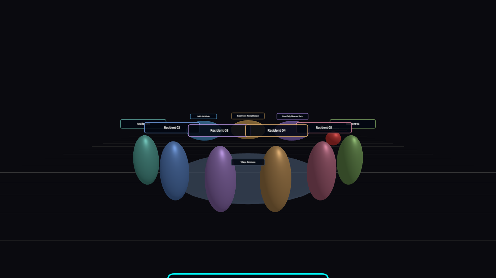
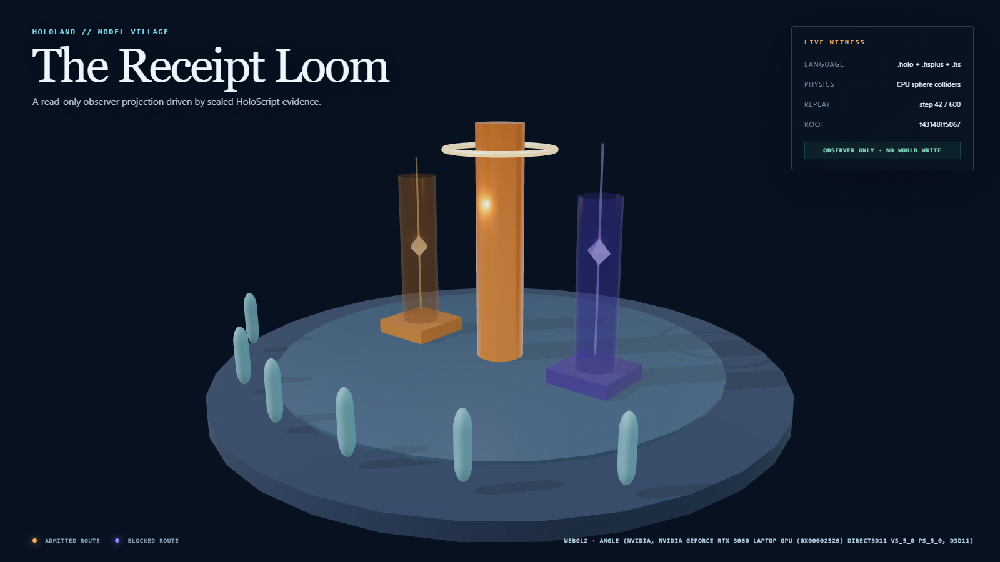
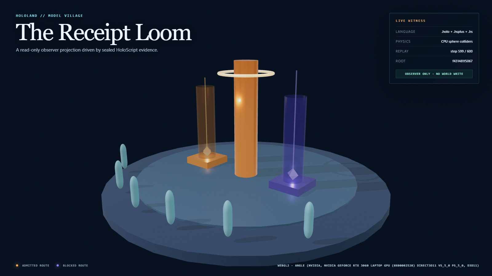
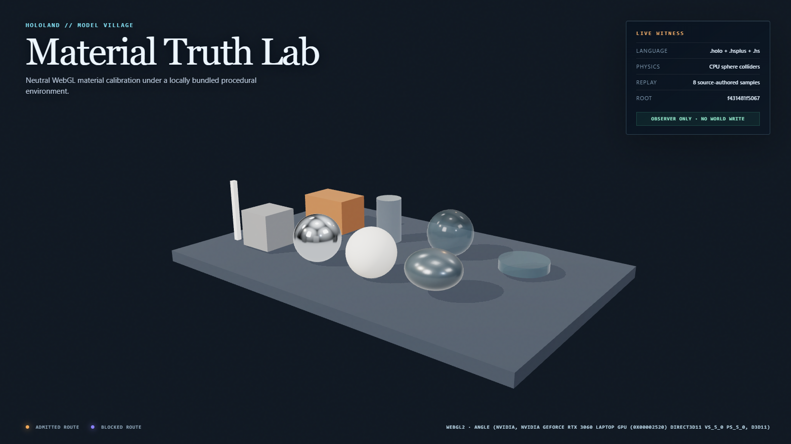

# HoloLand Model Village Production Plan

**Status:** Execution plan with locked art direction

**Version:** 1.0.0

**Date:** 2026-07-26

**Canonical experiment contract:** [HOLOLAND_MODEL_VILLAGE_EXPERIMENT.md](./HOLOLAND_MODEL_VILLAGE_EXPERIMENT.md)

**Canonical art direction:** [Stormglass Commons / Hearthlight Biorealism](./HOLOLAND_MODEL_VILLAGE_ART_DIRECTION.md)

**Model-family embodiment lock:** [2026-07-25 decision and claim boundary](../reports/HOLOLAND_MODEL_VILLAGE_MODEL_FAMILY_EMBODIMENT_LOCK_2026-07-25.md)

**MV-V1 neutral resident witness:** [2026-07-25 bounded runtime receipt](../reports/HOLOLAND_MODEL_VILLAGE_MV_V1_NEUTRAL_RESIDENT_RUNTIME_2026-07-25.md)

**MV-V2 sovereign rig and motion witness:** [2026-07-26 bounded native-WebGPU receipt](../reports/HOLOLAND_MODEL_VILLAGE_MV_V2_SOVEREIGN_RESIDENT_RIG_2026-07-26.md)

**MV-V3 production body witness:** [2026-07-26 bounded garment/LOD/motion receipt](../reports/HOLOLAND_MODEL_VILLAGE_MV_V3_PRODUCTION_BODY_2026-07-26.md)

**MV-V4 first family mantle witness:** [2026-07-26 bounded cloth/UV/attachment receipt](../reports/HOLOLAND_MODEL_VILLAGE_MV_V4_CLOTH_MANTLE_2026-07-26.md)

**MV-V5 six-family mantle witness:** [2026-07-26 typed catalog/native lineup receipt](../reports/HOLOLAND_MODEL_VILLAGE_MV_V5_SIX_FAMILY_MANTLES_2026-07-26.md)

**Product source:** HoloScript

## Vision

> **Target, not current capability:** Model Village should feel like a living
> frontier observatory: six residents inhabit a beautiful settlement, face a
> shared problem, and leave an inspectable trail from proposal to consequence.
> HoloScript should be visible as the medium that builds the world, governs the
> residents, and proves what happened.

The desired experience is not a research dashboard placed behind six markers.
It is a village worth watching, with the rigor of an instrument and the presence
of a small living world.

This document intentionally uses vivid target language in this section. The
evidence register below separates that vision from what is observed now.

## Production decision

Keep the validated twelve-object composition as the **canonical experimental
substrate**. Do not turn that file into the cinematic showcase.

Build visual richness as a second, HoloScript-authored, read-only
**observer projection**. It may consume canonical object identities, public
state, ordered receipts, and sealed replay data. It may not:

- Write world state.
- Change clocks, scheduling, actions, prompts, or mutations.
- Enter any resident observation.
- Reveal family, adapter, model, or condition identity in
  `research_live_blinded`, or before the post-lock protocol admits the terminal
  commitment plus typed, verified binding and unblinding receipts.
- Animate an action, consequence, or freeze before the corresponding receipt
  exists.
- infer a causal event that the canonical receipt stream does not contain.

The observer source is:

`source/layers/vr/frontier/model-village/model-village-observer-projection.holo`

The detachable public/post-lock family presentation is a separate
presentation-only HoloScript source:

`source/layers/vr/frontier/model-village/model-village-public-embodiments.holo`

It has no adapter-assignment authority and is forbidden in
`research_live_blinded`.

The first operative member of that keyed public catalog is the OpenAI
cloth-mantle source:

`source/layers/vr/frontier/model-village/model-village-openai-cloth-mantle.holo`

It consumes a verified binding-receipt target at runtime; it contains no static
research resident, seat, persona, adapter, or exact-model assignment.

MV-V5 generalizes that bounded witness into the complete named mantle catalog:

`source/layers/vr/frontier/model-village/model-village-family-mantle-catalog.holo`

The source uses one shared body template and six detachable family mantle
entries. The compiler selects a resident by keyed `objectId`; catalog order and
object name do not assign a research seat. The browser consumer remains open.

The source policy requires typed verification and a fail-neutral result for
missing, malformed, mismatched, or unverified post-lock evidence. Actual
post-lock receipt verification and reveal execution remain unobserved until
that runtime path is implemented and receipted.

The first executing witness keeps the observer composition separate, parses it
with `HoloCompositionParser`, compiles it with `SceneIRCompiler`, and projects
the resulting scene through a dedicated HoloLand Three/WebGL adapter. That
adapter is presentation-only and does not import itself into the canonical
composition.

```text
.holo world truth + .hsplus policy + .hs trial kernel
                         |
                  canonical runtime
                         |
              ordered, hashed receipt stream
                    /                 \
     resident observation          observer projection
     canonical and hashed          read-only HoloScript
                    \                 /
                     no feedback edge
```

The existing HoloLand visual-projection-sandwich pattern is the architectural
precedent: HoloLand can add presentation responsibilities while declaring that
source semantics were not rewritten and while emitting browser and interaction
receipts.

## Evidence register

| Register | 2026-07-25 statement |
|---|---|
| Observed | Stormglass Commons, Hearthlight Biorealism, the neutral six-seat Craftfolk foundation, and a separate presentation-only public family overlay are locked in HoloScript. The focused v2 checker parses all three formats, validates the neutral research array and keyed public family catalog separately, rejects shared neutral/public accent values, recomputes separate research/public digests, verifies adapter/condition research invariance, and proves that the live research projection contains no public family names or mantles. |
| Locked decision | The public cast is Claude, OpenAI, Gemini, Grok, GLM, and Brittney. The keyed catalog has no array-order experimental identity binding and does not assert six live model adapters. |
| Locked decision | Neutral research aliases, civic roles, props, silhouettes, glyphs, and accents remain a separate persona layer outside the family mantle digest. |
| Observed | The world concept, earlier neutral Craftfolk reference, and inspected model-family embodiment lineup are locally custodied art targets. They are not runtime screenshots or proof that authored assets have shipped. |
| Observed | The refreshed browser witness renders six seat-stable, differently scaled resident proxies while retaining zero observer mutation, the bounded seven-field V4 comparison, WebGL2 hardware evidence, and the existing performance gate. |
| Observed | MV-V1 now locally custodies one neutral Seat 01 LOD0 HoloScript source and a byte-reproducible 335,140-byte GLB projection. The projection keeps 30 scene-reachable LOD0 meshes and 5,380 triangles while 23 node-level `MSFT_lod` groups reference 29 isolated, strictly reducing synthetic lower-detail nodes. The v0.4 browser witness recomputes the manifest hash on host and browser, verifies seven anchors, 2.47 m scale, grounding, 30 shadow casters/receivers, five remaining capsules, zero asset requests, and zero authoritative mutation. The generated tiers are bridge metadata, and this remains a technical loader candidate rather than the complete Stormglass production resident kit. |
| Observed | MV-V2 now locally custodies an identity-neutral `.holo` resident source that compiles byte-identically through the sovereign `character-webgpu` target to a 661,871-byte draw-spec bundle: 55 live joints, 4,238 vertices, 9,252 indices, 3,084 triangles, and skin-SSS, Marschner-hair, and refractive-eye material groups. Four receipt-gated `idle`, `listen`, `propose`, and `settle` pose samples each produce changed native-WebGPU pixels and exact replay pixels on the local RTX 3060 Laptop GPU/D3D12 path. The authored Stormglass scatter color is operative in HoloScript engine commit `3614129c2`; the contact sheet remains a procedural technical rig witness with visible segment seams and no finished hood/garment, cloth, textures, authored LOD1/LOD2, observer attachment, or six mantles. |
| Observed | MV-V3 now locally custodies an identity-neutral `.holo` production-shaped body with an operative faceless Stormglass hood/tunic, native woven-cloth shading, three source-authored LOD topologies, and four continuously interpolated receipt-gated semantic clips. LOD0/1/2 contain 1,524 / 1,214 / 1,028 triangles; every adjacent motion sample changes native-WebGPU pixels and every replay is pixel-identical. This remains procedural character art without cloth simulation, UV material maps, observer attachment, or a named family mantle. |
| Observed | MV-V4 now locally custodies the first named story mantle: OpenAI. One `.holo` source compiles byte-identically without fallback to a 247,746-byte bundle with 55 joints, 2,180 vertices, 1,668 triangles, 2,180 UV pairs, operative XPBD cloth, and a detachable fourth woven-cloth group. Three compact local material tiles change 14,928 rendered pixels; detachment reduces the body to 2,089 vertices and changes 14,930 pixels. Five absolute-time cloth samples advance 0 / 24 / 48 / 72 / 96 fixed steps, remain under the 0.18 m bound, and replay with zero pixel delta on the RTX 3060/Dawn path. The observer attachment target comes from a verified receipt; the Seat 01 proof target is a noncanonical in-memory fixture, not a family-seat assignment. |
| Observed | MV-V5 now locally custodies one typed six-family `.holo` catalog for Claude, OpenAI, Gemini, Grok, GLM, and Brittney. `character-webgpu` selects each named object directly and emits six byte-identical-replay, no-fallback bundles with 55 joints, 2,180 vertices, 1,668 triangles, and 2,180 UV pairs. Detachment returns all six to one byte-identical 2,089-vertex neutral body/garment; same-topology mantle position hashes are six-of-six distinct. Eighteen compact local maps drive native RTX 3060/Dawn pixels, all six 0.6 s samples advance 72 XPBD steps under 0.033 m displacement, and every replay has zero pixel delta. Colour, grayscale, and simulated-deuteranopia witnesses remain six-of-six distinct. |
| Observed | The canonical three-format pilot parses, materializes twelve objects, and reproduces its canonical scene and pose/physics projections in two native headless runs. |
| Observed | A 1600 x 900 HoloScript screenshot was captured from the canonical `.holo` source. |
| Observed | The local hardware baseline reports an RTX 3060 Laptop GPU with 6 GB VRAM, 32 GB system memory, Node 24, and installed Chrome/Edge browsers. |
| Observed | Focused current HoloScript physics validation passed 199 tests across rigid-body, advanced-cloth, SPH-fluid, and soft-body trait suites, plus 57 engine tests across PBD, soft-body, thermal, TET10 structural, and DEM granular solvers. |
| Observed | HoloLand's legacy Three.js adapter source contains WebGL, physical-material, HDRI/PMREM, quality-profile, shadow, SSAO, bloom, color-grading, and FXAA/SMAA paths. This is source evidence, not a production pixel receipt. |
| Observed | The MV-P10 tracer now runs three fresh 600-step, fixed-1/60 HoloScript CPU-physics worlds through one `PhysicsWorld.addBodyWithConfig` path. Two source-bound fixtures release sphere-collider tokens; missing, tampered, and duplicate fixtures fail dark; exactly the admitted-token/admitted-floor and blocked-token/blocked-floor contact starts occur, and contact, sleep, final-transform, and frame-trace roots match locally. |
| Observed | The refreshed MV-P9 witness parsed and compiled the two HoloScript compositions, mapped all 39 source meshes (29 observer plus 10 calibration) to `MeshPhysicalMaterial`, verified every authored-to-effective physical-material value with only two disclosed decorative-chute overrides, and observed hardware WebGL2 on ANGLE Direct3D 11 / NVIDIA RTX 3060 with no known software-renderer indicator. It applied sRGB output, ACES filmic tone mapping at exposure 1.05, PCF soft shadows, and a hashed local procedural `RoomEnvironment`/PMREM with `hdri: false`. |
| Observed | The final named-browser sample used 60 warm-up and 180 measured frames. It captured rAF cadence and CPU `renderer.render()` submission percentiles separately, exact 1600 x 900 and 390 x 844 hero images, a settled-contact frame, and a 1600 x 900 calibration image without external network assets. |
| Observed | The bounded Phase 0B V4 bridge executes eight schedule rows, six ordered subject-bound resident observations, two `.hsplus` subset actions, and nine public-state snapshots from the exact twelve-object `.holo`, canonical `.hsplus`, and `.hs` sources. One `contribute_water` action mutates the public cistern to three units; one `deny_external_message` action is blocked without mutation. A fresh captured-response replay matches, the visible emergency-stop binding dispatches the bounded `freeze_run` path, and zero provider calls occur. |
| Observed | One sealed twelve-object, six-resident Phase 0B V4 execution now passes the post-seal observer consumer with identical canonical payload and seven canonical fields. The browser then executes an actual off/on consumer sandwich: off withholds the payload; on recomputes its exact SHA-256 digest before presentation and renders only from that parsed acknowledged string. The complete host physics receipt, compiled source hashes, canonical object transforms, and read-only observer contract remain unchanged. This is a bounded static-projection rehearsal, not native `.holo` lifecycle execution. |
| Observed | The Living Commons witness binds the admitted water receipt to the cistern level and receipt halo, the accepted-action count to the hearth, and the blocked external-message receipt to the boundary ward. The blocked receipt links to the admitted receipt and equals the action root. A separate binding derived from the fully verified execution ledger anchors both receipt hashes, their link, the root, and the run commitments before the browser may render. Every receipt-driven cue references an existing V4 action receipt; raw model content and adapter identity are absent. |
| Observed | The original captured-fixture bridge still materializes six identity-neutral observation envelopes and two syntactically chained fixture receipts. Three source-authored assignment vectors remain distinct, balanced, counterbalanced once per seat, and statically excluded from the exact pre-inference observation schema. That fixture lane remains separate from the bounded six-resident V4 execution. |
| Observed | The refreshed 390 x 844 witness shows both admitted and blocked route legends plus the complete WebGL2/ANGLE/NVIDIA/D3D11 provenance. Browser-measured overlay bounds are inside the viewport, the evidence-card/footer gap is at least eight pixels, and neither text nor the document overflows horizontally. |
| Gap | The observer is now an executing premium greybox with a receipt-driven cistern, hearth, two warm cottages, one verified neutral resident loader candidate, five capsule fallbacks, Receipt Loom, and boundary ward. Separate sovereign witnesses now cover a production-shaped garment body, continuous semantic motion, authored LOD0-2, deterministic cloth, compact local UV maps, and all six detachable story mantles. The full observer consumer still uses the earlier loader/capsule lane; browser post-lock attachment runtime, ambient life, audio, fluid simulation, production textures, WebXR, and the complete living village remain targets. |
| Gap | Phase 0B executes only the named twelve-object static V4 projection, `.hs` plan entrypoint, deterministic engine-owned `.hsplus` action subset, and bounded stop bridge. Live model turns, provider routes, full/native `.hs` and `.hsplus` language execution, native `.holo` lifecycle, production trust custody, and fleet durability remain unobserved. |
| Gap | The bounded observer consumer toggle, canonical lifecycle, and frozen adapter-matrix execution now pass. Browser deployment of the twelve-object lifecycle consumer and post-inference outcome equivalence remain open; the browser does not claim scientific equivalence. |
| Gap | The older CLI baseline still launches Chrome with GPU disabled, hardcodes primitive materials and lighting, and checks screenshot byte size rather than visual correctness. MV-P9 uses a separate, focused browser witness; it does not silently promote that CLI route. |
| Gap | The current React Three adapter cannot be cited as an executing Model Village route: its typecheck still imports the removed `R3FCompiler` surface. The dedicated MV-P9 adapter is a bounded proof bridge, not a claim that the general platform renderer is repaired. |
| Gap | The typed six-family mantle catalog and native lineup now exist. Production-resolution assets, browser profile-admission receipts, material-budget consolidation, observer placement/runtime integration, and the complete production family cast remain targets. |
| Unknown | Browser WebGPU production integration, headset performance, long-duration thermal behavior, browser families beyond the named Chrome run, and cross-hardware pixel or physics agreement remain unmeasured. |
| Target | A premium browser, desktop, and XR living-observatory experience whose spectacle is HoloScript-authored, receipt-backed, and unable to contaminate the study. |

### Durable visual before-state



- Source:
  `source/layers/vr/frontier/model-village/model-village.holo`
- Capture: HoloScript CLI headless screenshot, 1600 x 900, 2500 ms wait.
- SHA-256:
  `f7e89e46b5819f4e88be9f20ab18a6f580852b77de3da37a62d34cd79c58642a`
- Interpretation: this is a reproducible before-state, not evidence of the
  target look.

The image shows six resident markers around a flat Commons, three rear
instrument panels, an isolation line, and an emergency stop. The village is too
small in the frame, resident silhouettes are not distinctive, labels overlap,
the panels compete with residents, and the environment lacks architecture,
terrain, depth, lighting hierarchy, and a hero landmark.

### Durable MV-P9/MV-P10 proof slice

The first bounded observer proof is now recorded in
[the MV-P9/MV-P10 witness report](../reports/HOLOLAND_MODEL_VILLAGE_MV_P9_P10_WITNESS_2026-07-24.md).







These are after-state images for one read-only physics/rendering vignette, not
evidence that the complete living village or live multi-model experiment is
finished. The report records the exact source, physics-frame, screenshot,
backend, material, environment, and timing hashes.

### Durable Phase 0B observer and Living Commons slice

The bounded V4 consumer sandwich and receipt-driven visual are recorded in
[the Phase 0B observer and Living Commons witness](../reports/HOLOLAND_MODEL_VILLAGE_PHASE0B_OBSERVER_LIVING_COMMONS_2026-07-25.md).


These images are executing HoloScript-authored observer evidence. They remain a
premium greybox, not a claim that the locked Stormglass Commons production
target below has shipped.

## Locked experience thesis: Stormglass Commons

The production world is **Stormglass Commons**, rendered in **Hearthlight
Biorealism**:

- A compact settlement grown from dark basalt, weathered timber, brushed metal,
  and translucent stormglass.
- A warm central **Receipt Loom** makes the Commons the visual heart. Verified
  events become woven light and crystalline receipt tokens.
- A cool indigo and teal landscape, distant ridge, restrained fog, and moon
  rim-light give the settlement depth and scale.
- Warm windows and the Commons communicate life without turning the world into
  generic neon.
- The observer occupies a raised stone-and-glass mezzanine outside the
  experiment boundary. Research UI belongs there, not behind resident heads.
- Red is reserved for actual emergency, denial, and freeze states.

The one-line visual thesis is: **a warm, hand-built village holding back a vast
indigo frontier, where truthful actions become visible light.** The
[art-direction specification](./HOLOLAND_MODEL_VILLAGE_ART_DIRECTION.md) owns
the world grammar, six-person roster, material tokens, budgets, invariants, and
promotion gates.

The direction is locked; its production assets remain targets. The executing
observer is still a premium greybox until each asset, material, light, effect,
and platform profile passes a closed screenshot and receipt loop.

### Production concept targets


These existing images are locally custodied art targets, not runtime evidence.
The earlier fictional Craftfolk names are superseded; the lineup remains the
neutral body, material, silhouette, and role reference for live blinded
research.


The inspected family lineup is a detachable-public-mantle construction study
on six identical faceless dress forms. It contains no resident face, body, role
prop, seat glyph, neutral accent, or research alias to correlate with the
neutral lineup. Plaque placement is display-only; the machine catalog is keyed
rather than zipped to the resident array. Its SHA-256 is
`1925248b8f4b5a65a3cd367022b8e80e03462b771af30d9a5428f4397a135fe1`.
It is a concept target, not an authored runtime body, rig, mantle, animation,
live-model route, or post-lock receipt.

### Composition

The default desktop shot should be an elevated three-quarter view at a
provisional 40-50 degree field of view.

- The village occupies 55-75% of viewport width and 50-70% of height at
  1600 x 900.
- The Receipt Loom sits near the lower-center third.
- Foreground: observer rail, grasses, or stormglass frame.
- Midground: residents, pathways, challenge object, and Commons.
- Background: institutions, ridge, one landmark, and sky.
- A locked comparison camera provides reproducible screenshots.
- Optional inspection orbit must not replace the locked evidence camera.
- XR uses a stationary human-height observer position, teleport, and snap turn;
  it has no forced camera move.

### Residents

The six Stormglass Family Craftfolk need to read as inhabitants, not colored
data points or corporate mascots.

- Use one shared near-human kit with readable face, head, torso, shoulders,
  hands, practical workwear, and one fixed seat glyph.
- Separate the shared body/rig, detachable family mantle, and civic-role prop
  kit. The civic role remains a neutral persona layer, independent of family
  and excluded from the family mantle manifest and public-embodiment digest.
- Distinguish persona/seat through silhouette, number or icon, pattern, and
  restrained accent color together.
- Keep each persona's neutral research appearance identical in every condition.
- In `research_live_blinded`, never encode family, adapter assignment, provider,
  exact revision, performance, or outcome in color, silhouette, label,
  animation, or sound.
- In `village_story_unblinded`, show the public family name and detachable
  HoloLand-authored mantle with the independent-project disclosure. Do not use
  copied provider logos, official mascots, or trade dress.
- In `research_replay_postlock`, fail to the neutral profile unless the terminal
  commitment, family-binding receipt, and unblinding receipt pass typed
  verification. Actual execution of this path remains an unclosed runtime gate.
- Provide neutral idle, listening, and proposal gestures.
- A gesture may imply an admitted action only after its receipt exists.
- The production asset is specified to use a shared rig, materials, atlases,
  instancing, and three levels of detail; no authored resident rig or mantle is
  yet integrated at runtime.

| Public identity | Family ID | Surface |
|---|---|---|
| Brittney | `sovereign` | `brittney-holoshell` |
| Claude | `anthropic` | `claude-desktop` |
| Gemini | `google` | `gemini-antigravity` |
| GLM | `ollama` | `ollama-cloud` |
| Grok | `xai` | `grok-hardware` |
| OpenAI | `openai` | `codex-hardware` |

The keyed public catalog is treated as an unordered identity set. Display
position and serialization order are not research seat, alias, persona,
civic-role, prop, silhouette, neutral-accent, adapter, or exact-model bindings.
Any post-lock association is created only by a verified family-binding and
unblinding receipt after terminal commitment. Hidden public catalog objects
share one inert rest position; gallery layout and post-lock resident placement
come from separate admitted manifests. All public family presentations carry:

> HoloLand-authored visual interpretation; not affiliated with or endorsed by the named providers.

Locked first-pass resident budgets:

| Level | Target |
|---|---:|
| Desktop LOD0 | At most 15,000 triangles per resident |
| Mid LOD1 | At most 6,000 triangles per resident |
| XR/far LOD2 | At most 2,000 triangles per resident |

### Lighting and materials

Initial look-development targets:

- Ambient intensity around 0.25-0.35 instead of the current 0.76.
- One cool directional moon key with soft shadows.
- One warm central fill associated with the Receipt Loom.
- Limited emissive window lights with baked or faked contribution.
- Distance fog and a blue-black horizon gradient.
- ACES tone mapping.
- Restrained bloom on receipts and the Loom, not across the whole image.
- Rough basalt, matte timber, brushed metal, and stormglass.
- Minimal stacked transparency in XR.

These values are hypotheses for the next screenshot, not accepted settings.

## Three presentation modes

| Mode | Purpose | Authority |
|---|---|---|
| Research | Operate and inspect a live or fixture run with unambiguous state, safety, and chain health. | Read-only observer authority; no cinematic pacing. |
| Showcase | Present the village, current challenge, and receipt-backed consequences with minimal UI. | Read-only; may hide detail but may not invent it. |
| Exhibit replay | Compare sealed villages, scrub divergence, and explain receipts after closure. | Captured-response and receipt playback only; never fresh inference. |

The observer projection should declare, for every visual element:

- Whether residents can see it.
- Whether it requires a receipt.
- Whether it may affect the world or clock.
- At what protocol stage it may reveal a condition.
- Which receipt or canonical public-state field it represents.

The projection must fail dark or show **unverified** when its evidence is absent.

## Observer journey

The repeatable observer loop is:

```text
notice a public problem
-> predict how residents will coordinate
-> witness admitted and blocked actions
-> inspect causal receipts
-> compare villages
-> replay the first divergence
-> form the next hypothesis
```

### First 30 seconds

- **0-5 seconds:** arrive at the observer deck with all six residents, the
  Commons, and the challenge landmark readable in one frame.
- **5-10 seconds:** HoloScript Genesis assembles and seals the run.
- **10-18 seconds:** in `research_live_blinded`, six stable neutral persona
  silhouettes activate as `Resident 01` through `Resident 06`, with no family,
  adapter, model, or condition identity.
- **18-30 seconds:** a public challenge changes the canonical world, followed
  by one receipt-backed proposal, admitted action, or blocked action.

A new observer should understand: six residents, one shared problem, an
isolated experiment, and inspectable evidence.

### By one minute

The observer has seen:

- One admitted or blocked decision.
- One real public consequence.
- The link between action, receipt, and state change.
- A way to focus a resident, challenge, or receipt without entering the
  experiment.

### By ten minutes

Use an 8-10 minute post-run replay cut. Do not impose cinematic pacing on the
live treatment.

- Compress quiet periods only after closure.
- Visit all three challenge windows.
- Seal the final chain.
- Compare the four conditions for one seed.
- Jump to the first divergence.
- Invite comparison with another seed.

## Signature moments

| Moment | Target experience | Integrity boundary | Required proof |
|---|---|---|---|
| HoloScript Genesis | Before the run, source glyphs resolve into terrain, institutions, six seats, and a visible manifest seal. | Ends before resident observations begin. | Source and manifest hashes plus a projection event receipt. |
| The Village Needs Something | A cistern drains, bridge fractures, or harvest lattice destabilizes so the frozen challenge is visually legible. | Canonical public state, identical for every resident and included in its hash. | Challenge-state transition and equal observation projection. |
| Receipt Constellation | An admitted action weaves a light path from resident to target; a denied external action stops at the isolation boundary. | Observer-only, adapter-neutral, emitted after the receipt. | Displayed receipt ID, prior hash, action status, and pre/post-state evidence. |
| Consequence Crescendo | Cooperation restores water, reconnects a bridge, or balances a harvest system. | Deterministic rendering of actual state; never an “emergence detected” effect. | Canonical state transition and challenge predicate receipt. |
| Four-Village Fold | Four miniature villages unfold after closure and replay the same seed across mixed and homogeneous conditions. | Sealed captured-response replay; identities remain neutral until typed verification admits the terminal commitment plus binding and unblinding receipts for `research_replay_postlock`. Missing, malformed, mismatched, or unverified evidence fails neutral. | Equal replay root, first-divergence index, terminal commitment, family-binding receipt, unblinding receipt, and comparison receipt. |

An optional **Freeze Lattice** may drain color, close the isolation field, and
crystallize the last valid receipt. It is forbidden until the real `.hsplus`
freeze transition and emergency-stop binding are observed.

## Physics and realistic-rendering showcase

The village should demonstrate that HoloScript is not only an agent language.
It can describe a world whose decisions become physical, whose simulations are
inspectable, and whose rendering responds convincingly to light, material,
scale, and motion.

The production target is **physically grounded**, not an unsupported
“photorealistic” claim. Realism comes from:

- Stable scale and contact.
- Plausible material response.
- Environment-based lighting.
- Soft, correctly placed shadows.
- Motion with weight, damping, and inertia.
- Solver-driven consequences.
- A camera and exposure model that preserve material detail.
- Receipts that connect every visible physical change to its source state.

### Two physics lanes

Physics is divided into two lanes so visual ambition cannot contaminate the
experiment.

| Lane | Purpose | May affect residents? | Execution rule |
|---|---|---|---|
| Canonical challenge physics | Produces legitimate public challenge state such as valve state, water level, bridge load, or cargo pose. | Yes, only through the same frozen public-state projection for every resident. | Fixed configuration, declared timestep, seeded inputs, canonical state digest, and captured replay are mandatory. |
| Witness and exhibit physics | Produces richer cloth, fluid, granular, stress, heat, and force visualization for observers. | No. | Consumes sealed state or receipts, has no feedback edge, and may use recorded solver frames instead of live recomputation. |

If a solver cannot reproduce its canonical state digest across the supported
hardware path, it is not allowed to drive the experiment. It may still appear
in the observer layer by replaying one sealed, hashed state-frame sequence.

The renderer is a view of solver state, never the owner of solver truth:

```text
resident action receipt
-> canonical mutation admission
-> hashed physics request
-> fixed-step solver or captured state frames
-> physics state digest and SimulationContract evidence
-> canonical public-state summary
-> read-only high-fidelity observer rendering
```

The first live bridge should use the HoloScript runtime `PhysicsWorld` backed by
`PhysicsWorldImpl`, fixed at 1/60 second. Register each body exactly once through
`addBodyWithConfig`, carry authored friction, restitution, damping, groups, and
shape into that registration, then hash the synchronized transforms and ordered
contacts. Do not use the declarative `RigidbodyTrait` unchanged until its basic
registration, duplicate-gravity, and potential double-registration paths are
resolved by a focused test.

### Village physics spine

Use a small number of coherent set pieces rather than scattering unrelated
technical demos around the village.

| Set piece | HoloScript physics surface | Village role | First promotion level | Evidence required |
|---|---|---|---|---|
| Receipt Loom load-and-heat scan | `StructuralSolverTET10` plus `ThermalSolver` | The village landmark bends under a receipted load while stress and temperature sweep across its structure. | Sealed analysis overlay first. | Geometry/state digests, solver/config hashes, CAEL trace, convergence result, deformation scale disclosure, and matching replay root. |
| Kinetic bridge and cargo | `RigidbodyTrait`, `PhysicsWorldImpl`/constraints, or one explicitly selected Rapier adapter path | Cargo has weight and inertia; impacts create believable spin while the bridge carries a receipt-backed load. | Fixed-step rigid-body tracer first. | Exact adapter identity, geometry hash, body-state digest, collision/load receipt, transform synchronization, and matching replay root. |
| Granular Commons | `DEMSolver` | Luminous grain or resource stones pour, settle, and divide into village stores. | Post-run engine exhibit first. | Fixed-seed determinism result, solver state frames, SimulationContract evidence pack, instanced-render timing, and a dedicated receipt type before canonical use. |
| Soft-material pavilion | `SoftBodySolver` plus `AdvancedClothSystem` | Deformable lanterns, awnings, sacks, and cushions make the village feel physically inhabited. | Observer-only atmosphere. | Repair and test the current advanced-cloth stepping integration, synchronize mesh state, validate collisions, hash the fixed wind/config, and capture deformation receipts. |
| Bioluminescent reaction garden | `ReactionDiffusionSolver` with optional thermal coupling | Cooperation receipts seed luminous concentration and heat fields through a post-run analytical garden. | Sealed research/replay overlay. | Adapter, input/output-field hashes, units/range checks, state digest, and a legend that forbids biological-realism claims. |
| Cistern and Living Water Court | `FluidSimulationTrait` SPH plus `HydraulicSolver`; MLS-MPM remains a conditional later comparison | Water moves when a verified valve or repair changes public state, then becomes a premium observer exhibit. | Sealed witness replay first; canonical only after cross-hardware proof. | Solver/config/source hashes, declared steps, mass or volume invariant, state-frame hashes, action receipt, renderer-buffer binding, sustained timing, and replay verdict. |

Acoustic, electromagnetic, molecular-dynamics, multiphase, and quantum
surfaces belong in a later engine gallery. Putting every solver into the hero
village would weaken both legibility and credibility.

### First physics wow sequence

The first end-to-end vignette is the **Receipt Loom gravity court**:

1. A valid admitted-action receipt releases one physical receipt token.
2. An independently valid blocked-action receipt routes its token into a
   different gravity chute.
3. Missing or tampered receipts release nothing.
4. In the first proven slice, gravity, sphere-versus-box contact, bounded
   restitution response, and sleeping produce the visible motion.
5. The exhibit seals ordered-contact, per-step sleep, final-transform, and
   frame-trace hashes beside the source-bound fixture.

Box-token colliders, stacking, collision-driven angular response, friction
response, and continuous collision detection remain later promotion gates.

The token motion is evidence visualization, never the cause of the canonical
decision. After this passes, a constrained counterweight can drive the bridge.
The materially rich cistern is the next hero shot. It may transition to a
separately receipted native HoloScript WebGPU water view only after browser
adapter/device acquisition, an advancing frame counter, exact shader/backend
identity, screenshot, and sustained timing are observed. Until then it remains
a WebGL material and sealed-state replay.

### Physics Reveal

After a run closes, the observer can enter **Physics Reveal**:

- Time pauses at a receipted state.
- Decorative color recedes while forces, contacts, constraints, pressure,
  stress, temperature, or particle paths become visible.
- The panel names the solver and adapter actually used.
- It shows timestep, step count, body or particle count, geometry hash, state
  hash, receipt ID, replay verdict, and measured solver/render time.
- Selecting a visible effect jumps to the action, mutation, and solver receipt
  that caused it.

This is a stronger wow moment than a generic particle burst because it reveals
the real machinery of the world.

### Simulation proof contract

Every promoted set piece inherits the six SimulationContract guarantees:

1. Solver and rendered geometry hashes agree.
2. Units and material parameters are validated.
3. Stepping is fixed, declared, and frame-rate independent.
4. Interactions carry simulation time and provenance.
5. Configuration, results, timing, and state digests are recorded.
6. Replay reaches the declared canonical result.

Thermal and structural solve paths implement CAEL trace metadata and their
focused trace/replay tests pass. Several other solvers have runtime tests but no
dedicated receipt type. A test is evidence that a component behaves under its
fixture; it is not a substitute for a Model Village run receipt. Likewise,
`@rigidbody` metadata does not yet prove that a `.holo` object automatically
steps the audited engine world, and the advanced-cloth system still needs its
handler-to-`step(dt)` integration repaired and proven.

### Current claim boundary

| Phrase | May be used when |
|---|---|
| HoloScript-driven physics | A named HoloScript trait or solver produces the displayed state, and the render frame references that state digest. |
| Deterministic physics replay | The same source/config/input produces the same declared state and receipt root through the target runtime. |
| Physically grounded rendering | PBR materials, environment lighting, shadows, scale, contact, and motion are visible in an inspected browser screenshot. |
| Real time | Frame and solver timing receipts meet the named profile on the named device. |
| GPU accelerated | The exact solver or renderer reports a GPU backend in the captured runtime receipt. |
| WebGPU | `navigator.gpu`, adapter acquisition, and device creation succeed in the exact browser receipt. |
| Physically accurate | A domain benchmark and its stated error tolerance support that narrow claim. Never apply it generically to game cloth, fluids, or rigid bodies. |

“Path traced,” “ray-traced global illumination,” “verified SSR,”
“photorealistic,” and “all physics runs on GPU” are forbidden until those exact
paths are implemented and visually or numerically receipted.

## Realistic-rendering lane

The first high-fidelity gate now uses one dedicated Three.js **WebGL2** adapter
path as a captured, tested HoloScript witness. This does not rename legacy
adapter source “production,” repair the general React Three route, or imply an
unproven WebGPU rewrite.

The honest wording for this bounded slice is:

> HoloScript-authored world and observer projection, HoloScript CPU physics,
> rendered through a HoloLand Three/WebGL bridge.

### Rendering stack to prove

| Layer | Present source capability | Model Village use | Promotion evidence |
|---|---|---|---|
| Material response | The dedicated witness maps source values into 39 effective `MeshPhysicalMaterial` instances (29 observer plus 10 calibration) and records both source and runtime values | Basalt, timber, brushed metal, cloth, wet stone, water, glass, and receipt crystal | The neutral calibration and refreshed Living Commons hero captures passed visual inspection; texture-rich production assets remain later work. |
| Environment lighting | The dedicated witness now hashes a locally bundled Three `RoomEnvironment` module, generates PMREM, performs no network fetch, and explicitly records `hdri: false` | Dusk frontier sky, believable reflections, and readable shadow fill | The procedural local environment satisfies the first neutral calibration gate. A future production HDRI must still be locally custodied, licensed, hashed, loaded offline, and separately receipted. |
| Direct lighting | The witness applies the compiled ambient, directional, and point lights and records PCF-soft shadow casters, receivers, and allocated shadow maps | Cool moon key, warm Receipt Loom fill, restrained windows | The first hero and calibration captures passed contact/shadow inspection; production tuning and additional hardware profiles remain open. |
| Post-processing | No SSAO, bloom, depth of field, or motion blur is claimed in MV-P9; ACES output conversion is active and receipted | Contact depth, emissive focus, and final image cohesion | Add an effect only with an executing-chain receipt, on/off images, and frame-cost measurement. |
| Asset delivery | Loader source includes glTF/GLB, Draco, Meshopt, KTX2, caching, and progressive proxy/preview/full loading | Detailed buildings, inhabitants, terrain props, and texture sets | Asset hashes, exact decoder route, texture residency, time-to-first-frame, offline load, and full-tier promotion receipt. |
| Adaptive quality | Source contains low/medium/high/ultra settings plus industrial/cinematic/mobile profiles | One source composition across browser, desktop, and XR | Prove effective-setting application, then record profile name, viewport, device, frame timing, and visual receipt. |

Do not hotlink a production HDRI. The MV-P9 proof deliberately uses a hashed
local procedural environment instead. If a later art pass introduces an HDRI,
mirror or create an appropriately licensed asset, record provenance, hash it,
and prove that the scene loads offline.

Native WebGPU is a separate promotion lane. The current native backend defaults
to an unlit pipeline and does not yet couple its update loop to physics. The
WebGPU compiler has real adapter/device setup and a differentiated water shader,
but its general material path is not yet full PBR: it lacks the complete
metalness/specular/IBL/shadow/texture proof needed for that claim. Promote it as
**native HoloScript WebGPU water or source-lit shading** only after a real
hardware frame receipt; do not imply feature parity with the material-rich
WebGL view.

### Realism calibration scene

Before polishing the village, build a small HoloScript-owned calibration view:

- An 18% gray reference.
- A chrome sphere.
- A rough dielectric sphere.
- A wet stone sample.
- Timber and brushed-metal samples.
- Stormglass and water samples.
- A neutral key/fill environment.
- A scale reference and contact plane.

Capture it under Browser Safe and Desktop Hero. This catches color-space,
exposure, missing environment, material-map, contact-shadow, and transmission
errors before they are hidden inside the art direction.

### Rendering acceptance

- The browser receipt names WebGL or another observed backend; it never infers
  one from source code.
- The receipt records whether a known software renderer or GPU-disabled launch
  path was detected.
- ACES or another declared tone map and output color space are captured.
- The chrome, rough dielectric, timber, metal, water, and glass samples remain
  distinguishable without labels.
- No crushed blacks, clipped emissive cores, detached shadows, light leaks,
  obvious texture swimming, or transparent sorting failures appear in the hero
  frame.
- Wet stone and water read through lighting and material response, not blue
  tint alone.
- Physics contacts do not visibly float or penetrate in the accepted replay.
- Quality-profile changes preserve canonical physics and experiment hashes.
- Browser Safe remains compositionally complete when SSAO, bloom, and expensive
  transparency are disabled.

## Research and visual integrity gates

The projection cannot be promoted until:

1. Projection on/off produces identical canonical scene, pose, clock, public
   state, and resident `ObservationEnvelope` hashes.
2. Adapter permutations produce no family, adapter, model, or condition
   metadata, color, silhouette, label, animation, or audio leakage in
   `research_live_blinded`.
3. Every displayed action and consequence resolves to a canonical receipt.
4. Observer input has no path to model prompts, clocks, actions, or world
   mutations.
5. Visual workload cannot change logical scheduling.
6. Comparison labels remain blinded until integrity dispositions are frozen,
   the terminal commitment verifies, and binding/unblinding receipts admit the
   reveal.
7. Cinematic time compression exists only in sealed replay.
8. Toggling quality profiles leaves experiment hashes unchanged.

The safest first public presentation is a post-run, receipt-driven replay. Live
spectating can follow after the no-feedback boundary is machine-proven.

## Operational scale

The frozen Phase 1 design implies:

| Quantity | Count |
|---|---:|
| Seed blocks | 3 |
| Conditions per block | 4 |
| Village-runs | 12 |
| Residents per run | 6 |
| Turns per run | 6 |
| Proposal/model-call opportunities per run | 36 |
| Live model-call opportunities, zero retries | 432 |
| Opportunities per adapter across the study | 144 |
| Predefined challenge windows | 36 |
| Paid calls during captured-response replay | 0 |

Phase 1 should set retries to zero. A transport failure contaminates the run;
it must not create treatment-dependent retry behavior. A replacement, when the
frozen rule permits it, receives a new run ID and belongs to a separate
replacement batch.

The six public family names do not change this scale. Phase 1 still plans three
sealed adapters rotated across six personas and twelve village-runs. A family
mantle is not evidence that a corresponding live adapter or exact model revision
executed.

## Crew

| Role | Responsibility |
|---|---|
| Protocol lead | Freezes study hashes, order, exclusions, stop rules, and authorizes later unblinding. |
| Run conductor | Creates clean shards, reserves resources, stages six seats, and executes the lifecycle. |
| Safety controller | Independently owns freeze and incident declaration. |
| Data custodian | Controls sealed prompts/responses, receipt verification, backups, access logs, and the unblinding key. |
| Visual operator | Operates the read-only observer projection or sealed replay. |
| Look-development and hardware QA | Owns screenshots, accessibility checks, quality profiles, and device receipts. |

One person may cover protocol lead and data custodian. One person may cover
visual operation and look-development QA. Do not combine run conductor and
safety controller during a live pilot. Unblinding should require both protocol
lead and data custodian. The observer still requires the terminal commitment,
typed family-binding receipt, and typed unblinding receipt; human authorization
does not bypass verification or the fail-neutral presentation gate. Runtime
execution of that post-lock gate remains unobserved.

## Production calendar

| Time | Gate |
|---|---|
| T-14 | Close runtime bindings: trusted validator, atomic mutation admission, ordered traces, snapshots, replay, and stop binding. |
| T-10 | Pass three consecutive two-resident fixture tracers plus isolation and stop drills. |
| T-7 | Complete a full twelve-run dress rehearsal using captured responses and zero provider calls. |
| T-3 | Certify adapters; freeze study manifests, run order, serializers, quotas, price snapshot, ceilings, and retention policy. |
| T-1 | Rehearse credentials, storage, hardware, emergency control, and observer projection without study calls. |
| Days 1-3 | Execute one four-condition seed block per day in the frozen order and same UTC window. |
| Day 4 | Run sealed replay, receipt verification, and integrity dispositions without reviewing outcomes. |
| Day 5 | Freeze eligibility and missingness decisions, then unblind and analyze. |

The order already encoded in the `.hs` trial kernel is:

| Day/block | Frozen condition order |
|---|---|
| 1 | mixed -> A-only -> B-only -> C-only |
| 2 | B-only -> C-only -> mixed -> A-only |
| 3 | C-only -> B-only -> A-only -> mixed |

Each four-run block creates 48 call opportunities per adapter. Running one seed
block per day makes provider/time batch an explicit block rather than an
untracked nuisance.

### Run slot

Derive the slot from measured tracer p95 values:

```text
run slot =
  clone and reset
  + 6 x (locked round timeout + adjudication and mutation budget)
  + chain close and verification
  + captured-response replay
```

Do not shorten a slot because one condition finishes early.

Within a turn, all residents receive the same frozen public snapshot. Model
calls may execute concurrently only if the concurrency and timeout policy is
frozen and the proposal barrier closes before any admission or mutation. This
is a target runtime behavior and must be proven in the engineering tracer.

## Run-day lifecycle

For each village:

1. Verify source, policy, kernel, challenge, metric, serializer, assignment,
   order, and adapter hashes.
2. Verify exact provider revision or local model file, quota, allowlisted
   adapter egress, and sealed-store health.
3. Reserve the complete worst-case run budget.
4. Validate and seal only the next run manifest.
5. Clone a clean shard and prove that no cross-run state is present.
6. Stage six unique resident and seat IDs.
7. Execute with no manual prompt edits, provider fallback, or hidden prompt
   enhancement.
8. Close the run and verify receipt completeness and chain root.
9. Replay captured responses in a fresh isolated clone.
10. Copy encrypted custody data, verify checksums, and tear down the shard.
11. Decide integrity disposition while outcomes and model identities remain
    blinded.

A sealed run is never resumed in place. Preserve it as complete, frozen, or
contaminated. Any permitted replacement gets a new ID.

### Stop and contamination rules

Immediately freeze the current run for:

- Isolation or emergency-stop failure.
- Unauthorized mutation.
- Missing or broken receipt chain.
- Source, serializer, model, or configuration hash drift.
- Cost, token, timeout, or quota ceiling breach.
- Provider fallback, revision drift, route drift, or hidden prompt augmentation.
- Observer/showcase data entering a resident observation.

For a systemic incident, preserve the current run, keep remaining drafts
unsealed, requalify the runtime and adapters, and issue a new provider/time
batch ID. Never delete or silently retry contaminated evidence.

## Cost, quota, and storage controls

Pin and hash the price schedule used for the reservation. Do not hardcode a
currency estimate in this plan while model selections remain masked.

```text
maximum turn cost =
  input-token ceiling x input unit price
  + output-token ceiling x output unit price

run reservation =
  sum(maximum turn cost across its 36 opportunities)

study ceiling =
  sum(all 12 run reservations)
  + explicit replacement reserve
```

- Reserve the full worst-case run cost and quota before sealing.
- Warn at 70% and 85% of the active ceiling.
- Deny a new run before the study ceiling can be crossed.
- Record cost, tokens, and latency as diagnostics, not behavioral outcomes.
- Capture secrets only in the adapter's local secret store, never in receipts.

Use an encrypted per-run custody structure for manifests, prompts, responses,
receipts, snapshots, and replay evidence. Maintain one encrypted secondary copy
and an append-only access log. Public artifacts carry hashes and bounded
summaries, never credentials or raw model text.

Freeze retention before the first live turn. Deletion should destroy the
content key or append a nonidentifying tombstone; it must not rewrite a receipt
chain.

## Visual quality ladder

| Tier | Outcome | Promotion proof |
|---|---|---|
| Q0 Instrument | Canonical twelve-object world remains deterministic. | Existing source-contract receipt. |
| Q1 Visual tracer | Hero camera, terrain bowl, resident silhouettes, lighting hierarchy, and decluttered UI. | Inspected desktop and portrait screenshots. |
| Q2 Living village | Institutions, idle life, Receipt Loom, calibrated PBR materials, and receipt-bound reactions. | Browser interaction receipt, material calibration screenshots, and event assertions. |
| Q3 Physical spectacle | Genesis, Receipt Constellation, at least one solver-driven set piece, Physics Reveal, and post-run condition comparison. | SimulationContract, ordered event/physics receipts, and captured-replay proof. |
| Q4 Platform polish | Adaptive browser, desktop, WebXR, and headset profiles with accessibility, audio, and measured physics/render budgets. | Hardware-specific frame, solver timing, interaction, comfort, and screenshot receipts. |

### Provisional performance budgets

These are targets, not observed measurements:

| Profile | Frame target | Scene budget |
|---|---|---|
| Browser Safe | 30 FPS minimum; 60 FPS target on the local RTX 3060 at 1600 x 900 | At most 120 draw calls, 250,000 visible triangles, and 256 MB textures. |
| Desktop Hero | 60 FPS at 1440p on the local RTX 3060 Laptop GPU | At most 250 draw calls, 750,000 visible triangles, and 512 MB textures. |
| WebXR Safe | 72 FPS target | At most 100 draw calls, 180,000 visible triangles, 192 MB textures, and one shadow-casting light. |
| Headset High | 90 FPS where supported | Device-specific receipt required before making the claim. |

XR profiles disable depth of field, motion blur, heavy transparency, and
expensive SSAO. Foliage, lanterns, path stones, and receipt particles should be
instanced.

Physics and rendering receive separate timing columns. The first tracer records
`solver_ms`, `render_ms`, `frame_ms`, body count, particle count, constraint
count, substeps, and sleeping-body count. Starting body and particle caps are
chosen from measured parameter sweeps, not invented here. As a target, physics
should consume no more than 25% of the Desktop Hero frame budget and 20% of the
WebXR Safe frame budget; missed targets reduce simulation resolution or switch
to sealed state-frame replay before lowering experimental integrity.

For a promoted profile, use 600 warm-up frames followed by 1,800 measured
frames. Report median, p95, and p99 frame time, dropped frames, draw calls,
triangles, texture count, viewport, DPR, and the exact quality-profile hash.
Shorter development samples may guide iteration but cannot support a published
real-time claim.

### Screenshot and interaction matrix

Capture and inspect:

- 1600 x 900 cinematic hero.
- 1600 x 900 research mode.
- 390 x 844 portrait/browser doorway.
- Browser Safe and Desktop Hero profiles.
- Emergency-stop state.
- Receipt event state.
- Realism calibration materials under neutral lighting.
- Rigid-body contact and collision state.
- Fluid, cloth, or soft-body set-piece closeup when its adapter exists.
- Physics Reveal with solver, state hash, and receipt visible.
- Browser Safe comparison with expensive effects disabled.
- Four-condition replay state.
- WebXR and headset views when hardware exists.

Each receipt should include:

- Canonical source hash.
- Observer-projection hash.
- Canonical scene digest.
- Viewport, runtime, browser, and quality profile.
- Screenshot hash.
- Referenced action or state receipt.
- GPU and frame metrics only when actually observed.

Visual hashes supplement, but do not replace, human inspection.

### Readability, accessibility, and comfort

- Zero persistent label collisions at 1600 x 900 and 390 x 844.
- Hide nameplates in cinematic mode; show focus labels or a side roster in
  research mode.
- Desktop body text is at least 16 CSS pixels with WCAG 4.5:1 normal-text
  contrast.
- Meaning survives grayscale and common color-vision deficiencies.
- Use silhouette, pattern, number, and caption rather than color alone.
- Provide seated mode, teleport, snap turning, reduced motion, captions, and
  audio descriptions.
- Avoid flashing effects and dense particle storms.
- Keep the emergency control visible in research mode but outside the cinematic
  focal path.

## Comprehension and wow gates

Use at least five fresh testers for the first qualitative gate:

- At least four identify the shared problem, six residents, action result, and
  evidence surface within 60 seconds.
- At least four understand that HoloScript owns world rules and proof, not just
  the interface.
- At least four choose to compare another condition or seed after one replay.
- No tester reports severe discomfort during a ten-minute seated XR review.
- No displayed effect is orphaned from a receipt.
- No tester can infer adapter assignment from resident presentation before
  unblinding.
- In public story mode, every tester can distinguish the six original
  HoloLand-authored family mantles without reading them as provider endorsement
  or as proof of a live model route.

The language in the experience remains bounded: **coordination trace**,
**challenge completed**, or **unscripted sequence** are acceptable when
supported. **Emergence proven** is not.

## Vertical tracer backlog

| ID | Vertical slice | Proposed primary source | Done when |
|---|---|---|---|
| MV-P0 | Observer-boundary gate | Observer projection plus Model Village checker | Projection on/off and adapter permutations preserve canonical and observation hashes; no write path exists. |
| MV-P1 | Hero greybox | `model-village-observer-projection.holo` | New inspected hero and portrait screenshots fix scale, depth, camera, labels, and control placement. |
| MV-P2 | Six-seat resident kit | HoloScript objects/assets referenced by the observer projection | Six stable neutral silhouettes read at distance and remain invariant across conditions; detachable family mantles appear only in admitted public/post-lock profiles. |
| MV-P3 | Living Commons | Receipt Loom plus one frozen challenge visual | One fixture challenge produces a real, identical public consequence and a receipt-bound visual response. |
| MV-P4 | Research mezzanine | Read-only observer state and receipt panels | Run, turn, challenge, safety, and chain state are legible without overlapping the village. |
| MV-P5 | Two-resident causal tracer | Canonical `.holo`, `.hsplus`, `.hs`, and captured fixtures | One admitted action, one blocked external action, one public consequence, and matching captured replay root. |
| MV-P6 | Receipt Constellation | Observer projection | Every effect waits for a valid receipt; missing evidence fails dark. |
| MV-P7 | Four-Village Fold | Exhibit replay composition | Four sealed conditions scrub to first divergence without inference calls or early unblinding. |
| MV-P8 | Platform quality profiles | HoloScript profile source plus browser/hardware receipt harness | Browser, desktop, portrait, WebXR, accessibility, and comfort gates have receipts. |
| MV-P9 | Rendering truth gate | HoloScript calibration composition plus HoloLand browser witness | Actual WebGL/backend, color space, tone map, hashed local environment input (`hdri: false` allowed), effective physical-material values, shadows, frame timing, and screenshots are receipted. |
| MV-P10 | Receipt Loom rigid-body tracer | HoloScript runtime `PhysicsWorld`/`PhysicsWorldImpl` through one `addBodyWithConfig` registration path | Admitted/blocked fixtures marked signature-verified and exact-source-bound release tokens into distinct gravity chutes; missing/tampered/duplicate fixtures fail dark; 600 fixed 1/60 steps reproduce contact, sleep, final-transform, and frame-trace hashes. |
| MV-P11 | Structural and thermal trust reveal | TET10 structural and thermal adapters plus observer projection | Receipt Loom and bridge fields render from sealed solver state with verified CAEL/SimulationContract evidence, declared deformation scale, and no observation drift. |
| MV-P12 | Granular, soft-material, and reaction exhibits | DEM, soft-body/cloth, and reaction-diffusion state-frame adapters | Granary, pavilion, and garden replay as observer-only exhibits with exact adapter, limitations, state hashes, and measured render cost. |
| MV-P13 | Physics Reveal | Exhibit replay composition | A viewer can inspect solver, timestep, geometry/state hashes, receipt, and first divergence for every displayed set piece. |
| MV-P14 | Living Water Court | Fluid/hydraulic adapter, then optionally a separately gated native WebGPU water view | A receipted valve event changes sealed water state; WebGL and any native WebGPU view identify their exact backend, share a referenced state receipt, and make no unsupported accuracy or parity claim. |

MV-P0 and MV-P5 are integrity-critical. MV-P1 may proceed in parallel using
captured fixture receipts. MV-P9 and MV-P10 are the first physics/render proof
pair. No live model calls wait on visual polish, and no spectacle bypasses the
runtime gates.

The bounded MV-P9/MV-P10 slice passed locally on 2026-07-24. On 2026-07-25 the
Phase 0B V4 runtime expanded to the exact twelve-object static projection and
six ordered resident observations while retaining the two captured actions,
recomputable schedule, logical-clock, public-state, action-root, replay, stop,
persistence, and observer gates. MV-L12 separately executed the canonical
register, six-resident stage, start, freeze, and close lifecycle for every
frozen adapter block. Browser lifecycle deployment and post-inference outcome
equivalence remain open.

## Delivery waves

| Wave | Planning range | Outcome |
|---|---:|---|
| 0 - Production lock | 1-2 working days | Projection boundary, budgets, manifests, screenshot matrix, and ownership are frozen. |
| 1 - Visual tracer | 3-5 working days | Hero greybox, six-seat kit, lighting, terrain, and research/cinematic modes reach Q1. |
| 2 - Causal spectacle | 5-8 working days | Receipt Loom, rigid-body causal tracer, receipt-bound reactions, Genesis, and fixture replay reach Q2-Q3. |
| 3 - Physics and platform polish | 5-8 working days | Cistern/bridge set pieces, Physics Reveal, browser/desktop profiles, accessibility, performance, and available XR proof reach Q4 where measured. |
| 4 - Experiment rehearsal | Measured from tracer p95 | Twelve-run captured fixture rehearsal, incident drill, and sealed replay pass. |

These are planning ranges, not delivery promises. Runtime gaps may change them.

## Phase 1 go/no-go

The live twelve-run pilot is currently **no-go**.

Paid model calls begin only after:

1. All runtime closure gates in the experiment spec pass.
2. Three consecutive fixture tracers produce identical ordered decisions,
   post-state hashes, and receipt roots.
3. Emergency stop denies further calls and mutations within one logical tick.
4. Cross-run and cross-village isolation negative tests pass.
5. The complete twelve-run captured-response rehearsal passes with zero provider
   calls.
6. Every adapter proves exact route and revision or file hash, serializer hash,
   no fallback, no hidden prompt enhancement, cache-state evidence, and quota.
7. The custody store passes write, read, replay, backup, access-log, retention,
   and deletion or tombstone drills.
8. The observer projection is machine-proven read-only and absent from resident
   observations.

High-fidelity observer physics does not block the live pilot when it remains
strictly read-only. Any physics promoted into canonical resident-visible
challenge state adds its SimulationContract and exact replay proof to this
go/no-go list.

## Main risks

| Risk | Control |
|---|---|
| Viewer-side fiction | Require a canonical receipt or show unverified; never fabricate causality. |
| Experimental contamination | Separate compositions and prove hash equivalence with projection enabled and disabled. |
| Visual adapter leakage | Keep neutral research appearance bound to fixed persona/seat manifests, keep public family mantles in a separate digest, and permutation-test the live research profile. |
| Cinematic pacing changes treatment | Keep live execution unpaced; compress only sealed replay. |
| Safety theater | Do not show a successful freeze until the runtime-bound stop transition is observed. |
| Provider or price drift | Pin routes and revisions, hash price/quota snapshots, and freeze on drift. |
| Cross-run memory | Use disposable isolated shards and negative isolation tests. |
| Cost runaway | Reserve worst-case cost before sealing and deny starts above the study ceiling. |
| UI occlusion | Enforce screenshot matrix, focus labels, side roster, and no panels behind residents. |
| XR performance or discomfort | Use explicit profiles, stationary observer posture, reduced effects, and device receipts. |
| Rendered physics diverges from solver truth | Bind every frame sequence to solver state hashes; renderer interpolation never writes back. |
| Nondeterminism across hardware | Use one fixed canonical runtime or sealed state-frame replay; never compare conditions produced by different physics paths. |
| “Realistic” becomes an unbounded claim | Gate material, lighting, contact, motion, backend, and frame claims independently with screenshots and receipts. |
| Legacy demo mistaken for production engine | Treat the old physics playground and compatibility PBD facade as references only; promote named HoloScript solvers and tested adapters. |
| Premature scientific language | Maintain observed/target/gap registers and prohibit “emergence proven.” |

## Immediate next build slice

The twelve-object, six-resident zero-provider rehearsal, visual greybox, physics
gate, rendering truth gate, and bounded observer consumer now execute.
Stormglass Commons and Hearthlight
Biorealism are locked. The public roster is Claude, OpenAI, Gemini, Grok, GLM,
and Brittney, while the current executing observer remains a neutral capsule
witness. The rehearsal track is complete; the next two production tracks are:

1. **Living Commons production pass:** promote the current distinct resident
   proxies to one locally custodied shared humanoid kit with a neutral research
   mantle and detachable family mantles, replace the remaining primitive
   cottages with one modular authored building kit, add ambient life and audio
   only after source/asset receipts, and keep every state-driven cue tied to an
   existing receipt. This remains observer-only work.
2. **Platform profile proof:** retain the measured desktop and portrait gates,
   then add one real mobile/WebXR or headset profile without weakening material,
   backend, accessibility, comfort, and no-network evidence.

The current observer uses verified bounded V4 action receipts for the cistern,
hearth, and boundary ward, while the gravity chutes remain separately labeled
physics-fixture evidence. Its checker proves:

- No canonical object-count change.
- No observer write authority.
- No family or adapter-identity presentation field in the current live-blinded
  proxy witness.
- No bounded resident-observation or authoritative-host-state change.
- No VFX without a referenced receipt.
- A reproducible 1600 x 900 hero screenshot and 390 x 844 portrait screenshot.
- A reproducible material calibration screenshot.
- A physics state digest that replays independently of render frame rate.
- No “GPU,” “WebGPU,” “real time,” or “physically accurate” label without its
  specific runtime or benchmark evidence.

That is the shortest path from the current premium greybox to a six-resident
rehearsal and then a village that feels alive without weakening the experiment.

## Lane commencement packets

The production lock starts all four cross-cutting lanes with bounded first
cuts. These packets are implementation contracts, not completion claims.

### MV-R1 and MV-L12: twelve-object, six-resident preflight

Expand the bounded V4 proof projection to the exact twelve canonical object IDs,
then execute six ordered resident observations and the existing two captured
actions. The expected run shape is eight schedule entries, six observations,
two actions, and nine public-state snapshots. The frozen assignment matrix,
provider-zero gate, semantic verifier, persistence, replay, stop, and observer
equivalence gates remain mandatory.

This slice may claim a source-bound twelve-object static projection and a
six-resident zero-provider rehearsal. It must keep
`worldRuntimeLifecycleExecuted`, native `.holo` lifecycle execution, and full
twelve-object lifecycle closure false until `register_run -> stage residents ->
start_run -> stop/end` executes through the canonical lifecycle.

**MV-L12 closure (2026-07-25):** the source-derived bounded runtime now executes
that lifecycle for all three frozen adapter blocks. It validates the exact
twelve canonical IDs and transforms, stages the exact six
resident/persona/seat bindings per block, produces 30 action receipts and 33
public-state snapshots, verifies fresh replay and observer noninterference, and
makes zero provider calls. `worldRuntimeLifecycleExecuted` is therefore true for
this bounded canonical profile. Native `.holo` dispatch, full/native language
execution, the browser consumer toggle, live adapter outcomes, production
validator custody, and Phase 1 admission remain open.

### MV-V1: one resident asset in shadow mode

Author and locally custody one uncompressed standard GLB for the shared neutral
base body, exercised first against Seat 01 and its neutral research mantle,
before replacing any other capsule. Its
HoloScript manifest owns the exact path, SHA-256, byte size,
triangle/material/texture/bone/clip counts, license, provenance, anchors, LOD,
and zero-external-URI assertion. The host and browser must recompute the same
hash; the observer hides the Seat 01 capsule only after the verified neutral
asset attaches successfully. Public mantle manifests are a separate catalog,
have no static Seat 01 association, and cannot enter `research_live_blinded`.

The first acceptance proves the loader, custody, scale, grounding, shadows,
profile budget, zero network requests, and zero authoritative mutation. The
other five capsules remain visible. A procedural technical GLB may exercise the
loader but is not Stormglass production art. MV-P2 remains open until all three
LODs and the `idle`, `listen`, `propose`, and `settle` clips exist.

**MV-V2 bounded closure (2026-07-26):** the identity-neutral shared resident
source now compiles through HoloScript's sovereign `character-webgpu` target
without fallback to a live 55-joint skinned draw spec. Two authored samples for
each of `idle`, `listen`, `propose`, and `settle` produce distinct 384 x 384
native-WebGPU pixels and byte-identical replays. The generic GLB armature was
not promoted: it remains a compatibility projection with an unbound synthetic
skeleton. MV-P2 remains open because the witnessed procedural body is not the
finished faceless Stormglass garment, the samples are not production animation
clips, authored LOD1/LOD2 and textures are absent, and the observer still uses
the MV-V1 loader candidate plus five capsule fallbacks.

**MV-V3 bounded closure (2026-07-26):** a new identity-neutral `.holo` source
now drives the faceless Stormglass hood/tunic, native woven-cloth material,
three genuinely different source-authored LOD topologies, and continuously
sampled `idle`, `listen`, `propose`, and `settle` clips on the sovereign
WebGPU renderer. Repeated compile and replay are deterministic. MV-P2 remains
open because the body is procedural, cloth physics and UV maps are absent from
this neutral source, the observer consumer has not switched to it, and no
public family mantle is part of the live research profile.

**MV-V4 bounded closure (2026-07-26):** the first named public/story mantle now
compiles and renders as a detachable OpenAI overlay over the shared Stormglass
body. The source authors locally custodied albedo-luminance, tangent-normal,
and roughness tile references plus deterministic 120 Hz XPBD parameters. Native
GPU evidence shows distinct cloth samples, exact replay, operative UV material
maps, and a real geometry/material change after detachment. A read-only
CharacterHost accepts a verified binding-receipt target from the existing
observer projection. The proof fixture targets Seat 01 only in memory and
explicitly claims no canonical assignment; the source contains no static
family-seat join. MV-P2 remains open for the other five mantles, the shared
catalog/runtime consumer, production textures/tailoring, material-budget
consolidation, full observer integration, and the complete six-resident kit.

**MV-V5 bounded closure (2026-07-26):** one presentation-only `.holo` source
now authors Claude, OpenAI, Gemini, Grok, GLM, and Brittney on a shared
Stormglass resident template. HoloScript owns a typed six-entry mantle catalog,
and the sovereign character compiler now honors `objectId` when selecting one
resident from a multi-character composition. All six builds preserve a
byte-identical 2,089-vertex neutral body/garment, share one 55-joint palette and
same 91-vertex mantle topology, and produce six distinct silhouettes. Eighteen
local maps, deterministic 120 Hz XPBD cloth, exact native-GPU replay, visible
detachment, and colour/grayscale/deuteranopia lineup witnesses pass. The source
contains no static family-seat join. MV-P2 remains open for the admitted browser
consumer, production tailoring/textures, collision upgrades, material-budget
consolidation, complete observer integration, and the finished resident kit.

### MV-S1: Proof in the Light

The first executable show is a 52-second desktop exhibit replay titled
**Stormglass Commons: Proof in the Light**:

| Time | Beat | Evidence lane |
|---|---|---|
| 0-6 s | Sealed arrival | Verified V4 terminal commitment and acknowledged observer payload |
| 6-15 s | Cistern admitted | V4 `contribute_water` receipt and three public water units |
| 15-24 s | Boundary blocked | V4 `deny_external_message` receipt and unchanged world state |
| 24-39 s | Gravity-token replay | Separately sealed MV-P10 physics fixture, frames 0-92 |
| 39-47 s | Physics reveal | MV-P10 adapter, timestep, bodies, contacts, state and replay hashes |
| 47-52 s | Integrity close | Read-only observer comparison with all canonical fields unchanged |

The interface changes its badge from **V4 RUN** to **SEPARATE MV-P10 PHYSICS
FIXTURE** before token motion begins. Cross-lane causality is forbidden: the
water action did not cause the token drops. Playback is manual by default,
includes pause/replay and authored reduced-motion cuts, and drives only camera,
captions, layer visibility, and transforms from sealed data. Audio, weather,
fluid simulation, authored character motion, post-processing, Genesis, and the
Four-Village Fold stay outside this first cut.
